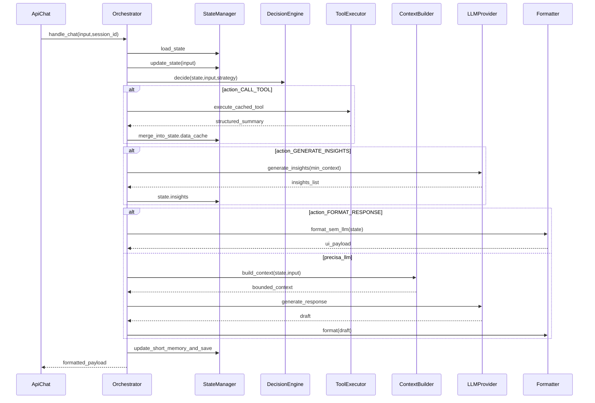

<!--
name: orion_mcp greenfield
overview: "Criar o projeto **orion_mcp** como sucessor limpo do **project_mcp_v1**: núcleo state-driven (orquestrador + decision engine + context builder + tools cacheáveis + LLM só para texto), persistência em PostgreSQL (estado + pgvector), cache Redis, e camada MCP opcional que reutiliza os mesmos handlers das tools (sem subprocess no fluxo `/chat`)."
todos:
  - id: scaffold-orion
    content: Criar pacote `orion_mcp/` com `pyproject.toml`, FastAPI app, `Settings` Pydantic validado no startup, `.env.example`, estrutura `api/`, `core/`, `infra/`, `mcp_adapter/`.
    status: completed
  - id: db-state
    content: Implementar migrações SQL (`conversation_state`, índices), `State` Pydantic, `StateManager` load/save/update com write-through e testes.
    status: completed
  - id: decision-orchestrator
    content: Implementar `DecisionEngine` (actions + caps de LLM/tool), `Orchestrator` linear (`action_executor`), métricas por request.
    status: completed
  - id: tools-cache
    content: "Registry de tools in-process (1ª tool: analytics stub ou port seletiva), Redis cache por `tool_key`, summarização determinística do resultado."
    status: completed
  - id: context-llm-format
    content: "`ContextBuilder` com limite de tokens, `LLMProvider` (OpenAI primeiro), `Formatter` separado; endpoint `/api/v1/chat` end-to-end com mocks."
    status: completed
  - id: memory-rag
    content: Tabela `memory_embeddings` + pgvector, pipeline retrieve `top_k` com filtros metadata, worker opcional para embed.
    status: completed
  - id: mcp-adapter
    content: Servidor MCP (FastMCP) expondo tools com schemas e handlers compartilhados com o registry; sem subprocess no fluxo HTTP.
    status: completed
  - id: obs-ci
    content: OpenTelemetry + logs estruturados; workflow CI com pytest; contrato OpenAPI verificado.
    status: completed
  - id: traceability-matrix
    content: Documentar no repositório a matriz requisito→módulo/teste (checklist dos 6 princípios + 14 preventivos + skills) e manter atualizada a cada fase.
    status: completed
  - id: docs-as-code
    content: Adicionar `/docs` (architecture, modules, api) gerados ou validados por script (`scripts/generate_docs.py` / `validate_docs_vs_code.py`) e job CI `docs.yml`.
    status: completed
  - id: queue-embeddings
    content: "Infra de fila (Celery+RabbitMQ ou Redis queue): jobs assíncronos só para embeddings/indexação; nunca para persistência crítica do turno."
    status: completed
  - id: grafana-stack
    content: Compose opcional Prometheus + Grafana com dashboard mínimo (latência, llm_calls, tool_calls, cache hit) além de export OTEL.
    status: completed
  - id: prompts-yaml
    content: Pacotes de prompt/skill em YAML com `yaml.safe_load` + modelos Pydantic (`Skill`, etc.); proibir parse manual frágil.
    status: completed
isProject: false
-->

# Plano: **orion_mcp** (sucessor do `project_mcp_v1`)

## Matriz de rastreabilidade (tudo o que você pediu)

Esta secção amarra **cada bloco do seu texto** a um entregável concreto no `orion_mcp`. Se algo não aparecer na implementação, a falha fica visível aqui.

### Secção 0 — Princípios obrigatórios

| Requisito | Implementação | Verificação |
|-----------|---------------|-------------|
| LLM **não** gerencia memória | `memory/` só é lido/escrito por `StateManager`, `update_short_memory`, workers de embed; nenhum provider escreve estado | Testes: LLM mock nunca recebe callbacks de persistência |
| LLM **não** decide fluxo | Único grafo: `Orchestrator` → `DecisionEngine.decide()` (código puro) | Testes unitários de `decide` com tabela de casos |
| Histórico **não** é contexto | API não aceita “transcript completo” como entrada de contexto; no máximo IDs/refs; `ContextBuilder` só usa campos do `State` + pergunta atual | Teste: contexto gerado sem lista de mensagens antigas |
| Decisões determinísticas (state-driven) | `Action` derivado de `(state, user_input, strategy)` com funções puras + limite de tentativas | Propriedade: mesmo estado+input+strategy → mesma action |
| Tools idempotentes e cacheáveis | Contrato `Tool`: args canónicos, sem efeitos colaterais fora de DB read/cache; Redis `tool:{hash}` | Testes: mesma chave → mesmo summary; contract de read-only |
| Contexto **construído**, nunca acumulado | `ContextBuilder.build_context(state, user_input)` monta seções fixas com teto de tokens; proibição explícita de JSON bruto/histórico | Teste de regressão de tamanho e de seções |

### Secção 1 — Árvore `/api` + `core/` + `infra/`

| Requisito | Implementação |
|-----------|-----------------|
| `/api` → `/chat` | Rotas: **`POST /api/v1/chat`** (versionamento explícito) **e** alias opcional `POST /api/chat` que redireciona ou delega internamente para v1 (evita quebra de cliente legado sem duplicar lógica) |
| Pacotes `core/orchestrator`, `state`, `memory`, `context`, `decision`, `tools`, `llm`, `formatter` | Nomes de pastas podem ser `core/context/` (builder) e `core/decision/` (engine) para espelhar o texto; `orchestrator/` contém só fachada de fluxo |
| `infra/db`, `cache`, `queue`, `observability` | Postgres (+ pgvector), Redis, fila para embeds, OTEL/Prometheus/Grafana |

### Secção 2.1 — State engine

| Requisito | Implementação |
|-----------|-----------------|
| Tabela `conversation_state (session_id PK, state JSONB, updated_at)` | Migração SQL + repositório async |
| Campos do `State` | Modelo Pydantic com: `intent`, `entities`, `current_metric`, `filters`, `data_cache` (tool_key → `{summary, timestamp}`), `insights`, `short_memory`, `long_memory_refs`, `flags` |
| API | `load_state`, `save_state`, `update_state(state, user_input)` — a última só atualiza fatos derivados por regras/heurísticas (Fase 1 sem LLM no update, salvo decisão explícita documentada) |

### Secção 2.2 — Memory system

| Requisito | Implementação |
|-----------|-----------------|
| Short-term | Coluna ou campo `conversation_summary` / `state.short_memory`; `update_short_memory(state, last_response)` com **sumarização sem LLM** na Fase 1 (template/heurística) ou **no máximo 1 chamada “fast”** contada no orçamento se você aprovar depois |
| Long-term (RAG) | `text-embedding-3-large` (ou configurável), **pgvector** como padrão; tabela `memory_embeddings (id, session_id, content, embedding vector(1536), metadata JSONB)` |
| `retrieve_memory(query, session_id)` | Serviço que embeda a query, `top_k` com filtros em metadata: usuário, métrica, entidade (chaves normalizadas no `State`/`metadata`) |
| Otimização | Índice por `(session_id)` + IVFFlat/HNSW; pré-filtro SQL por metadata antes de ordernar por distância |

### Secção 2.3 — Tool system

| Requisito | Implementação |
|-----------|-----------------|
| Interface `Tool` | `name`, `schema` (JSON Schema gerado do Pydantic), `async def run(args) -> dict` estruturado |
| Sem LLM dentro da tool | Code review + lint rule opcional (import ban) |
| Cache Redis | Chave `tool:{sha256(name + canonical_json(args))}`; valor = **summary** serializável + metadados; TTL configurável |
| Fluxo | `if cache hit → return summary`; senão `run_tool()` → `summarize_result` **determinístico** (truncagem + agregados numéricos) → `cache.set` |

### Secção 2.4 — Decision engine

| Requisito | Implementação |
|-----------|-----------------|
| `decide(state, user_input) -> Action` | Enum/tagged union **fixa** |
| Actions | `CALL_TOOL`, `GENERATE_RESPONSE`, `GENERATE_INSIGHTS`, `FORMAT_RESPONSE` |
| `FORMAT_RESPONSE` | Caminho **sem novo LLM**: quando o conteúdo final já existe em `state`/template (ex.: só reformatar dados cacheados para UI); contabiliza 0 `llm_calls` |
| Exemplos do texto (“por que”, cache vazio) | Cobertos por testes nomeados na suite `test_decision_engine.py` |

### Secção 2.5 — Context builder

| Requisito | Implementação |
|-----------|-----------------|
| `build_context(state, user_input) -> str` | Implementação única referenciada pelo orquestrador |
| Secções | Intenção, métrica, dados resumidos (`data_cache`), insights, memória curta, memória longa (trechos recuperados), pergunta atual |
| Limite | Padrão configurável **2k–4k tokens** (contagem aproximada + truncagem por secção); **proibido** injetar JSON bruto do tool ou histórico completo |

### Secção 2.6 — LLM layer

| Requisito | Implementação |
|-----------|-----------------|
| `LLMProvider` | `async generate(prompt, model, temperature)` + streaming opcional depois |
| Tipos de modelo | Tabela de config: `reasoning`, `fast`, `embeddings` mapeando para IDs reais via `Settings` |
| Uso | Orquestrador escolhe **modelo por estratégia** (`fast`/`deep`), não por “modo de execução” paralelo ao grafo |

### Secção 2.7 — Formatter

| Requisito | Implementação |
|-----------|-----------------|
| Entrada | JSON/objeto: `{content, format}` com `html \| tabela \| lista` |
| Isolamento | Formatter **não** recebe `State` nem histórico; só o artefato final + formato desejado |

### Secção 2.8 — Orchestrator (fluxo completo)

| Requisito | Implementação |
|-----------|-----------------|
| Pseudocódigo do texto | `handle_chat` implementa a sequência: load → `update_state` → `decide` → (tool branch) → (insights branch) → `build_context` → `llm.generate` (se action não for só format) → `formatter` → `update_short_memory` → `save_state` → retorno |
| `orchestrator.py` sem lógica de negócio | Regra de código: arquivo só encadeia chamadas; condicionais complexas ficam em `decision_engine`, `action_executor`, `state` |

### Secção 3 — Performance (obrigatório)

| Requisito | Implementação |
|-----------|-----------------|
| &lt; 2 chamadas LLM por request | Enforcement central (contador + exceção `BudgetExceeded`) incluindo insights + resposta |
| &lt; 1 tool por request (padrão) | Padrão: **uma** tool selecionada pela `DecisionEngine`; **exceção documentada**: “paralelo” só para **conjunto fechado** de tools **read-only** com mesma política de cache e **um** round-trip agregado (conta como 1 “tool step” no orçamento operacional) — implementar na Fase 2+ se necessário para analytics |
| &lt; 3k tokens por chamada | `max_tokens` + truncagem do `ContextBuilder` alinhada ao teto |
| Timeout 10s | `asyncio.wait_for` / timeout HTTP no client OpenAI e nas tools DB |
| Fallback parcial | Resposta degradada com flags em `state.flags` + payload UI explicando o que faltou |
| Cache agressivo | Redis L1 + `data_cache` no estado para o turno |

### Secção 4 — Observabilidade

| Requisito | Implementação |
|-----------|-----------------|
| Métricas por request | Objeto/trace: `llm_calls`, `tool_calls`, `latency_total`, `tokens_used` (quando API retornar usage) |
| OpenTelemetry | Spans por etapa |
| Prometheus | `/metrics` ou exporter sidecar |
| Grafana | `docker-compose.observability.yml` opcional com datasource Prometheus + dashboard mínimo (Fase 5) |

### Secção 5 — Stack tecnológica

Já coberta: FastAPI, PostgreSQL+pgvector, Redis, Celery/RabbitMQ (fila), OpenAI/Anthropic (providers plugáveis).

### Secção 6 — Diferencial vs `project_mcp_v1`

Tratado na migração seletiva + tabela “não portar” do plano; a matriz acima é a definição formal do “novo”.

### Secção 7 — Roadmap

As fases do plano abaixo foram **alinhadas** às suas Fases 1–5; ver secção “Roadmap de entrega”.

### Texto preventivo (itens 1–14) + “10 mandamentos”

| # | Tema | Ação no Orion |
|---|------|----------------|
| 1 | Docs desfasadas | `/docs` + scripts gerar/validar + CI `docs.yml` (todo `docs-as-code`) |
| 2 | Orquestrador monolítico | Pastas `orchestrator/*` com responsabilidade única |
| 3 | Múltiplos modos | **Um fluxo**; só `strategy` muda parâmetros internos |
| 4 | Config infernal | `Settings` Pydantic + validadores + `.env.example` |
| 5 | YAML frágil | `yaml.safe_load` + modelos tipados (todo `prompts-yaml`) |
| 6 | Contratos duplicados | Enums/`AgentType`/`ToolName` centralizados |
| 7 | DB opcional silencioso | Fail-fast em produção |
| 8 | MCP subprocess | Proibido no hot path do `/chat`; MCP só como adapter |
| 9 | Consistência eventual | Write-through de estado antes da resposta HTTP |
| 10 | Segurança | Sem log de secrets; SQL só parametrizado; tools não aceitam SQL livre do utilizador |
| 11 | Dois bancos | Postgres único + pgvector; MySQL fora do escopo default |
| 12 | Contrato API | `/api/v1/chat` + OpenAPI |
| 13 | Testabilidade | Testes por módulo obrigatórios na CI |
| 14 | Observabilidade | Logs estruturados + métricas + Grafana opcional |
| — | 10 mandamentos | Secção dedicada em `ARCHITECTURE.md` (cópia explícita da lista) |

### Skills (`.cursor/skills`)

| Skill | Como Orion cumpre sem violar os princípios |
|-------|---------------------------------------------|
| [agente_criador_time_agentes.md](project_mcp_v1/.cursor/skills/agente_criador_time_agentes.md) | Contratos tipados (`PayloadIn`/`PayloadOut` por “papel”), limites de retry, agregação; **sem** Maestro LLM — papéis viram etapas ou prompts especializados invocados **só** após `decide` |
| [agente_dev_mcp_server.md](project_mcp_v1/.cursor/skills/agente_dev_mcp_server.md) | `mcp_adapter/` com schemas completos, validação de inputs, erros convertidos em conteúdo MCP seguro, `readOnlyHint`, logs sem PII |
| [agente_dev_mcp_client.md](project_mcp_v1/.cursor/skills/agente_dev_mcp_client.md) | **Não** usar loop “LLM escolhe tool” no core; se existir cliente MCP para devtools, é **fora** do orquestrador ou ferramenta de admin com políticas distintas |

---

## Objetivo e posicionamento

Implementar um backend **FastAPI** com um único fluxo linear por requisição, governado por **estado persistido** e por uma **Decision Engine determinística**, alinhado aos princípios que você listou (LLM não gerencia memória nem fluxo; histórico não vira contexto bruto; contexto é montado; tools idempotentes e cacheáveis).

O nome **orion_mcp** faz sentido como **produto que expõe capacidades via MCP** para hosts (Cursor, Claude Desktop), **sem** repetir o anti-padrão atual de [`app/main.py`](project_mcp_v1/app/main.py) que sobe o servidor via **stdio subprocess** ([`mcp_client/client.py`](project_mcp_v1/mcp_client/client.py)) no caminho crítico do chat.

**Convenção recomendada (compatível com as skills):**

- **Núcleo**: registry de tools **Python puro** (handlers assíncronos, schemas Pydantic/JSON Schema, sem LLM dentro).
- **MCP**: *adapter* fino (FastMCP / SDK MCP) que **delega** para os mesmos handlers do núcleo — mesma lógica, dois “transportes” (HTTP interno vs MCP stdio/SSE), checklist de segurança e schemas como em [`agente_dev_mcp_server.md`](project_mcp_v1/.cursor/skills/agente_dev_mcp_server.md).
- **“Multi-agente”** (skill [`agente_criador_time_agentes.md`](project_mcp_v1/.cursor/skills/agente_criador_time_agentes.md)): reinterpretar como **papéis e contratos** (payloads tipados, limites de tentativa, agregação), mas **roteamento por `decide(state, input)`**, não por LLM escolhendo agente. Onde a skill sugere Maestro LLM, Orion troca por **estado + regras + estratégia** (`fast` vs `deep` só altera modelo/limite/prompt interno, não o grafo).

## Layout do repositório (novo diretório)

Criar [`orion_mcp/`](orion_mcp/) na raiz do workspace (irmão de `project_mcp_v1/`), evitando copiar arquivos “por osmose”. Migração é **seletiva** (domínio analytics, SQL meta, glossário), não fork linha a linha do orquestrador legado ([`app/orchestrator.py`](project_mcp_v1/app/orchestrator.py)).

Estrutura alvo:

- [`orion_mcp/api/`](orion_mcp/api/) — rotas versionadas (`/api/v1/chat`), modelos Pydantic de request/response, middleware de observabilidade.
- [`orion_mcp/core/`](orion_mcp/core/)
  - `orchestrator/` — só composição do fluxo (sem regra de negócio pesada): [`orchestrator.py`](orion_mcp/core/orchestrator/orchestrator.py), [`state_manager.py`](orion_mcp/core/orchestrator/state_manager.py), [`decision_engine.py`](orion_mcp/core/orchestrator/decision_engine.py), [`context_builder.py`](orion_mcp/core/orchestrator/context_builder.py), [`action_executor.py`](orion_mcp/core/orchestrator/action_executor.py) (espelha a exigência anti-monólito do seu texto preventivo).
  - `state/` — modelo `State` (Pydantic) + transições `update_state(state, user_input)` (parse/heurísticas determinísticas; opcionalmente 1 chamada “fast” só para extração estruturada **se** você aceitar isso como exceção controlada — default do plano: **zero LLM** na atualização de estado na Fase 1).
  - `memory/` — short-term (campo `conversation_summary` / `short_memory` no estado ou coluna dedicada) + long-term (embeddings + pgvector) conforme seu schema.
  - `tools/` — implementações + contratos; camada de cache Redis por `tool_key = sha256(name + canonical_json(args))`.
  - `llm/` — `LLMProvider` + adapters OpenAI/Anthropic; política de modelo por “estratégia”.
  - `formatter/` — pós-processamento para UI (HTML/tabela/lista) **sem** estado/histórico.
- [`orion_mcp/infra/`](orion_mcp/infra/) — `db/` (SQLAlchemy/asyncpg ou psycopg), `cache/redis.py`, `queue/` (stub Celery/RabbitMQ até precisar), `observability/` (OTEL + métricas Prometheus-friendly).
- [`orion_mcp/mcp_adapter/`](orion_mcp/mcp_adapter/) — servidor MCP que expõe o catálogo (skills MCP server: schemas, `readOnlyHint`, logs sem PII).
- [`orion_mcp/migrations/`](orion_mcp/migrations/) — SQL para `conversation_state`, `memory_embeddings`, extensão `vector`, índices IVFFlat/HNSW conforme volume.

## Fluxo determinístico (referência)

**Orçamento por request (suas metas):** contador explícito `llm_calls` e `tool_calls` no contexto da requisição; hard caps (ex.: máx. 2 LLM, máx. 1 tool) aplicados na Decision Engine **antes** de chamar providers.

## Persistência e consistência

- **Fonte da verdade**: `conversation_state` (JSONB) + `updated_at`, com **write-through** antes de responder (mitigação ao item “consistência eventual” do seu texto preventivo).
- **Memória longa**: tabela `memory_embeddings` com filtro `(session_id, metric_key, entity_keys…)` nos metadados para reduzir ruído; indexação pesada pode ser async (worker), mas **commits de estado crítico** são síncronos no fluxo do chat.
- **Fail-fast**: em `production`, se `DATABASE_URL` obrigatório e migrações falharem, subir erro claro (contraste com [`app/main.py`](project_mcp_v1/app/main.py) que hoje degrada sessão Postgres com warning).

## Configuração e contratos

- **`Settings` Pydantic v2** em [`orion_mcp/core/config/settings.py`](orion_mcp/core/config/settings.py): validação no startup (ex.: `enable_long_memory` exige pgvector + dimensão coerente), `.env.example` na raiz do pacote.
- **Enums centrais** para papéis/estratégias/actions (evita duplicação AgentType vs string solta, problema citado no texto preventivo).
- **API versionada**: `/api/v1/chat` + OpenAPI gerado pelo FastAPI (item 12 do preventivo).

## O que reaproveitar do `project_mcp_v1` (com auditoria)

Portar/adaptar com testes, não copiar o grafo legado:

- **Domínio analytics**: inspiração em [`mcp_server/analytics_queries.py`](project_mcp_v1/mcp_server/analytics_queries.py), [`mcp_server/sql_params.py`](project_mcp_v1/mcp_server/sql_params.py), [`mcp_server/query_sql_meta.py`](project_mcp_v1/mcp_server/query_sql_meta.py) — manter **SQL parametrizado** e proibição de SQL dinâmico vindo de LLM.
- **Glossário / entidades**: [`app/entity_glossary.py`](project_mcp_v1/app/entity_glossary.py) como referência de comportamento.
- **Context retrieval** (se ainda necessário): avaliar [`mcp_server/context_retrieval/`](project_mcp_v1/mcp_server/context_retrieval/) — só integrar se couber na política “contexto construído”; caso contrário, deixar para Fase 3 com limites rígidos.

**Não portar como está:** orquestração baseada em múltiplos modos/loops ([`app/orchestrator_*.py`](project_mcp_v1/app/)), MCP client subprocess no core, ou “agente_llm escolhe tool” do exemplo em [`agente_dev_mcp_client.md`](project_mcp_v1/.cursor/skills/agente_dev_mcp_client.md) — isso vira **documentação de anti-padrão** para Orion.

## Testes e CI

- **Pirâmide**: testes unitários da `DecisionEngine` e `ContextBuilder` (entrada de estado fixo), testes de contrato das tools (args inválidos, cache hit/miss), testes de API com DB em container (pytest + docker compose opcional).
- Espelhar a disciplina de testes existente em [`project_mcp_v1/tests/`](project_mcp_v1/tests/) (ex.: [`test_orchestrator_flow_and_decisions.py`](project_mcp_v1/tests/test_orchestrator_flow_and_decisions.py)), mas apontando para os novos módulos.

## Observabilidade

- Logs JSON por passo (`step`, `session_id`, `latency_ms`, `llm_calls`, `tool_calls`, `tokens` se disponível).
- OTEL traces: span por `load_state`, `decide`, `tool_execute`, `llm_generate`, `format`.
- Métricas Prometheus: histogramas de latência por etapa + contadores de cache.

## Roadmap de entrega (incremental)

| Fase | Escopo | Critério de pronto |
|------|--------|--------------------|
| 1 | Monorepo `orion_mcp`, FastAPI **`POST /api/v1/chat`** (e alias `/api/chat` se ativado em config), `State` completo + `conversation_state`, `DecisionEngine` com **quatro** actions (incl. `FORMAT_RESPONSE`), orquestrador linear “fino”, `LLMProvider` mockável, **entrypoint único** documentado (`uvicorn orion_mcp.api.main:app` ou pacote equivalente), `ARCHITECTURE.md` com os **10 mandamentos** | Testes de estado + decisão + endpoint + matriz de rastreabilidade versionada |
| 2 | Tool registry (`Tool` + schema), Redis `tool:{hash}`, summarização determinística, `ContextBuilder` com seções obrigatórias e teto **2k–4k tokens**, enforcement **&lt;3k tokens por chamada LLM** + **&lt;2 LLMs** + **&lt;1 tool** (padrão), timeout **10s** | Testes de cache, orçamento, truncagem, timeout |
| 3 | pgvector + `memory_embeddings` + `retrieve_memory` com filtros (sessão/métrica/entidade); **fila** (Celery/RabbitMQ ou Redis) só para embed/indexação; memória curta persistida | Testes de retrieval + contrato de worker (sem estado crítico async) |
| 4 | `Formatter` isolado, mapa `reasoning`/`fast`/`embeddings`, `mcp_adapter` (FastMCP) reutilizando handlers; **prompts/skills em YAML** validados por Pydantic | Smoke MCP + testes de carga mínima de YAML |
| 5 | OTEL + Prometheus + **Grafana** (compose opcional), fallback parcial, logs JSON com `llm_calls`/`tool_calls`/`latency_total`/`tokens_used`; **CI** pytest + validação OpenAPI + **validação docs↔código** | Dashboard ou documentação de importação do dashboard + pipeline CI verde |

## Documentação (evitar “docs desfasadas”)

- **OpenAPI** como contrato vivo (FastAPI) + validação no CI.
- **`ARCHITECTURE.md`**: invariantes + os **10 mandamentos** (texto explícito, não só referência).
- **`/docs`**: `architecture.md`, `modules.md`, `api.md` — gerados ou verificados por script (`scripts/generate_docs.py` / `scripts/validate_docs_vs_code.py`) conforme todo `docs-as-code`.
- Evitar README “solto” como única fonte; README só aponta para `/docs` e para o OpenAPI.

## Riscos e decisões explícitas

1. **Extração de entidades/intenção**: ou 100% heurística na Fase 1, ou uma chamada LLM “fast” **somente** para struct output com schema fixo — isso contaria no orçamento de 2 LLMs; precisa estar visível na `DecisionEngine` e nos testes.
2. **Sampling MCP**: só no adapter MCP se for requisito real; não acoplar ao `/chat` core.
3. **MySQL legado**: Orion assume Postgres; integração MySQL só se requisito explícito (fora do escopo default do plano).
