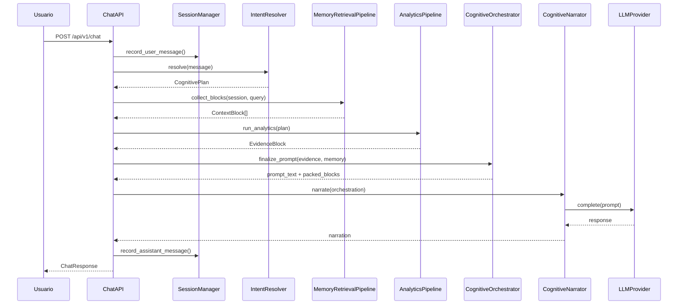
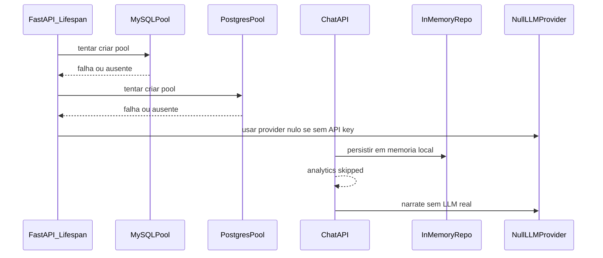
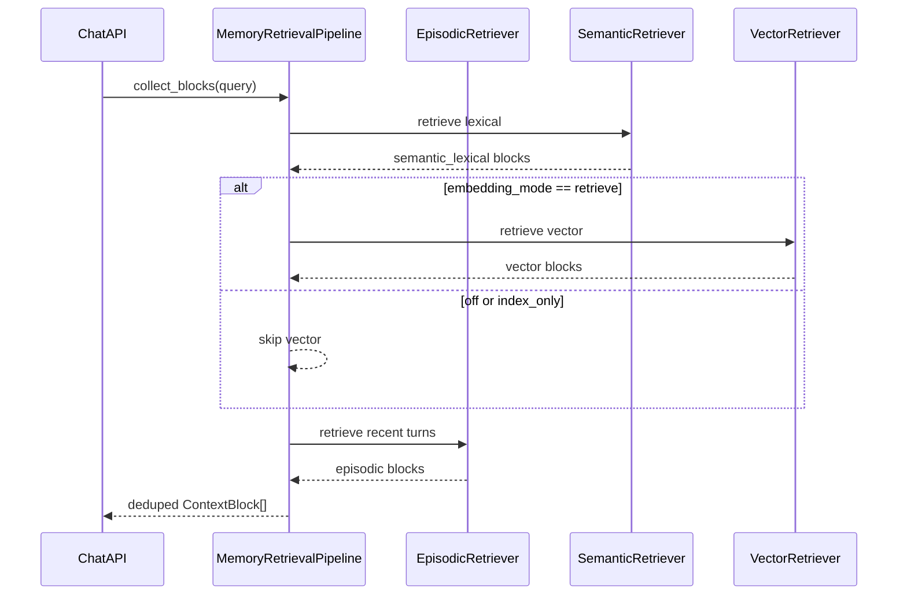
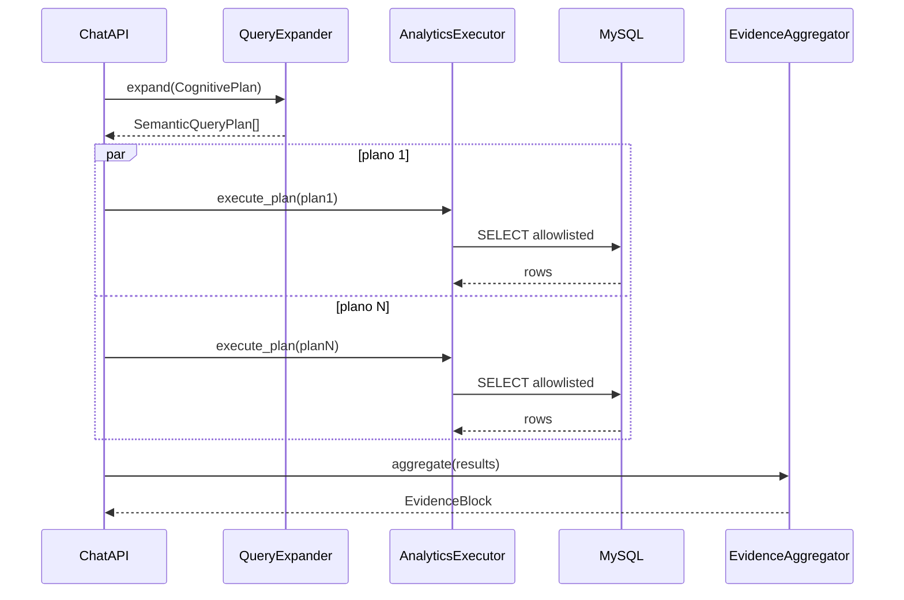
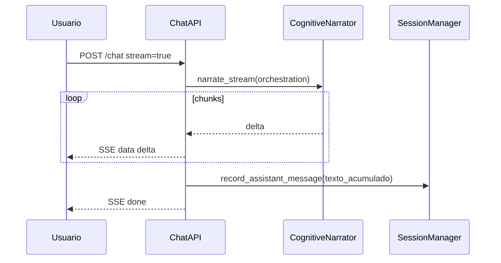
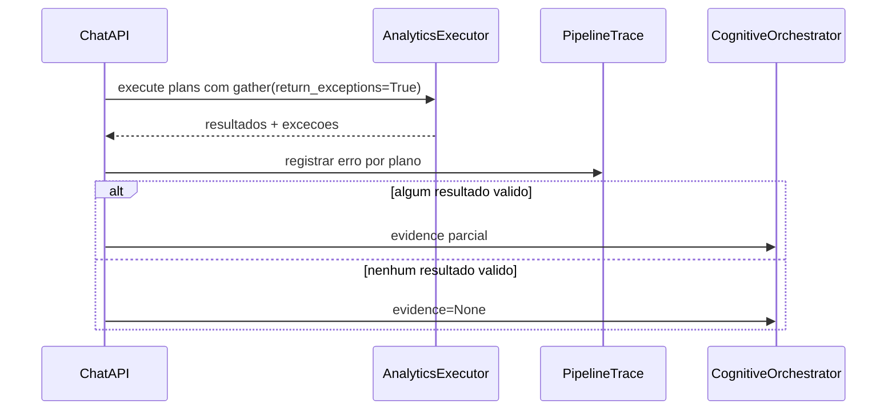
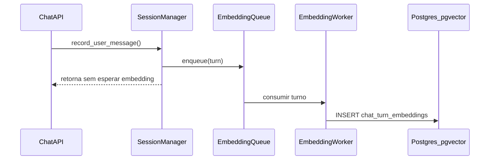

# Analise Arquitetural Senior — Orion MCP v3

Este documento analisa o projeto Orion MCP v3 sob a perspectiva de arquitetura de software, fluxo de processamento, gargalos operacionais e melhorias estruturais. O foco da análise é o estado atual do sistema como um runtime cognitivo analítico: entrada conversacional, resolução de intenção, memoria contextual, execução analitica segura, evidencia, orquestração cognitiva e narração LLM.

## 1. Arquitetura e Estrutura do Projeto

### Organização geral

O Orion MCP v3 esta organizado como um backend Python orientado por camadas. A estrutura principal vive em `src/orion_mcp_v3/` e separa contratos, runtime cognitivo, API HTTP, broker analitico, memoria conversacional, providers externos e infraestrutura.

O desenho atual favorece uma arquitetura de runtime:

```text
api
  -> runtime
  -> memory
  -> broker
  -> providers
  -> infra / connection_hub
contracts
  -> base comum para runtime, broker e memory
```

O papel de cada area e o seguinte:

- `api/`: borda HTTP FastAPI. Cria a aplicação, injeta dependencias, inicializa pools, configura o provider LLM e expõe rotas de chat, sessões e opções.
- `runtime/`: nucleo cognitivo. Contem resolução de intenção, estado de sessão, politica de atenção, fusão de contexto, alocação de orçamento, scheduler, renderização de prompt e narração.
- `broker/`: nucleo analitico. Transforma intenção em planos semanticos, compila queries seguras, executa MySQL, agrega resultados e constroi evidencia.
- `memory/`: memoria conversacional. Inclui repositorios de conversa, recuperação episodica, recuperação lexical/semantica e Memory Augmentation opcional por pgvector.
- `contracts/`: contratos estáveis compartilhados (`CognitivePlan`, `SemanticQueryPlan`, `EvidenceBlock`, `ContextBlock`, `AnalyticalDigest`, proveniencia).
- `providers/`: adaptações externas, principalmente OpenAI para LLM e embeddings.
- `protocols/`: interfaces para providers (`LLMProvider`, `EmbeddingService`).
- `connection_hub/`: clientes e pools de conexão com bancos.
- `infra/`: migrações e documentação de persistencia, sobretudo Postgres/pgvector e Redis keyspace.
- `docs/`: documentação arquitetural, roadmaps, guias, notas e decisões de direção.

### Núcleo cognitivo e analítico

O valor central do Orion não esta nos embeddings. O projeto evolui para um runtime cognitivo analítico onde o caminho de maior valor e:

```text
pergunta humana
  -> intenção cognitiva
  -> plano analítico
  -> SQL seguro / MySQL
  -> evidencia estruturada
  -> digest / redução
  -> proveniencia / drift
  -> fusão contextual
  -> resposta narrada
```

Essa direção esta refletida em módulos como:

- `runtime/intent_resolver.py`: resolve intenção e atenção a partir da mensagem.
- `broker/planner.py`: deriva `SemanticQueryPlan` a partir do `CognitivePlan`.
- `broker/query_expander.py`: expande intenção em planos concretos.
- `broker/sql_compiler.py`: compila SELECT seguro com allowlist.
- `broker/executor.py`: executa plano/template em MySQL.
- `broker/evidence_builder.py`: gera baseline, variação, anomalias, confidence e coverage.
- `broker/evidence_aggregator.py`: agrega evidencias de múltiplos resultados.
- `runtime/cognitive_orchestrator.py`: funde evidence, digest e memoria em prompt final.

### Memory Augmentation

O subsistema vetorial foi corretamente rebaixado para uma camada experimental e opcional:

- `memory/chat_turn_embedding_store.py`: indexa e consulta `chat_turn_embeddings`.
- `memory/vector_retriever.py`: transforma resultados pgvector em `ContextBlock`.
- `memory/retrieval_pipeline.py`: combina memoria episodica, lexical e opcionalmente vetorial.
- `providers/openai_embedding.py`: implementa embeddings externos.

A configuração `ORION_EMBEDDING_MODE` deve preservar o escopo:

- `off`: sem embeddings.
- `index_only`: indexa turnos, mas não usa retrieval vetorial.
- `retrieve`: indexa e usa `VectorRetriever` em paralelo com lexical.

Essa camada não deve decidir SQL, não deve entrar no planner, não deve compor prompt diretamente e não deve ser requisito para `POST /chat`.

### Acoplamento e dependências

A direção de dependencias esperada e saudável:

```text
api -> runtime / memory / broker / providers / config
runtime -> contracts / protocols
broker -> contracts / connection_hub
memory -> contracts / repositories / providers opcionais
providers -> protocols
contracts -> sem dependencias de runtime/broker/memory
```

Pontos de acoplamento relevantes:

1. `api/routes/chat.py` é o maior nó de coordenação.
   - Recebe HTTP.
   - Persiste mensagens.
   - Resolve intenção.
   - Recupera memoria.
   - Dispara analytics.
   - Orquestra prompt.
   - Chama narrator/LLM.
   - Controla streaming SSE.
   - Registra tracing.

   Esse arquivo concentra demasiada lógica de aplicação. Ainda não é necessariamente um problema funcional, mas e o principal ponto de crescimento descontrolado.

2. `api/main.py` concentra composição de infraestrutura.
   - Cria pool MySQL.
   - Cria pool Postgres.
   - Inicializa repositorio de conversa.
   - Inicializa store de embeddings.
   - Configura provider LLM.

   O acoplamento e aceitável para uma composition root, mas deve continuar restrito a inicialização, sem lógica de dominio.

3. `memory/chat_turn_embedding_store.py` recebe `EmbeddingService`, mas ainda utiliza `OpenAIEmbeddingService.to_pgvector`.
   - Isso introduz dependencia concreta de provider dentro da camada de memoria.
   - O ideal seria mover conversão de vector literal para helper neutro ou para o protocolo.

4. `memory/retrieval_pipeline.py` usa helpers internos do composer em algumas versões do projeto.
   - Se helpers privados forem reaproveitados entre módulos, a fronteira entre retrieval e composition enfraquece.
   - A decisão arquitetural correta e manter retrieval fora do composer, com utilitarios públicos se necessário.

5. Barrels `runtime/__init__.py` e `broker/__init__.py`.
   - Facilitam imports.
   - Aumentam risco de carregar submódulos desnecessários.
   - Podem mascarar ciclos indiretos em evolução futura.

### Dependências circulares e nós complexos

Não ha sinal de ciclo fatal ativo no caminho principal, mas ha regiões sensíveis:

- `runtime/__init__.py`: importa muitos submódulos e pode participar de ciclos se contratos voltarem a depender de runtime.
- `broker/__init__.py`: expõe muitos componentes e pode induzir import pesado.
- `api/routes/chat.py`: nó mais complexo do sistema, concentrando controle transacional, recuperação, analytics, streaming e narração.

O projeto ja corrigiu um risco importante ao mover proveniencia para `contracts/provenance.py`, reduzindo dependencias de `contracts` para `runtime`.

## 2. Mapeamento Ponta a Ponta do Processo (Caminhos e Fluxos)

### Bootstrap da aplicação

O ciclo começa em `api/main.py`.

Passos:

1. Carrega `OrionSettings`.
2. Configura logging e tracing.
3. Cria FastAPI.
4. No lifespan:
   - Se `ORION_MYSQL_URL` existir, cria pool MySQL e `AnalyticsExecutor`.
   - Se `ORION_POSTGRES_URL` existir, cria pool Postgres e `PostgresConversationStateRepository`.
   - Se embeddings estiverem ativos e Postgres existir, cria `ChatTurnEmbeddingStore`.
   - Se LLM tiver API key, cria provider OpenAI; caso contrario usa provider nulo.
5. Cria `SessionManager` com repositório compartilhado pelo state do lifespan.
6. Registra router `/api/v1`.

Caminhos alternativos:

- Sem MySQL: chat continua sem analytics real.
- Sem Postgres: sessões ficam em memória local do processo.
- Sem LLM API key: usa `NullLLMProvider`.
- Sem embeddings: memoria permanece episodica/lexical.
- Falha ao inicializar MySQL/Postgres: loga erro e degrada para modo parcial.

### Happy path de `POST /api/v1/chat`

Fluxo principal:

1. Recebe `ChatRequest`.
2. Normaliza `conversation_id`.
3. Obtém ou cria `Session`.
4. Persiste mensagem do usuário.
5. Se `embedding_mode` permitir indexação, tenta indexar o turno.
6. Resolve intenção com `IntentResolver`.
7. Converte perfil cognitivo em `AttentionPolicy`.
8. Recupera memoria:
   - episodica por conversa;
   - lexical/semantica;
   - vetorial apenas se `ORION_EMBEDDING_MODE=retrieve`.
9. Verifica se a intenção exige analytics e se executor MySQL/allowlist existem.
10. Se sim, executa `_run_analytics`.
11. Converte resultados em `EvidenceBlock`.
12. `CognitiveOrchestrator` funde:
    - mensagem do usuário;
    - evidence;
    - digest, quando existir;
    - memory blocks;
    - politica de atenção;
    - orçamento de tokens.
13. `CognitiveNarrator` chama LLM ou provider nulo.
14. Persiste resposta do assistente.
15. Se `embedding_mode` permitir, tenta indexar resposta.
16. Retorna `ChatResponse`.

### Fluxo de analytics

Quando `cognitive_plan.needs_analytics == true` e MySQL esta disponível:

1. `QueryExpander` expande o plano cognitivo em um ou mais `SemanticQueryPlan`.
2. Para cada plano:
   - usa template analítico quando disponível;
   - ou compila plano via SQL allowlisted.
3. `AnalyticsExecutor` executa consultas em MySQL.
4. `asyncio.gather(..., return_exceptions=True)` coleta resultados.
5. Exceções individuais são convertidas em eventos de log e descartadas.
6. Se nenhum resultado valido sobrar, segue sem evidencia.
7. Se houver resultados, `EvidenceAggregator` / `EvidenceBuilder` constroem evidencia.
8. Evidence entra no orquestrador como `ContextBlock` de fonte `BROKER`.

### Fluxo de memoria

A recuperação de memoria ocorre antes do analytics:

1. `MemoryRetrievalPipeline` recebe `session_id`, query e retrievers.
2. Adiciona summary/essence se houver cache.
3. Executa `VectorRetriever` se modo `retrieve`.
4. Executa `SemanticRetriever` lexical.
5. Executa `EpisodicRetriever` ou fallback para mensagens recentes.
6. Deduplica blocos.
7. Opcionalmente comprime.
8. Retorna `ContextBlock[]` ao orquestrador.

Observação arquitetural: memoria e analytics são fluxos independentes que se encontram apenas na fusão contextual. Isso e correto: memoria não deve decidir SQL.

### Fluxo de streaming SSE

Quando `stream=true`:

1. A rota monta o mesmo contexto cognitivo.
2. Retorna `StreamingResponse`.
3. `narrate_stream` emite deltas.
4. O gerador acumula texto.
5. No `finally`, persiste resposta completa do assistente.
6. Atualiza fase da sessão para `IDLE`.
7. Emite evento final `done`.

Riscos:

- Se a conexão cair no meio, apenas os deltas acumulados ate o `finally` serão persistidos.
- A resposta streaming tem metadados mais simples que a resposta não-streaming.
- Erros no LLM durante streaming podem deixar resposta parcial.

### Fluxos de exceção e degradação

Principais caminhos:

- Erro no pool MySQL durante startup: analytics desabilitado; chat continua.
- Erro no pool Postgres durante startup: repositório in-memory; chat continua.
- Erro de embedding: capturado no `SessionManager`, logado e não derruba chat.
- Erro individual em query analytics: capturado por `gather(..., return_exceptions=True)`, resultado descartado.
- Todos os analytics falham: segue sem `EvidenceBlock`.
- Erro no repositório ativo ao gravar mensagem: tende a propagar como erro HTTP.
- Erro no retrieval de memoria: tende a propagar.
- Erro no LLM real: tende a propagar, salvo tratamento interno do provider/narrator.

## 3. Diagnóstico de Problemas e Gargalos

### Gargalos de performance

1. Caminho crítico do chat muito longo.
   - O endpoint executa persistência, memoria, analytics, orquestração, LLM e persistência final.
   - Com embeddings ativos, pode aguardar chamada externa de embedding antes do pipeline principal.

2. Persistência de conversa em JSONB crescente.
   - `PostgresConversationStateRepository` mantém mensagens como array JSONB por conversa.
   - Cada append faz leitura, desserialização, merge e update do histórico completo.
   - Com `FOR UPDATE`, concorrência por sessão fica serializada.
   - Custo cresce linearmente com tamanho da conversa.

3. `GET /sessions` potencialmente explosivo.
   - Lista sessões e busca mensagens por sessão.
   - O default de muitas mensagens completas por sessão pode gerar resposta muito grande.
   - Falta paginação/cursor por histórico.

4. Fan-out analítico sem orçamento operacional explícito.
   - `asyncio.gather` paraleliza planos.
   - Não ha timeout por plano, limite global por processo ou cancelamento coordenado visível no fluxo.

5. Processamento em memória de resultados analíticos.
   - Evidence/reducers podem receber muitas linhas.
   - Sem limite rígido de linhas processadas, o custo de memoria e CPU cresce com o resultado SQL.

6. Cache de embeddings por sessão.
   - Cache evita re-embed imediato, mas precisa TTL/LRU para sessões numerosas.

### Gargalos de concorrência

- Sessões em memória local não são compartilhadas entre processos.
- Repositório Postgres por JSONB usa lock por conversa em append.
- Indexação de embeddings no caminho de gravação aumenta latência do turno.
- Sem semáforo por provider externo, LLM/embedding podem saturar rate limit.
- Analytics pode consumir conexões MySQL em rajadas se multiplos requests fizerem fan-out.

### Pontos cegos de negócio

1. Sem MySQL, perguntas analíticas ainda geram resposta narrada sem evidência real.
   - O sistema degrada bem tecnicamente, mas deve sinalizar melhor ao usuário quando não ha dados reais.

2. Confidence do planner ainda e heurística.
   - O valor `confidence` não e calibrado estatisticamente.
   - Pode induzir falsa segurança se usado como métrica forte.

3. Periodos temporais default podem estar hardcoded.
   - O compilador e templates precisam derivar janela temporal do `CognitivePlan`, não assumir periodo fixo.

4. Evidence e digest ainda não parecem totalmente integrados em todos os caminhos.
   - O chat usa `EvidenceBlock`; `AnalyticalDigest` existe, mas nem sempre entra no fluxo final.

5. Streaming pode persistir resposta parcial.
   - Isso e aceitável se documentado, mas precisa metadado de completion/failure.

### Dívidas técnicas

- `api/routes/chat.py` acumula responsabilidades de application service, tracing, orchestration e streaming.
- `api/main.py` mistura composition root com detalhes de inicialização de subsistemas.
- Barrels grandes podem mascarar dependencias e dificultar análise de ciclos.
- `memory/chat_turn_embedding_store.py` ainda conhece conversão concreta de OpenAI para pgvector.
- Observabilidade ainda depende muito de logs JSONL, sem métricas operacionais permanentes.
- Timeouts existem em settings, mas precisam ser aplicados consistentemente.
- Falta suite de carga/concorrência para conversas longas e múltiplas sessões.

## 4. Plano de Ação e Melhorias

### Prioridade 1 — Resiliência do caminho crítico

1. Isolar a indexação de embeddings do request.
   - Mover `store.index_turn` para tarefa supervisionada ou fila.
   - Garantir que falha de embedding nunca impacte latência do chat.
   - Manter `ORION_EMBEDDING_MODE=off` como default.

2. Aplicar timeouts reais.
   - LLM: timeout por chamada.
   - Embeddings: timeout curto e retry limitado.
   - MySQL: timeout por plano.
   - Postgres: timeout por append/listagem.
   - Registrar timeout no pipeline trace.

3. Padronizar erros.
   - Criar camada de erro de aplicação para chat.
   - Retornar mensagens controladas para falha de LLM, dados indisponíveis, timeout analytics.
   - Garantir `CognitivePhase.IDLE` em blocos `finally` quando houver erro.

### Prioridade 2 — Persistência e escalabilidade de sessões

1. Migrar mensagens para modelo append-only.
   - Criar `conversation_messages(session_id, message_id, role, content, created_at)`.
   - Manter `conversation_state` como metadados da sessão.
   - Opcionalmente manter snapshot JSONB para cache.

2. Paginar `GET /sessions`.
   - Endpoint de lista: apenas metadata, última mensagem, contagem, updated_at.
   - Endpoint de histórico: `GET /sessions/{id}/messages?limit=&cursor=`.
   - Reduzir default de `session_list_max_messages`.

3. Testar concorrência por sessão.
   - Dois requests simultâneos no mesmo `conversation_id`.
   - Sequência correta de `message_id`.
   - Ausência de perda de mensagens.

### Prioridade 3 — Núcleo analítico

1. Fortalecer `CognitivePlan -> SemanticQueryPlan`.
   - Taxonomia clara de intents analíticas.
   - Mapeamento explicito para `AnalyticsStrategy`.
   - Testes por pergunta-tipo: ranking, queda, baseline, comparação, monitoramento.

2. Fortalecer DSL SQL.
   - Validar campos obrigatorios por strategy.
   - Externalizar politicas temporais.
   - Melhorar templates por domínio.

3. Evoluir `EvidenceBuilder`.
   - Separar cálculo estatístico, cobertura, anomalias e formatação.
   - Adicionar métricas de qualidade da evidência.
   - Garantir provenance em todos os blocos analíticos.

4. Integrar digest de forma consistente.
   - Definir quando `AnalyticalDigest` entra no prompt.
   - Controlar budget entre evidence, digest e memoria.
   - Testar drift guard na narração.

### Prioridade 4 — Observabilidade e operação

1. Transformar trace em métricas.
   - Latência por etapa: intent, memory, analytics, evidence, orchestrate, narrate.
   - Contadores: analytics skipped, analytics failed, vector hits, lexical hits.
   - Tokens: prompt, completion, budget fitted/dropped.
   - Pools: conexões ocupadas, waits, timeouts.

2. Definir SLOs internos.
   - p95 chat sem analytics.
   - p95 chat com analytics.
   - p95 streaming first token.
   - taxa de fallback sem evidence.

3. Adicionar testes de carga.
   - Conversa com milhares de mensagens.
   - Muitas sessões em `/sessions`.
   - MySQL lento.
   - LLM lento.
   - Provider de embeddings indisponível.

### Prioridade 5 — Simplificação arquitetural

1. Extrair application services de `api/routes/chat.py`.
   - `ChatTurnService`: fluxo não-stream.
   - `StreamingChatService`: fluxo SSE.
   - `AnalyticsPipelineService`: `_run_analytics`.
   - `MemoryContextService`: montagem de memory blocks.

2. Reduzir barrels.
   - Preferir imports diretos em módulos sensíveis.
   - Manter `__init__.py` apenas para API pública estável.

3. Manter embeddings congelados.
   - Sem novos retrievers vetoriais no broker.
   - Sem writer para `memory_embeddings` sem decisão explícita.
   - Sem vector dentro do composer/planner.

## 5. Utilize diagramas de sequência em texto (estilo Mermaid) para ilustrar o fluxo dos dados e a interação entre os componentes

### Diagrama 1 — Happy path do chat analítico



### Diagrama 2 — Degradação sem MySQL, Postgres, LLM e embeddings



### Diagrama 3 — Memory retrieval com vector opcional



### Diagrama 4 — Analytics fan-out e evidencia



### Diagrama 5 — Streaming SSE



### Diagrama 6 — Fluxo de erro em analytics



### Diagrama 7 — Fluxo recomendado para indexação em background



Esse fluxo reduz latência no caminho crítico e preserva a regra arquitetural: embeddings são auxiliares, opcionais e não bloqueiam cognição analítica.
