# Análise Arquitetural Sênior — Orion MCP v3

Este documento revisa o Orion MCP v3 como um **runtime cognitivo analítico**. A análise usa a linguagem das skills de engenharia carregadas: **Module**, **Interface**, **Implementation**, **Seam**, **Adapter**, **Depth**, **Leverage**, **Locality** e **Deletion test**.

O objetivo não é listar arquivos; é identificar onde o sistema ganha ou perde profundidade arquitetural, quais caminhos de execução existem, onde a complexidade está concentrada e quais mudanças aumentam resiliência, escalabilidade e manutenção.

## 1. Arquitetura e Estrutura do Projeto

### 1.1 Tese arquitetural

O Orion não deve ser interpretado como um sistema de memória vetorial. Ele está mais próximo de um **runtime cognitivo analítico orientado por evidência**, onde a pergunta humana é transformada em plano, dados, evidência, contexto e narração.

O eixo central é:

```text
pergunta humana
  -> intenção cognitiva
  -> estratégia analítica
  -> plano semântico
  -> SQL seguro / templates
  -> evidência estruturada
  -> fusão contextual
  -> prompt governado por atenção
  -> narração LLM
```

Embeddings existem, mas pertencem à camada opcional de **Memory Augmentation**. Eles devem aumentar continuidade conversacional, não decidir analytics.

### 1.2 Mapa de módulos

#### `api` — Module de borda HTTP e composition root operacional

**Interface:** rotas FastAPI (`/api/v1/chat`, `/api/v1/sessions`, `/api/v1/chat/options`, `/health`) e modelos de request/response.

**Implementation:** inicializa dependências no lifespan, injeta providers, executa fluxo de chat, controla SSE, tracing e persistência de mensagens.

**Arquivos principais:**

- `src/orion_mcp_v3/api/main.py`
- `src/orion_mcp_v3/api/routes/chat.py`
- `src/orion_mcp_v3/api/models.py`

**Avaliação de profundidade:** hoje o `api` é um Module pouco profundo no `routes/chat.py`: a Interface HTTP é simples, mas a Implementation concentra quase todo o processo. Isso dá alto acoplamento operacional e baixa Locality para bugs do turno de chat.

**Deletion test:** se `routes/chat.py` fosse removido, a complexidade não desapareceria; ela reapareceria espalhada em runtime, memory e broker. Isso indica que existe um Module real ali, mas ele ainda está mal nomeado e pouco encapsulado.

#### `runtime` — Module cognitivo

**Interface:** `IntentResolver.resolve()`, `CognitiveOrchestrator.finalize_prompt()`, `CognitiveNarrator.narrate()`, `AttentionPolicy`, scheduler, allocator e prompt renderer.

**Implementation:** interpreta intenção, monta camadas de contexto, aplica política de atenção, aloca orçamento de tokens, renderiza prompt e chama o provider LLM.

**Arquivos principais:**

- `src/orion_mcp_v3/runtime/intent_resolver.py`
- `src/orion_mcp_v3/runtime/cognitive_orchestrator.py`
- `src/orion_mcp_v3/runtime/analytical_system_prompt.py`
- `src/orion_mcp_v3/runtime/narrator.py`
- `src/orion_mcp_v3/runtime/context_fusion.py`
- `src/orion_mcp_v3/runtime/budget_allocator.py`

**Avaliação de profundidade:** é o Module mais próximo do desenho desejado. `CognitiveOrchestrator.finalize_prompt()` oferece uma Interface pequena para muita Implementation: fusão, scheduler, allocator e render. O novo `analytical_system_prompt` aumenta Leverage porque injeta regras analíticas e anti-alucinação sem espalhar instruções pelo código.

**Risco:** o `runtime/__init__.py` é um barrel grande. Ele aumenta conveniência, mas também carrega muitos símbolos e pode mascarar dependências indiretas. O risco é import coupling, não comportamento imediato.

#### `broker` — Module analítico

**Interface:** `CognitivePlan -> SemanticQueryPlan -> AnalyticsResult -> EvidenceBlock`.

**Implementation:** resolve plano analítico, expande templates, compila SQL seguro, executa MySQL, agrega evidência e calcula estatísticas.

**Arquivos principais:**

- `src/orion_mcp_v3/broker/planner.py`
- `src/orion_mcp_v3/broker/query_expander.py`
- `src/orion_mcp_v3/broker/sql_compiler.py`
- `src/orion_mcp_v3/broker/executor.py`
- `src/orion_mcp_v3/broker/evidence_builder.py`
- `src/orion_mcp_v3/broker/evidence_aggregator.py`
- `src/orion_mcp_v3/broker/queries/*.py`

**Avaliação de profundidade:** conceitualmente é profundo: uma pergunta vira evidência analítica. Mas a Interface ainda vaza algumas políticas em `hints`, templates e datas. O `broker` deve ficar livre de embeddings e de lógica conversacional.

**Seam importante:** o melhor seam é entre `CognitivePlan` e `SemanticQueryPlan`, porque concentra a transformação de intenção em estratégia executável.

#### `memory` — Module de memória conversacional

**Interface:** `ConversationStateRepository`, `MemoryRetrievalPipeline.collect_blocks()`, retrievers episódico, lexical e vetorial opcional.

**Implementation:** guarda mensagens, recupera histórico recente, faz matching lexical e opcionalmente pgvector.

**Arquivos principais:**

- `src/orion_mcp_v3/memory/retrieval_pipeline.py`
- `src/orion_mcp_v3/memory/composer.py`
- `src/orion_mcp_v3/memory/episodic_retriever.py`
- `src/orion_mcp_v3/memory/semantic_retriever.py`
- `src/orion_mcp_v3/memory/vector_retriever.py`
- `src/orion_mcp_v3/memory/chat_turn_embedding_store.py`
- `src/orion_mcp_v3/memory/repositories/*.py`

**Avaliação de profundidade:** a separação `retrieval_pipeline != composer` está correta. O composer deve continuar puro: blocos prontos entram, prompt/memória composta sai. O retrieval deve continuar fora dele.

**Risco:** o seam de embeddings ainda é raso. `ChatTurnEmbeddingStore` recebe `EmbeddingService`, mas ainda depende de `OpenAIEmbeddingService.to_pgvector`. Isso prende o Module de memória a um Adapter concreto.

#### `contracts` — Module de linguagem comum

**Interface:** dataclasses e enums de domínio técnico: `CognitivePlan`, `SemanticQueryPlan`, `ContextBlock`, `EvidenceBlock`, `AnalyticalDigest`, `CoverageInfo`, `ProvenanceAnchor`.

**Implementation:** quase inexistente; o valor é estabilidade sem dependências de runtime/broker/memory.

**Avaliação de profundidade:** é o melhor seam do projeto. Callers dependem de tipos estáveis, e decisões de runtime podem mudar sem quebrar o broker quando o contrato é preservado.

#### `providers` e `protocols` — Adapters de borda externa

**Interface:** `LLMProvider`, `EmbeddingService`.

**Implementation:** `OpenAIProvider`, `OpenAIEmbeddingService`, `NullLLMProvider`, `EchoLLMProvider`.

**Avaliação de profundidade:** o seam de LLM está bom. O seam de embeddings precisa ser mais neutro, porque a serialização pgvector não deveria depender do adapter OpenAI.

#### `connection_hub` e `infra` — Adapters de dados

**Interface:** pools e clientes para MySQL/Postgres/Redis; migrações.

**Implementation:** drivers concretos, scripts de migração, keyspaces.

**Avaliação de profundidade:** adequado como camada de infraestrutura. A atenção principal deve ir para o modelo de persistência de mensagens, que hoje usa JSONB crescente.

### 1.3 Acoplamento e dependências

Direção saudável atual:

```text
api -> runtime / broker / memory / providers / config
runtime -> contracts / protocols
broker -> contracts / connection_hub
memory -> contracts / repositories / providers opcionais
providers -> protocols
contracts -> sem dependência de runtime, broker ou memory
```

Pontos complexos:

1. `api/routes/chat.py` é o maior nó de coordenação. Ele faz request handling, persistência, retrieval, analytics, evidence merge, orchestration, narration, streaming e tracing.
2. `api/main.py` é composition root. Isso é aceitável, mas deve continuar restrito a bootstrapping.
3. `runtime/__init__.py` e `broker/__init__.py` reduzem a clareza de dependências reais.
4. `memory/retrieval_pipeline.py` não deve depender de helpers privados do composer. Se houver lógica compartilhada, ela deve virar utilitário público ou Module próprio.
5. `memory/chat_turn_embedding_store.py` ainda deixa o Adapter OpenAI atravessar o seam de memória.
6. `broker/query_expander.py` e templates ainda carregam parte da política temporal; isso deveria ser resolvido antes, no plano.

### 1.4 Dependências circulares ou nós de risco

Não há sinal de ciclo fatal atual, mas existem zonas de risco:

- `runtime/__init__.py`: ao exportar muitos símbolos, pode reintroduzir ciclos se contratos ou módulos de broker importarem runtime por conveniência.
- `broker/__init__.py`: mesmo risco para executor, templates, evidence e planner.
- `api/routes/chat.py`: não é ciclo, mas é um hub. Quanto mais regras entrarem ali, menor será a Locality.
- `contracts` já foi corrigido ao mover proveniência para `contracts/provenance.py`; isso deve ser preservado.

## 2. Mapeamento Ponta a Ponta do Processo (Caminhos e Fluxos)

### 2.1 Bootstrap

1. `api/main.py` carrega `OrionSettings`.
2. Configura logging e tracing.
3. Cria aplicação FastAPI.
4. No lifespan:
   - tenta criar pool MySQL e `AnalyticsExecutor`;
   - tenta criar pool Postgres e `PostgresConversationStateRepository`;
   - cria `ChatTurnEmbeddingStore` se embeddings estiverem ativos;
   - cria provider LLM real se há API key, senão `NullLLMProvider`.
5. Cria `SessionManager`.
6. Registra router `/api/v1`.

Fluxos alternativos:

- Sem MySQL: analytics é pulado.
- Sem Postgres: sessões ficam em memória local.
- Sem LLM real: provider nulo.
- Sem embeddings: memory segue episódica + lexical.
- Falha em inicialização de pool: loga e degrada.

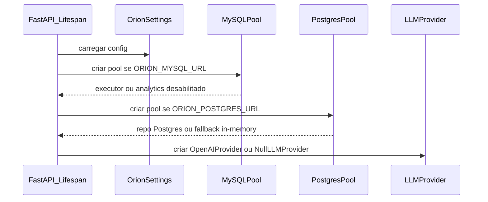

### 2.2 Happy path do chat analítico

1. Cliente envia `POST /api/v1/chat`.
2. `SessionManager` cria/obtém sessão.
3. Mensagem do usuário é persistida.
4. `IntentResolver` retorna `CognitivePlan`.
5. `MemoryRetrievalPipeline` retorna `ContextBlock[]`.
6. `analytics_guard` verifica `needs_analytics`, executor e allowlist.
7. `_run_analytics` expande planos e executa templates.
8. `EvidenceAggregator` produz `EvidenceBlock`.
9. `CognitiveOrchestrator` injeta `system_prompt`, user turn, evidence, digest e memória.
10. Scheduler e allocator empacotam blocos.
11. `CognitiveNarrator` chama `LLMProvider`.
12. Resposta é persistida e retornada.

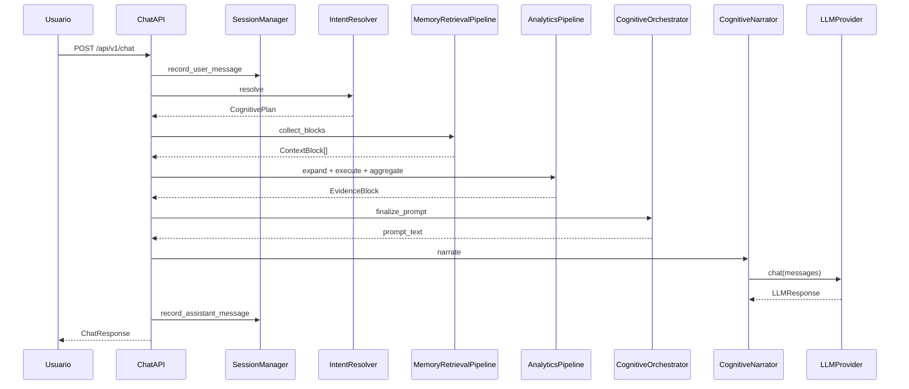

### 2.3 Fluxo de memória

1. `MemoryRetrievalPipeline` recebe `session_id`, query e retrievers.
2. Adiciona summary/essence se existir.
3. Executa `SemanticRetriever` lexical.
4. Executa `VectorRetriever` somente se `ORION_EMBEDDING_MODE=retrieve`.
5. Executa `EpisodicRetriever` para turnos recentes.
6. Deduplica e comprime se configurado.
7. Retorna blocos para o orquestrador.

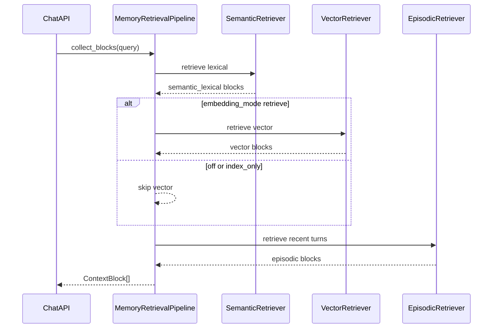

### 2.4 Fluxo analítico

1. `QueryExpander` escolhe templates e planos.
2. Cada plano executa via `AnalyticsExecutor`.
3. Templates SQL usam `date_from` e `date_to` vindos do `CognitivePlan.time_scope`.
4. `asyncio.gather(..., return_exceptions=True)` captura falhas individuais.
5. Resultados válidos viram evidence.
6. Se todos falham, fluxo segue sem evidence.


### 2.5 Streaming SSE

1. O mesmo pipeline cognitivo é montado.
2. `narrate_stream()` produz chunks.
3. A rota emite SSE.
4. No `finally`, persiste texto acumulado.

Risco: se a conexão cair após poucos chunks, o texto parcial pode ser persistido. Isso deve ser tratado como comportamento explícito ou enriquecido com metadado de completion.

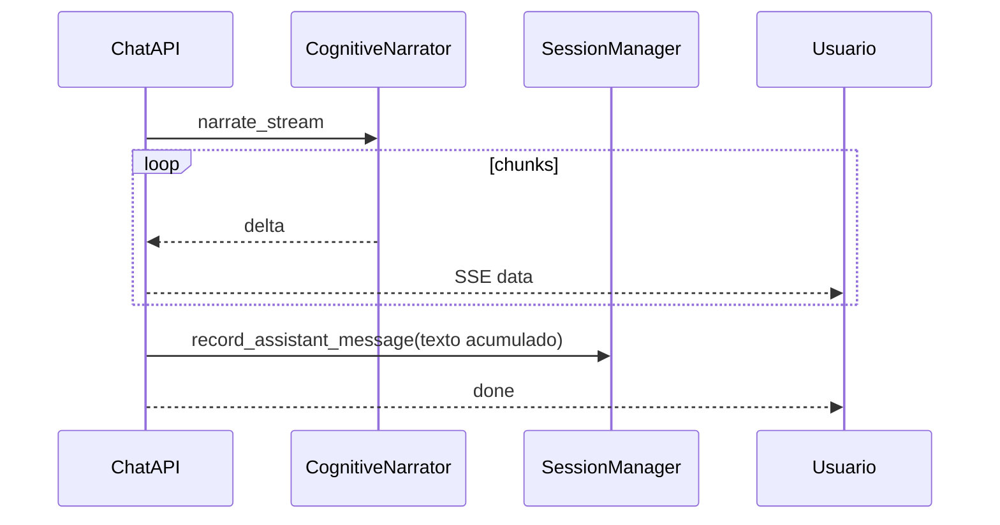

### 2.6 Fluxos de exceção e tratamentos

- **MySQL ausente:** analytics não executa; resposta pode sair sem evidência.
- **Postgres ausente:** sessão fica em memória local; não há persistência cross-process.
- **LLM ausente:** `NullLLMProvider`.
- **Embedding falha:** erro é logado; chat deve continuar.
- **Uma query falha:** resultado é descartado; evidence usa o restante.
- **Todas queries falham:** sem evidence.
- **Persistência falha:** tende a propagar como erro HTTP.
- **LLM retorna vazio:** resolvido parcialmente aumentando budget para modelos constrained; deve permanecer observável via log do narrator.

## 3. Diagnóstico de Problemas e Gargalos

### 3.1 Pontos cegos

1. **Pergunta analítica sem evidence real.** Quando MySQL está indisponível, o fluxo pode seguir para narração. O usuário deveria receber aviso explícito de que analytics não executou.
2. **Confidence heurística.** `CognitivePlan.confidence` não é calibrada estatisticamente. Deve ser tratada como sinal operacional, não probabilidade.
3. **Duplicidade de instruções ao LLM.** `analytical_system_prompt` injeta regras e `narrator` também injeta anti-alucinação/cobertura. Isso pode ser aceitável, mas deve ser racionalizado para evitar conflito.
4. **Evidence em duas vias.** O `EvidenceBlock` entra no prompt principal e parte dele também entra no coverage note do narrator. Isso aumenta tokens e pode criar prioridade ambígua.
5. **Streaming parcial.** Persistir resposta parcial sem metadata pode confundir histórico.

### 3.2 Gargalos de performance

1. **Caminho crítico longo.** Persistência, memory retrieval, analytics, orchestration, LLM e persistência final acontecem na requisição.
2. **JSONB crescente em conversas.** Append de mensagem lê e regrava array inteiro, com lock por sessão. Isso degrada com histórico longo.
3. **`GET /sessions` pesado.** O limite padrão de mensagens completas por sessão é alto e pode gerar payloads muito grandes.
4. **Fan-out analytics sem orçamento dedicado.** Há paralelismo, mas não um Module claro para timeout, cancelamento, limite global ou circuit breaker.
5. **LLM constrained model.** Modelos como `gpt-5*` consomem tokens internos; sem budget adequado, podem retornar vazio.
6. **Embeddings no caminho de gravação.** Mesmo opcionais, se ativos podem adicionar latência externa ao turno.

### 3.3 Gargalos de concorrência

- `PostgresConversationStateRepository` serializa updates por conversa.
- Sessões in-memory não são distribuídas entre workers.
- Analytics concorrente pode saturar MySQL.
- LLM e embeddings não têm semaphore/rate limiter local.
- Streaming mantém requisição aberta e consome recursos por conexão.

### 3.4 Dívidas técnicas

1. `api/routes/chat.py` precisa virar Module de aplicação.
2. `_run_analytics` não deveria viver dentro da rota.
3. `ConversationStateRepository` precisa de Adapter Postgres append-only.
4. `ChatTurnEmbeddingStore` não deve conhecer `OpenAIEmbeddingService.to_pgvector`.
5. Barrels grandes devem ser reduzidos ou tratados como API pública estável.
6. Logs JSONL são úteis, mas métricas operacionais ainda faltam.

## 4. Plano de Ação e Melhorias

### Prioridade 1 — Deepen o Module de turno de chat

**Problema:** `api/routes/chat.py` concentra responsabilidades demais.

**Solução proposta:** extrair um Module `ChatTurnRunner` ou `ChatTurnService`.

**Interface sugerida:**

```python
result = await chat_turn_runner.run(request)
stream = chat_turn_runner.stream(request)
```

**O que fica atrás da Implementation:**

- sessão;
- persistência;
- intent;
- memory retrieval;
- analytics;
- orchestration;
- narration;
- tracing;
- estado cognitivo.

**Benefício:** aumenta Locality para bugs de chat e aumenta Leverage dos testes. Um teste de integração chamaria a Interface do turno e validaria comportamento sem passar por HTTP.

### Prioridade 2 — Extrair `AnalyticsPipeline`

**Problema:** `_run_analytics` é um pipeline real, mas está embutido na rota.

**Interface sugerida:**

```python
evidence = await analytics_pipeline.run(cognitive_plan, message, trace_context)
```

**Implementation escondida:**

- expandir planos;
- executar templates;
- aplicar timeout;
- descartar falhas parciais;
- agregar evidence;
- registrar trace.

**Benefício:** melhora testabilidade e torna explícito onde aplicar budget, cancelamento e observabilidade.

### Prioridade 3 — Criar Module temporal dedicado

**Problema:** parsing temporal já cresceu em `IntentResolver`. Ele é valioso, mas pode virar um subdomínio próprio.

**Interface sugerida:**

```python
date_range = temporal_resolver.resolve(text, today=date.today())
```

**Contrato:**

- `date_from`;
- `date_to`;
- `period_grain`;
- `period_source`;
- `confidence`;
- `original_text`.

**Benefício:** concentra a complexidade de datas em um seam pequeno, testável e reutilizável por planner/templates.

### Prioridade 4 — Migrar mensagens para append-only

**Problema:** JSONB crescente tem custo linear e lock por conversa.

**Solução proposta:**

- manter `conversation_state` para metadados;
- criar `conversation_messages`;
- escrever mensagens append-only;
- paginar histórico;
- manter Adapter in-memory compatível com a mesma Interface.

**Benefício:** melhora concorrência e performance sem alterar callers.

### Prioridade 5 — Racionalizar instruções ao LLM

**Problema:** `analytical_system_prompt` e `narrator` podem duplicar regras de cobertura/evidência.

**Solução proposta:**

- deixar `analytical_system_prompt` responsável por identidade, estrutura e regras analíticas;
- deixar `narrator` responsável apenas por chamar provider e registrar resultado;
- mover coverage note para metadata/bloco próprio ou removê-lo se evidence já estiver no prompt.

**Benefício:** prompt mais previsível, menor custo de tokens, menor risco de instruções conflitantes.

### Prioridade 6 — Seams de providers e budgets

**Problema:** providers externos têm comportamentos específicos e custos variáveis.

**Melhorias:**

- tornar budget por modelo configurável;
- adicionar timeout e retry limitado;
- logar `finish_reason`, model e token usage em nível controlado;
- manter teste de regressão para `gpt-5*` com `max_completion_tokens` mínimo.

### Prioridade 7 — Métricas e SLOs

Criar métricas por etapa:

- `intent_latency_ms`;
- `memory_latency_ms`;
- `analytics_latency_ms`;
- `orchestrate_latency_ms`;
- `llm_latency_ms`;
- `reply_chars`;
- `evidence_confidence`;
- `analytics_result_count`;
- `vector_hit_count`;
- `prompt_tokens`;
- `completion_tokens`.

SLOs sugeridos:

- p95 chat sem analytics;
- p95 chat com analytics;
- p95 tempo até primeiro chunk em streaming;
- taxa de respostas sem evidence em perguntas analíticas;
- taxa de `finish_reason=length`.

## 5. Diagramas de Sequência em Texto (Mermaid)

### 5.1 Arquitetura macro

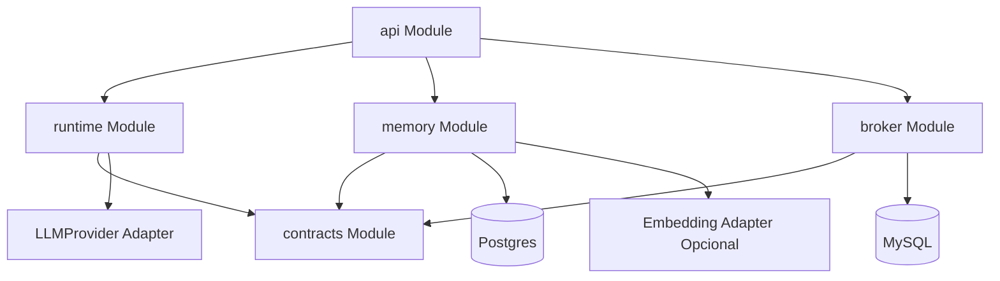

### 5.2 Turno de chat com analytics

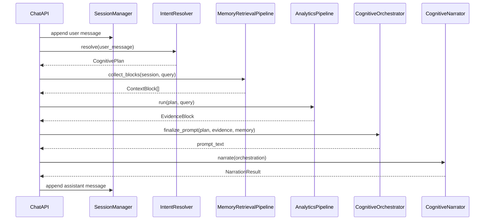

### 5.3 Caminho alternativo sem analytics

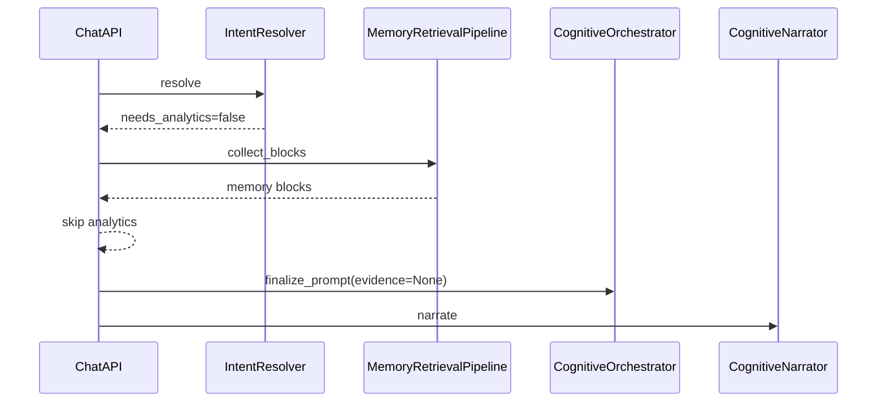

### 5.4 Degradação sem infraestrutura externa

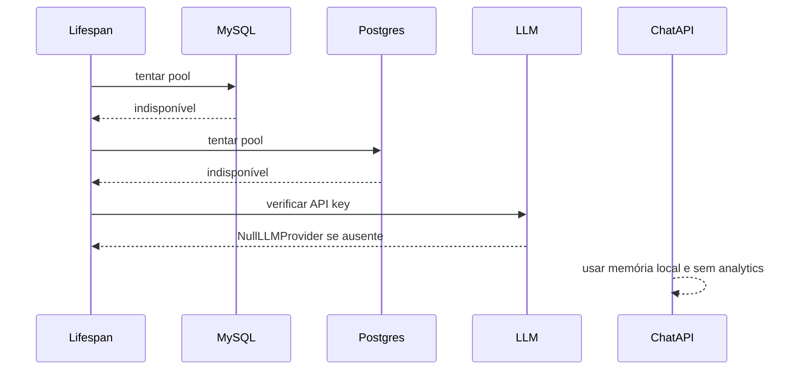

### 5.5 Memory Augmentation opcional

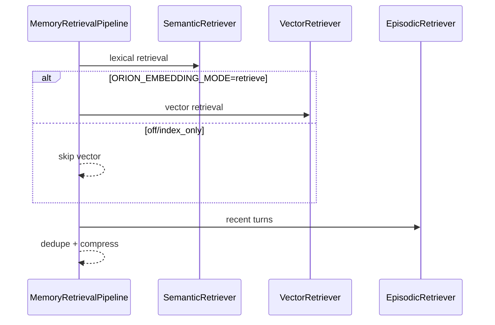

### 5.6 Analytics com falhas parciais

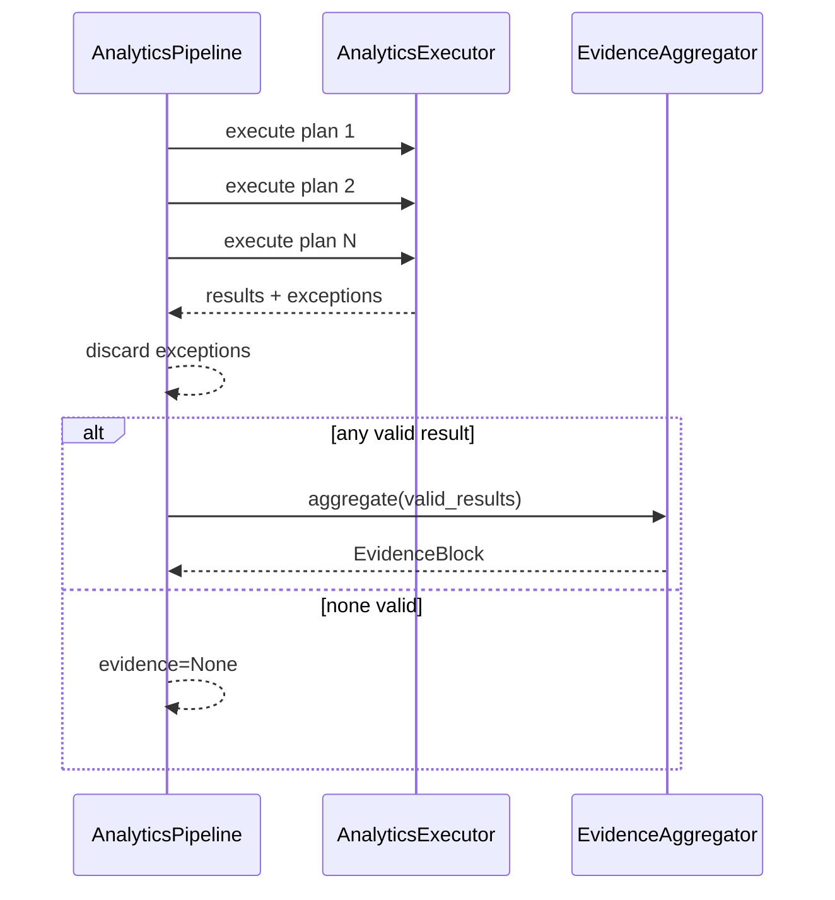

### 5.7 Provider LLM constrained model

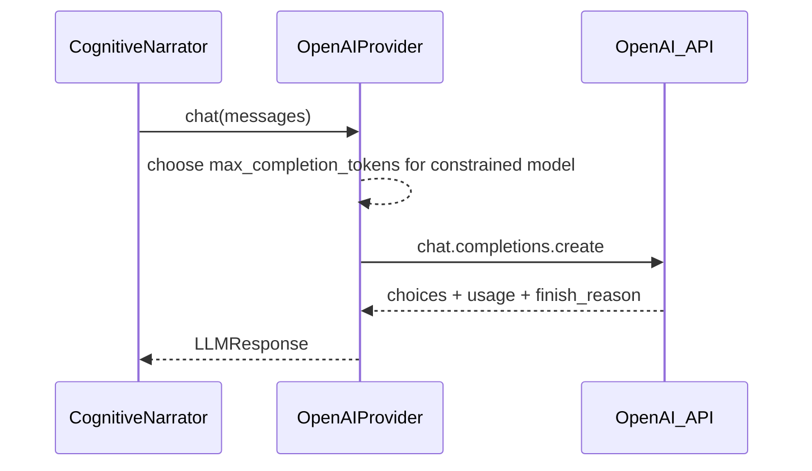

## Conclusão

O Orion tem um núcleo promissor porque seus contratos já apontam para um runtime analítico governado por evidência, atenção e proveniência. O principal trabalho arquitetural agora não é adicionar mais camadas, mas **aprofundar módulos existentes**:

1. transformar `routes/chat.py` em uma Interface de aplicação menor;
2. tornar analytics um Module profundo;
3. isolar interpretação temporal;
4. trocar persistência JSONB crescente por append-only;
5. manter Memory Augmentation opcional e simples;
6. tornar provider/LLM budgets observáveis e configuráveis.

Essa direção aumenta **Leverage** para callers e testes, e aumenta **Locality** para manutenção: bugs de chat ficam no Module de turno, bugs de analytics no Module analítico, bugs temporais no temporal resolver, e bugs de provider no Adapter externo.
