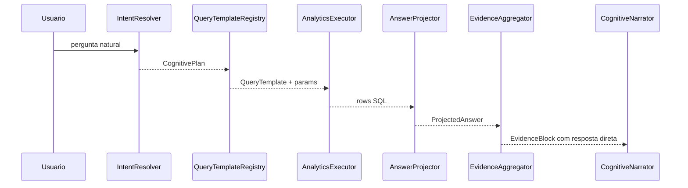

# Answer Capability Layer

## Contexto

As queries analíticas do Orion já retornam colunas suficientes para responder perguntas objetivas. Exemplo: `visao_executiva` retorna `periodo`, `concessionaria`, `total_os`, `faturamento`, `ticket_medio`, `maior_recebimento` e `menor_recebimento`.

O problema observado nos logs não era falta de dados nem falha do SQL. O problema era o seam entre `QueryTemplate` e `EvidenceBuilder`: cada template declarava apenas um `VALUE_KEY`, então o pipeline tratava uma query rica como se ela respondesse só uma métrica principal.

## Decisão

Adicionar uma camada explícita de capacidade de resposta:

```text
QueryTemplate
  -> AnswerCapability
  -> AnswerPlan
  -> ProjectedAnswer
  -> EvidenceBlock
  -> LLM narrator
```

Essa camada transforma “colunas disponíveis” em “respostas possíveis”.

## Contratos

### `AnswerCapability`

Declara o que uma query sabe responder:

- métricas disponíveis;
- dimensões disponíveis;
- medida padrão;
- dimensão padrão;
- operações suportadas (`ranking_desc`, `ranking_asc`, `top_and_bottom`, `list`).

Exemplo conceitual:

```python
MEASURES = {
    "faturamento": {"label": "receita/faturamento", "kind": "money"},
    "ticket_medio": {"label": "ticket médio", "kind": "money", "additive": False},
}
DIMENSIONS = {
    "concessionaria": {"label": "concessionária"},
}
```

### `AnswerPlan`

Representa a interpretação objetiva da pergunta:

```text
template_slug = visao_executiva
measure = faturamento
dimension = concessionaria
operation = top_and_bottom
```

### `ProjectedAnswer`

É a resposta direta antes da narração:

```text
maior receita/faturamento por concessionária: osaka (R$ 187.547,00)
menor receita/faturamento: ...
```

## Fluxo



## Regras

1. O LLM não deve descobrir qual coluna responde a pergunta.
2. O `AnswerProjector` deve selecionar a métrica certa antes do prompt.
3. `VALUE_KEY` continua existindo como fallback estatístico.
4. `MEASURES` e `DIMENSIONS` são a interface semântica real do template.
5. Fan-out pode continuar existindo, mas a resposta direta deve escolher o resultado mais compatível com a pergunta.

## Benefício

Essa mudança aumenta a profundidade do módulo analítico:

- melhora Locality: problemas de resposta por métrica ficam em `answer_projector`;
- melhora Leverage: qualquer query que declare capabilities passa a responder melhor;
- reduz dependência do LLM: ele narra uma resposta já projetada;
- preserva os templates SQL existentes;
- mantém `EvidenceBuilder` como camada estatística, não como interpretador de pergunta.
