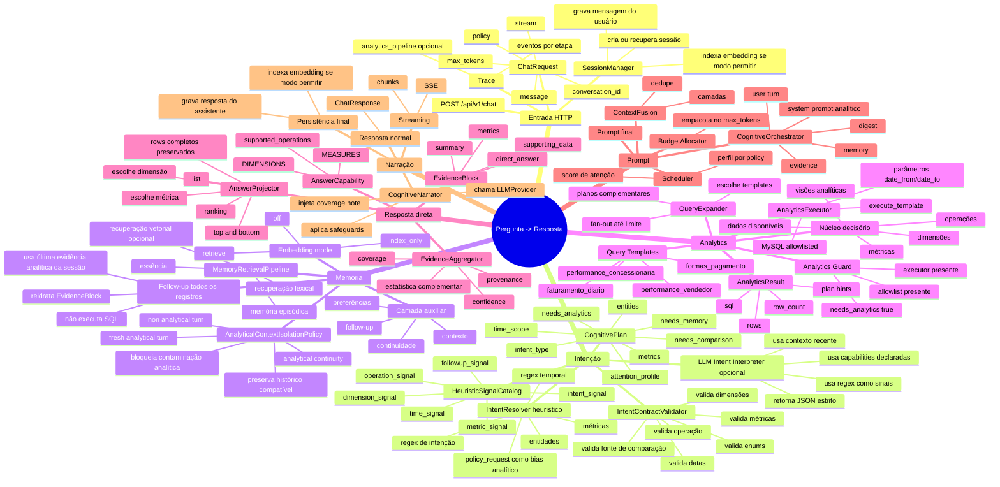
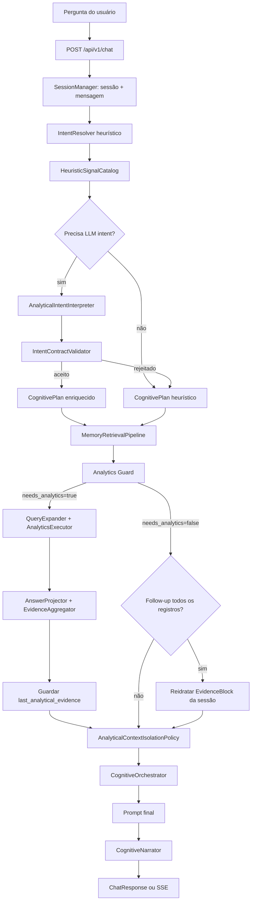

# Mapa Mental — Fluxo Ponta a Ponta do Orion MCP v3

Este documento mapeia o fluxo implementado até agora: da pergunta do usuário até a resposta final. Ele inclui o caminho principal, os ramos alternativos, os fallbacks e as decisões cognitivas/analíticas existentes.

## Premissa Arquitetural

O Orion MCP v3 é um runtime analítico cognitivo. Chat é a interface de entrada e
saída; memória é uma camada auxiliar de contexto e continuidade. O eixo principal é:

```text
pergunta → intenção → contrato validado → visão analítica → SQL controlado
         → evidência → contexto auxiliar → LLM narrador → resposta
```

A LLM pode ajudar a interpretar perguntas novas, mas a interpretação precisa virar
contrato estruturado e validado contra capacidades reais. A resposta final deve ser
narrada a partir de `EvidenceBlock`, cobertura, proveniência e contexto de memória,
não a partir de memória solta ou dados crus sem projeção.

## Visão Mental



## Fluxo Principal



## 1. Entrada e Sessão

O fluxo começa em `POST /api/v1/chat`. A rota recebe uma `ChatRequest` com mensagem, política de atenção, limite de tokens, `conversation_id` e opção de streaming.

Possibilidades implementadas:

- Se `conversation_id` vier vazio, uma sessão nova é criada.
- Se `conversation_id` existir, a sessão é reutilizada.
- A mensagem do usuário é persistida antes de qualquer processamento.
- Se embeddings estiverem habilitados para indexação, o turno pode ser indexado em background lógico pelo `SessionManager`.
- Se `analytics_pipeline_trace` estiver ativo, cada etapa emite eventos JSONL.

## 2. Resolução de Intenção

A primeira leitura é heurística:

- `IntentResolver.resolve()` extrai sinais comparativos, temporais, analíticos, recall, monitoramento e execução.
- Datas explícitas viram `time_scope`, por exemplo `2026-03-01/2026-03-31`.
- `policy_request="analytical"` atua como bias quando a pergunta tem sinais de dados.
- Métricas e entidades são extraídas como hints.

Depois, os regex também viram sinais genéricos:

- `intent_signal`
- `time_signal`
- `metric_signal`
- `dimension_signal`
- `operation_signal`
- `followup_signal`

Se o caso for ambíguo, contextual, comparativo, follow-up ou houver memória analítica recente, entra o `AnalyticalIntentInterpreter`.

O interpretador LLM:

- recebe a pergunta;
- recebe contexto recente;
- recebe o catálogo seguro de capabilities;
- recebe sinais regex como evidência;
- retorna somente JSON;
- nunca gera SQL.

O `IntentContractValidator` só aceita o contrato se:

- `intent_type` é conhecido;
- `operation` é suportada;
- `metric` existe em alguma capability;
- `dimension` existe em alguma capability;
- datas ISO são válidas;
- comparação tem dois períodos ou fonte de memória suficiente.

Se a validação falha, o sistema volta para o `CognitivePlan` heurístico.

## 3. Tipos de Intenção Implementados

O `CognitivePlan` pode representar:

- `analytical`: pergunta de dados, SQL/evidência normalmente necessários.
- `comparative`: comparação entre períodos, entidades ou histórico.
- `temporal`: pergunta centrada em período, mas nem sempre analítica sozinha.
- `recall`: recuperação de conversa/memória.
- `monitoring`: alerta, anomalia, monitoramento.
- `execution`: comando operacional/exportação/ação.
- `hybrid`: mistura de analytics + memória.
- `conversational`: conversa comum ou follow-up sem analytics.

Campos que controlam o resto do fluxo:

- `needs_analytics`
- `needs_memory`
- `needs_comparison`
- `needs_temporal_context`
- `needs_baseline`
- `needs_trend_analysis`
- `needs_entity_resolution`
- `confidence`
- `metrics`
- `entities`
- `time_scope`
- `attention_profile`

## 4. Memória

A recuperação de memória acontece antes do analytics porque o prompt final pode precisar de continuidade conversacional.

Camadas implementadas:

- summary/essence se existir;
- `SemanticRetriever` lexical;
- `VectorRetriever` se `embedding_mode=retrieve`;
- `EpisodicRetriever` para turnos recentes;
- dedupe e compressão.

Modos de embedding:

- `off`: sem indexação e sem recuperação vetorial.
- `index_only`: registra embeddings, mas não usa vector retrieval no chat.
- `retrieve`: indexa e recupera vetorialmente em paralelo ao lexical/episódico.

O vetor é opcional e não substitui o núcleo analítico.

## 5. Isolamento de Contexto Analítico

O `AnalyticalContextIsolationPolicy` evita que análises antigas contaminem perguntas novas.

Decisões implementadas:

- `analytical_fresh_turn`: pergunta analítica nova bloqueia memória analítica histórica e vector memory.
- `analytical_continuity`: comparação, recall analítico ou continuidade permite histórico compatível.
- `non_analytical_turn`: conversa comum preserva memória normal.

Compatibilidade analítica usa `AnalyticalSignature`:

- `template_slug`
- `measure`
- `dimension`
- `operation`
- `date_from`
- `date_to`
- `entities`

Para comparações, datas podem diferir se a forma analítica for compatível.

## 6. Follow-up “Todos os Registros”

Foi implementado um caminho especial para pedidos como:

```text
quero todos os registros!
lista completa
todos os registos
```

Comportamento:

- não executa SQL de novo;
- usa `session.extra["last_analytical_evidence"]`;
- lê o `direct_answer.rows` preservado no `ProjectedAnswer`;
- reidrata um novo `EvidenceBlock`;
- injeta esse bloco como evidência no prompt;
- mantém provenance, coverage, confidence e supporting data da evidência original.

Isso permite listar os registros já calculados, sem depender da narração anterior top 10 e sem consultar o banco novamente.

## 7. Analytics Guard

O analytics só roda quando:

- `cognitive_plan.needs_analytics=True`;
- `AnalyticsExecutor` está presente;
- `SqlAllowlist` está presente.

Se faltar algo:

- analytics é pulado;
- o motivo é registrado no trace;
- o sistema segue para memória/orquestração/narração.

Possíveis motivos:

- `needs_analytics=false`;
- `executor_ausente`;
- `allowlist_ausente`.

## 8. Query Expansion

Quando analytics roda, `QueryExpander` tenta usar templates registrados.

Templates atuais:

- `faturamento_diario`
- `formas_pagamento`
- `performance_concessionaria`
- `performance_vendedor`

O módulo `visao_executiva` foi removido; a visão por concessionária agora é coberta por `performance_concessionaria`.

Possibilidades:

- se templates combinam, eles viram `SemanticQueryPlan` de template;
- se não combinam, pode cair para plano compilado;
- fan-out pode gerar múltiplos ângulos;
- o limite padrão impede explosão de planos.

Cada template declara:

- `SQL`
- `ANSWERS`
- `VALUE_KEY`
- `TIME_KEY`
- `GRAIN`
- `LABEL_KEY`
- `MEASURES`
- `DIMENSIONS`
- `SUPPORTED_OPERATIONS`
- `PARAMETERS`

## 9. Execução SQL

`AnalyticsExecutor.execute_template()` executa SQL parametrizado.

Regras implementadas:

- templates usam `%s` para parâmetros;
- `PARAMETERS` define a ordem dos valores;
- `DATE_FORMAT` usa `%%` para escapar `%` literal;
- SQL é pré-definido, não gerado por LLM;
- queries compiladas passam por allowlist.

Saída:

- `AnalyticsResult.plan`
- `AnalyticsResult.sql`
- `AnalyticsResult.rows`
- `AnalyticsResult.row_count`

## 10. Answer Capability

O `AnswerCapability` transforma colunas retornadas por SQL em capacidades semânticas.

Cada template pode responder várias perguntas porque declara:

- métricas disponíveis;
- dimensões disponíveis;
- sinônimos;
- medida padrão;
- dimensão padrão;
- operações suportadas.

Exemplo prático em `performance_concessionaria`:

- medida `vendas`;
- medida `recebido`;
- medida `ticket_medio_os`;
- medida `percentual_recebido`;
- dimensão `concessionaria`;
- dimensão `periodo`.

## 11. Answer Projector

O `AnswerProjector` escolhe:

- qual resultado SQL é mais compatível com a pergunta;
- qual métrica usar;
- qual dimensão usar;
- qual operação aplicar.

Operações implementadas:

- `ranking_desc`
- `ranking_asc`
- `top_and_bottom`
- `list`

Importante:

- o resumo pode mostrar apenas top 10;
- `ProjectedAnswer.rows` preserva todos os registros ordenados;
- isso alimenta o follow-up “todos os registros”.

## 12. Evidence Aggregator

O `EvidenceAggregator` transforma resultados e projeção direta em `EvidenceBlock`.

Ele produz:

- resumo analítico;
- resposta direta em primeiro plano;
- estatística complementar;
- métricas;
- confidence;
- coverage;
- provenance;
- supporting data.

Quando `ProjectedAnswer` existe:

- `direct_answer` entra em `supporting_data`;
- `answer_plan` entra em `metrics`;
- a resposta direta fica antes do resumo complementar;
- o LLM recebe evidência objetiva já materializada.

## 13. Orquestração Cognitiva

`CognitiveOrchestrator.finalize_prompt()` monta o prompt final.

Camadas possíveis:

- system prompt analítico;
- turno do usuário;
- essence;
- evidence;
- digest;
- memory.

Depois:

- `ContextFusion` une camadas;
- scheduler ordena blocos;
- allocator aplica orçamento de tokens;
- `render_blocks_to_prompt()` gera o texto final.

## 14. Narração

`CognitiveNarrator` chama o `LLMProvider`.

Possibilidades:

- resposta normal via `ChatResponse`;
- resposta streaming via SSE;
- provider real;
- `NullLLMProvider` em testes/degradação;
- safeguards quando não há evidência;
- coverage note quando há evidência/cobertura.

Safeguards comuns:

- `anti_hallucination_preamble`;
- `evidence_cited`;
- `coverage_note_injected`;
- `no_evidence`;
- `no_coverage_data`.

## 15. Persistência Pós-Resposta

Depois da narração:

- resposta do assistente é persistida;
- fase da sessão volta para `IDLE`;
- uso de tokens e metadados são retornados;
- se embedding index estiver ativo, a resposta pode ser indexada.

Além disso:

- após analytics, `last_analytical_evidence` fica em memória de sessão;
- isso habilita follow-ups que reutilizam dados sem SQL novo.

## 16. Fluxos Alternativos

### Conversa Simples

```text
pergunta -> sessão -> intent conversational -> memória -> prompt -> narrador -> resposta
```

Não exige executor MySQL.

### Pergunta Analítica Nova

```text
pergunta -> intent analytical -> isolamento fresh -> SQL -> evidence -> prompt -> resposta
```

Memória analítica antiga é bloqueada para evitar contaminação.

### Pergunta Analítica com LLM Intent

```text
pergunta ambígua -> heurística -> sinais regex -> LLM interpreter -> validator -> CognitivePlan -> analytics
```

Se o contrato for rejeitado, volta para heurística.

### Comparação

```text
pergunta comparativa -> needs_comparison -> histórico compatível pode entrar -> analytics ou memória -> resposta
```

Datas podem diferir quando a forma analítica é a mesma.

### Follow-up “Todos os Registros”

```text
pergunta -> needs_analytics false -> pega last_analytical_evidence -> reidrata EvidenceBlock -> prompt -> resposta
```

Não executa SQL novamente.

### Sem Executor ou Allowlist

```text
pergunta analítica -> analytics_guard falha -> segue sem evidence -> narrador aplica no_evidence
```

### Embeddings Desligados

```text
embedding_mode off -> sem vector -> memória episódica/lexical -> analytics continua normal
```

### Streaming

```text
stream=true -> mesmo prompt -> narrate_stream -> SSE chunks -> grava texto final
```

## 17. Ordem de Prioridade Cognitiva

O fluxo atual segue esta prioridade:

```text
system/instruções
  > pergunta atual
  > evidência analítica atual
  > evidência reidratada de follow-up
  > memória compatível
  > memória conversacional comum
  > vector memory opcional
```

Essa ordem protege o núcleo analítico contra respostas baseadas em memória antiga ou embeddings soltos.

## 18. Pontos de Observabilidade

O pipeline pode emitir eventos como:

- `intent_resolve`
- `intent_interpret`
- `memory_retrieve`
- `analytics_guard`
- `analytics_expand`
- `semantic_plan`
- `analytics_execute`
- `answer_project`
- `analytics_merge`
- `context_isolation`
- `cognitive_orchestrate`
- `narrate`
- `narrate_stream`

Esses eventos permitem diagnosticar:

- se o analytics deveria rodar;
- qual template foi escolhido;
- quantas rows voltaram;
- se houve evidência;
- se memória foi descartada;
- se o prompt recebeu evidence;
- se o narrador respondeu com ou sem safeguards.

## 19. Resumo Executivo

O Orion hoje funciona como um runtime cognitivo analítico:

```text
pergunta
  -> intenção
  -> contrato validado
  -> memória isolada
  -> analytics seguro
  -> resposta direta
  -> evidência/proveniência
  -> prompt governado por atenção
  -> narração final
```

A memória vetorial existe como camada opcional. O centro do sistema é o pipeline:

```text
dado SQL -> evidência -> contexto governado -> resposta narrada
```

O fluxo mais importante já implementado é: o LLM não decide SQL nem inventa coluna; ele narra uma resposta construída por contratos, capabilities, validação, evidência e provenance.
