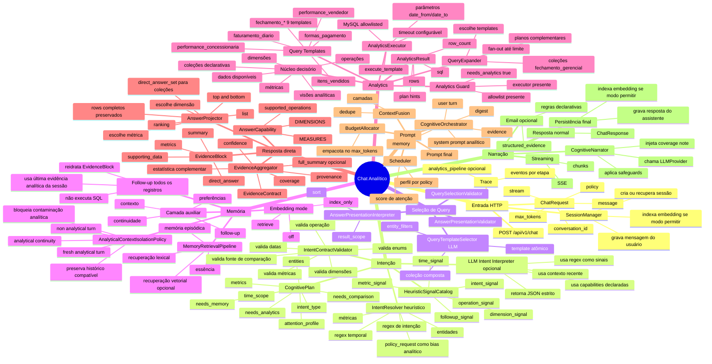
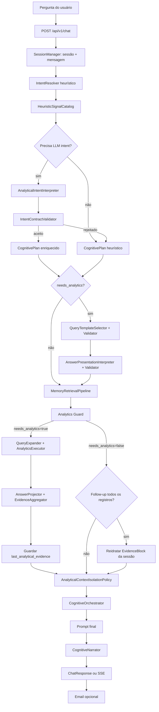
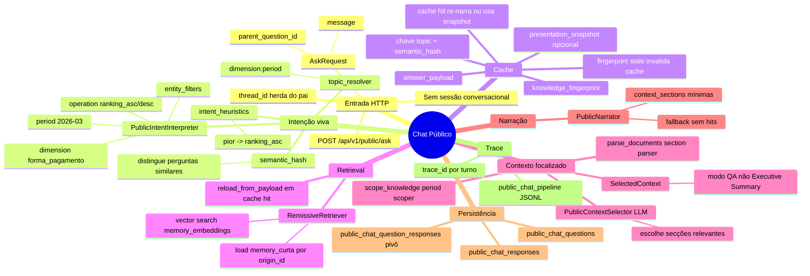
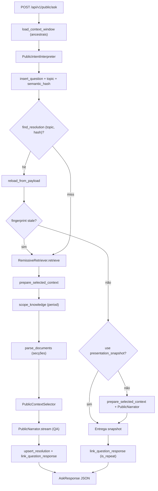

# Mapa Mental — Fluxo Ponta a Ponta do Orion MCP v3

Este documento mapeia os fluxos implementados até agora: da pergunta do usuário até a resposta final. Cobre o **Chat Analítico** (runtime cognitivo com MySQL), o **Chat Público** (consulta sobre conhecimento destilado) e a **Memória Remissiva V2** (rotina offline que alimenta o Chat Público).

## Dois Runtimes, Um Produto

O Orion MCP v3 expõe dois caminhos independentes montados na mesma app FastAPI:


| Runtime            | Entrada                   | Fonte de dados                                             | Sessão                                              |
| ------------------ | ------------------------- | ---------------------------------------------------------- | --------------------------------------------------- |
| **Chat Analítico** | `POST /api/v1/chat`       | MySQL (templates SQL allowlisted) + memória conversacional | `SessionManager` + `conversation_id`                |
| **Chat Público**   | `POST /api/v1/public/ask` | `memory_curta` via índice `memory_embeddings`              | Encadeamento por `parent_question_id` + `thread_id` |


A rotina `scripts/distill_supervised_memory.py` (Memória Remissiva V2) **não** participa do chat analítico em tempo real; ela materializa conhecimento validado nas tabelas `memory_`*, consumido depois pelo Chat Público.

## Premissa Arquitetural

O Orion MCP v3 é um runtime analítico cognitivo. No **Chat Analítico**, chat é interface de entrada e saída; memória é camada auxiliar de contexto e continuidade. O eixo principal é:

```text
pergunta → intenção → contrato validado → seleção de query → visão analítica
         → SQL controlado → evidência → contexto auxiliar → LLM narrador → resposta
```

No **Chat Público**, o eixo é consultivo — sem SQL, sem broker:

```text
pergunta → intenção viva → cache (topic, semantic_hash) → retrieval remissivo
         → preparação de documento → seleção de secções → LLM narrador QA → resposta
```

Em ambos os casos, a LLM pode ajudar a interpretar perguntas novas, mas a interpretação precisa virar contrato estruturado e validado. No chat analítico, a resposta final deve ser narrada a partir de `EvidenceBlock`, cobertura, proveniência e contexto de memória. No chat público, a resposta deve usar apenas secções de contexto seleccionadas — não o documento inteiro.

---

## Parte A — Chat Analítico (`POST /api/v1/chat`)

### Visão Mental




### Fluxo Principal




### 1. Entrada e Sessão

O fluxo começa em `POST /api/v1/chat`. A rota recebe uma `ChatRequest` com mensagem, política de atenção, limite de tokens, `conversation_id` e opção de streaming.

Possibilidades implementadas:

- Se `conversation_id` vier vazio, uma sessão nova é criada.
- Se `conversation_id` existir, a sessão é reutilizada.
- A mensagem do usuário é persistida antes de qualquer processamento.
- Se embeddings estiverem habilitados para indexação, o turno pode ser indexado em background lógico pelo `SessionManager`.
- Se `analytics_pipeline_trace` estiver ativo, cada etapa emite eventos JSONL.

### 2. Resolução de Intenção

A primeira leitura é heurística:

- `IntentResolver.resolve()` extrai sinais comparativos, temporais, analíticos, recall, monitoramento e execução.
- Datas explícitas viram `time_scope`, por exemplo `2026-03-01/2026-03-31`.
- `policy_request="analytical"` atua como bias quando a pergunta tem sinais de dados.
- Métricas e entidades são extraídas como hints.

Depois, os regex também viram sinais genéricos:

- `intent_signal`
- `time_signal`
- `metric_signal`
- `dimension_signal`
- `operation_signal`
- `followup_signal`

Se o caso for ambíguo, contextual, comparativo, follow-up ou houver memória analítica recente, entra o `AnalyticalIntentInterpreter`.

O interpretador LLM:

- recebe a pergunta;
- recebe contexto recente;
- recebe o catálogo seguro de capabilities;
- recebe sinais regex como evidência;
- retorna somente JSON;
- nunca gera SQL.

O `IntentContractValidator` só aceita o contrato se:

- `intent_type` é conhecido;
- `operation` é suportada;
- `metric` existe em alguma capability;
- `dimension` existe em alguma capability;
- datas ISO são válidas;
- comparação tem dois períodos ou fonte de memória suficiente.

Se a validação falha, o sistema volta para o `CognitivePlan` heurístico.

### 3. Seleção de Query e Apresentação

Quando `needs_analytics=True` e há LLM disponível, entra uma segunda camada de contrato **antes** da memória e do SQL:

**QueryTemplateSelector** (`query_select` no trace):

- recebe a pergunta, o `CognitivePlan` e o catálogo de capabilities (`query_cards`);
- pode escolher um **template atômico** (`selection_kind="template"`) ou uma **coleção composta** (`selection_kind="collection"`);
- retorna `template_slug`, `measure`, `dimension`, `operation` e `entity_filters`;
- o `QuerySelectionValidator` rejeita slugs ou operações fora do catálogo.

**AnswerPresentationInterpreter** (`answer_present` no trace):

- só roda quando a seleção de query foi aceita;
- define como apresentar o resultado: `result_scope` (ex. top N vs todos), `sort`;
- o `AnswerPresentationValidator` garante compatibilidade com a capability escolhida.

Os hints enriquecidos (`template_slug`, `collection_slug`, `intent_contract`, `entity_filters`, `result_scope`) fluem para o `QueryExpander` e o `AnswerProjector`.

### 4. Tipos de Intenção Implementados

O `CognitivePlan` pode representar:

- `analytical`: pergunta de dados, SQL/evidência normalmente necessários.
- `comparative`: comparação entre períodos, entidades ou histórico.
- `temporal`: pergunta centrada em período, mas nem sempre analítica sozinha.
- `recall`: recuperação de conversa/memória.
- `monitoring`: alerta, anomalia, monitoramento.
- `execution`: comando operacional/exportação/ação.
- `hybrid`: mistura de analytics + memória.
- `conversational`: conversa comum ou follow-up sem analytics.

Campos que controlam o resto do fluxo:

- `needs_analytics`
- `needs_memory`
- `needs_comparison`
- `needs_temporal_context`
- `needs_baseline`
- `needs_trend_analysis`
- `needs_entity_resolution`
- `confidence`
- `metrics`
- `entities`
- `time_scope`
- `attention_profile`

### 5. Memória

A recuperação de memória acontece antes do analytics porque o prompt final pode precisar de continuidade conversacional.

Camadas implementadas:

- summary/essence se existir;
- `SemanticRetriever` lexical;
- `VectorRetriever` se `embedding_mode=retrieve`;
- `EpisodicRetriever` para turnos recentes;
- dedupe e compressão.

Modos de embedding:

- `off`: sem indexação e sem recuperação vetorial.
- `index_only`: registra embeddings, mas não usa vector retrieval no chat.
- `retrieve`: indexa e recupera vetorialmente em paralelo ao lexical/episódico.

O vetor é opcional e não substitui o núcleo analítico.

### 6. Isolamento de Contexto Analítico

O `AnalyticalContextIsolationPolicy` evita que análises antigas contaminem perguntas novas.

Decisões implementadas:

- `analytical_fresh_turn`: pergunta analítica nova bloqueia memória analítica histórica e vector memory.
- `analytical_continuity`: comparação, recall analítico ou continuidade permite histórico compatível.
- `non_analytical_turn`: conversa comum preserva memória normal.

Compatibilidade analítica usa `AnalyticalSignature`:

- `template_slug`
- `measure`
- `dimension`
- `operation`
- `date_from`
- `date_to`
- `entities`

Para comparações, datas podem diferir se a forma analítica for compatível.

### 7. Follow-up “Todos os Registros”

Foi implementado um caminho especial para pedidos como:

```text
quero todos os registros!
lista completa
todos os registos
```

Comportamento:

- não executa SQL de novo;
- usa `session.extra["last_analytical_evidence"]`;
- lê o `direct_answer.rows` preservado no `ProjectedAnswer`;
- reidrata um novo `EvidenceBlock`;
- injeta esse bloco como evidência no prompt;
- mantém provenance, coverage, confidence e supporting data da evidência original.

Isso permite listar os registros já calculados, sem depender da narração anterior top 10 e sem consultar o banco novamente.

### 8. Analytics Guard

O analytics só roda quando:

- `cognitive_plan.needs_analytics=True`;
- `AnalyticsExecutor` está presente;
- `SqlAllowlist` está presente.

Se faltar algo:

- analytics é pulado;
- o motivo é registrado no trace;
- o sistema segue para memória/orquestração/narração.

Possíveis motivos:

- `needs_analytics=false`;
- `executor_ausente`;
- `allowlist_ausente`.

### 9. Query Expansion e Coleções

Quando analytics roda, `QueryExpander` tenta usar templates registrados.

**Templates atômicos** (auto-discovery em `broker/queries/`):

- `faturamento_diario`
- `formas_pagamento`
- `performance_concessionaria`
- `performance_vendedor`
- `itens_vendidos`

**Templates de fechamento gerencial** (9 slugs):

- `fechamento_faturamento_comissao_concessionaria_periodo`
- `fechamento_faturamento_comissao_tipo_os_concessionaria_periodo`
- `fechamento_producao_servico`
- `fechamento_producao_produto`
- `fechamento_faturamento_tipo_pagamento`
- `fechamento_faturamento_tipo_venda`
- `fechamento_faturamento_tipo_venda_produtos`
- `fechamento_parcelamento_cartao`
- `fechamento_taxas_cartao_credito`

**Coleção composta** (`ANALYTICS_COLLECTIONS`):

- `fechamento_gerencial_por_mes` — fan-out dos 9 templates acima, com `presentation_mode="sections"` e match por termos na pergunta.

O módulo `visao_executiva` foi removido; a visão por concessionária continua coberta por `performance_concessionaria`.

Possibilidades:

- se templates combinam, eles viram `SemanticQueryPlan` de template;
- se a coleção é selecionada, múltiplos templates executam em fan-out;
- se não combinam, pode cair para plano compilado;
- fan-out pode gerar múltiplos ângulos;
- o limite padrão impede explosão de planos.

Cada template declara:

- `SQL`
- `ANSWERS`
- `VALUE_KEY`
- `TIME_KEY`
- `GRAIN`
- `LABEL_KEY`
- `MEASURES`
- `DIMENSIONS`
- `SUPPORTED_OPERATIONS`
- `PARAMETERS`

### 10. Execução SQL

`AnalyticsExecutor.execute_template()` executa SQL parametrizado.

Regras implementadas:

- templates usam `%s` para parâmetros;
- `PARAMETERS` define a ordem dos valores;
- `DATE_FORMAT` usa `%%` para escapar `%` literal;
- SQL é pré-definido, não gerado por LLM;
- queries compiladas passam por allowlist;
- timeout MySQL configurável via `ORION_MYSQL_TIMEOUT` (padrão 30s).

Saída:

- `AnalyticsResult.plan`
- `AnalyticsResult.sql`
- `AnalyticsResult.rows`
- `AnalyticsResult.row_count`

### 11. Answer Capability

O `AnswerCapability` transforma colunas retornadas por SQL em capacidades semânticas.

Cada template pode responder várias perguntas porque declara:

- métricas disponíveis;
- dimensões disponíveis;
- sinônimos;
- medida padrão;
- dimensão padrão;
- operações suportadas.

Exemplo prático em `performance_concessionaria`:

- medida `vendas`;
- medida `recebido`;
- medida `ticket_medio_os`;
- medida `percentual_recebido`;
- dimensão `concessionaria`;
- dimensão `periodo`.

### 12. Answer Projector

O `AnswerProjector` escolhe:

- qual resultado SQL é mais compatível com a pergunta;
- qual métrica usar;
- qual dimensão usar;
- qual operação aplicar.

Operações implementadas:

- `ranking_desc`
- `ranking_asc`
- `top_and_bottom`
- `list`

Importante:

- o resumo pode mostrar apenas top 10;
- `ProjectedAnswer.rows` preserva todos os registros ordenados;
- isso alimenta o follow-up “todos os registros”;
- para coleções, produz `direct_answer_set` com secções por template;
- quando aplicável, persiste `full_summary` além do resumo escopado.

### 13. Evidence Aggregator e EvidenceContract

O `EvidenceAggregator` transforma resultados e projeção direta em `EvidenceBlock`.

Ele produz:

- resumo analítico;
- resposta direta em primeiro plano;
- estatística complementar;
- métricas;
- confidence;
- coverage;
- provenance;
- supporting data;
- `EvidenceContract` com `operational_confidence` (`data_coverage`, `aggregation_reliability`, `pipeline_integrity`, `narrative_confidence`).

Quando `ProjectedAnswer` existe:

- `direct_answer` entra em `supporting_data`;
- `answer_plan` entra em `metrics`;
- `full_summary` pode ser anexado quando difere do resumo escopado;
- a resposta direta fica antes do resumo complementar;
- o LLM recebe evidência objetiva já materializada.

O scoring de `data_coverage` considera volume de rows e cobertura temporal — não fica preso em valor fixo quando há dados suficientes.

### 14. Orquestração Cognitiva

`CognitiveOrchestrator.finalize_prompt()` monta o prompt final.

Camadas possíveis:

- system prompt analítico;
- turno do usuário;
- essence;
- evidence;
- digest;
- memory.

Depois:

- `ContextFusion` une camadas;
- scheduler ordena blocos;
- allocator aplica orçamento de tokens;
- `render_blocks_to_prompt()` gera o texto final.

### 15. Narração e Email

`CognitiveNarrator` chama o `LLMProvider`.

Possibilidades:

- resposta normal via `ChatResponse`;
- resposta streaming via SSE;
- provider real;
- `NullLLMProvider` em testes/degradação;
- safeguards quando não há evidência;
- coverage note quando há evidência/cobertura.

Safeguards comuns:

- `anti_hallucination_preamble`;
- `evidence_cited`;
- `coverage_note_injected`;
- `no_evidence`;
- `no_coverage_data`.

**Email opcional:** quando configurado, após a narração o sistema pode enviar a resposta por email, formatando `structured_evidence` com motor de regras declarativas (`LineRule`, `CollectionPrefixRule`, `NoteLineRule`).

### 16. Persistência Pós-Resposta

Depois da narração:

- resposta do assistente é persistida;
- fase da sessão volta para `IDLE`;
- uso de tokens e metadados são retornados;
- se embedding index estiver ativo, a resposta pode ser indexada.

Além disso:

- após analytics, `last_analytical_evidence` fica em memória de sessão;
- isso habilita follow-ups que reutilizam dados sem SQL novo.

### 17. Fluxos Alternativos (Chat Analítico)

#### Conversa Simples

```text
pergunta -> sessão -> intent conversational -> memória -> prompt -> narrador -> resposta
```

Não exige executor MySQL.

#### Pergunta Analítica Nova

```text
pergunta -> intent analytical -> query_select -> isolamento fresh -> SQL -> evidence -> prompt -> resposta
```

Memória analítica antiga é bloqueada para evitar contaminação.

#### Pergunta Analítica com LLM Intent

```text
pergunta ambígua -> heurística -> sinais regex -> LLM interpreter -> validator -> CognitivePlan -> query_select -> analytics
```

Se o contrato for rejeitado, volta para heurística.

#### Coleção Fechamento Gerencial

```text
pergunta "fechamento gerencial março" -> query_select collection -> fan-out 9 templates -> direct_answer_set -> prompt -> resposta
```

#### Comparação

```text
pergunta comparativa -> needs_comparison -> histórico compatível pode entrar -> analytics ou memória -> resposta
```

Datas podem diferir quando a forma analítica é a mesma.

#### Follow-up “Todos os Registros”

```text
pergunta -> needs_analytics false -> pega last_analytical_evidence -> reidrata EvidenceBlock -> prompt -> resposta
```

Não executa SQL novamente.

#### Sem Executor ou Allowlist

```text
pergunta analítica -> analytics_guard falha -> segue sem evidence -> narrador aplica no_evidence
```

#### Embeddings Desligados

```text
embedding_mode off -> sem vector -> memória episódica/lexical -> analytics continua normal
```

#### Streaming

```text
stream=true -> mesmo prompt -> narrate_stream -> SSE chunks -> grava texto final
```

---

## Parte B — Memória Remissiva V2 (offline)

Rotina independente que consolida conversas supervisionadas em índice remissivo vetorial. **Não altera** o runtime do chat analítico.

### Fluxo Diário

```text
cron → scripts/distill_supervised_memory.py
     → SupervisedConversationReader (conversation_state + chat_turn_embeddings)
     → LLM destilação (JSON: knowledge, essence, compression_log)
     → parse_distillation_payload (validação + filtros de qualidade)
     → RemissiveMemoryStore → memory_curta + memory_embeddings + memory_essence
```

### Modelo de Dados


| Tabela                   | Função                                                                       |
| ------------------------ | ---------------------------------------------------------------------------- |
| `memory_curta`           | Conteúdo validado (resposta consolidada, métricas); upsert por `context_key` |
| `memory_embeddings`      | Índice N:M — perguntas curtas vetorizadas apontando para `origin_id`         |
| `memory_essence`         | Achados estáveis por `(user_id, theme)`                                      |
| `memory_compression_log` | Auditoria por `batch_key` idempotente                                        |


A `context_key` é calculada localmente (`{user_id}:{category}:{theme}[:{periodo}]`), nunca confiada no LLM.

### Separação

- Entrada: `conversation_state`, `chat_turn_embeddings` (read-only).
- Saída: tabelas `memory_*`.
- Consumidor planejado: **Chat Público** via `RemissiveRetriever`.

---

## Parte C — Chat Público (`POST /api/v1/public/ask`)

Módulo **totalmente isolado** em `src/orion_mcp_v3/public_chat/`. Consulta exclusivamente conhecimento validado em `memory_`* — sem broker, sem MySQL, sem `SessionManager`.

Montado via `mount_public_chat()` em `create_app()`. Ativo quando `PUBLIC_CHAT_ENABLED=true` e credenciais válidas.

### Visão Mental




### Fluxo Principal




### Encadeamento (sem sessão)

```text
POST /api/v1/public/ask { message, parent_question_id? }
```

- Raiz: `parent_question_id=NULL`, `thread_id=question.id`.
- Follow-up herda `thread_id` do pai.
- Janela de contexto: até `PUBLIC_CHAT_CONTEXT_DEPTH` turnos ancestrais para enriquecer intent.

### Intenção Viva (Fase 4A)

O `IntentContract` do Chat Público inclui campos que evitam colisão de cache e orientam o contexto:

- `intent`: `consulta_metrica`, `comparacao`, `recall`, `geral`
- `operation`: `ranking_asc`, `ranking_desc`, `list`, `summary`, `comparison`
- `dimension`: ex. `forma_pagamento`, `concessionaria`
- `period`: ex. `2026-03`
- `metric`, `domain`, `entity_filters`, `confidence`

Heurísticas locais (`intent_heuristics`) enriquecem o contrato — ex.: “pior” mapeia para `ranking_asc`.

O `topic` deriva deterministicamente do contrato (`dimension:period`, `metric:period`, etc.). O `semantic_hash` distingue perguntas semanticamente diferentes dentro do mesmo tópico.

### Contexto Focalizado (Fases 4B–4D)

Problema resolvido: documentos multi-secção (ex. fechamento mensal) não vão inteiros ao narrador.

Pipeline `prepare_selected_context()`:

1. **Period scoper** (`scope_knowledge`) — filtra hits ao período do contrato; degrada graciosamente se nenhum match exato.
2. **Section parser** (`parse_documents`) — divide texto validado em secções (headers `##` ou padrão `Título:`).
3. **Context selector** (`PublicContextSelector`) — LLM escolhe secções relevantes à pergunta literal.
4. **Narrator QA** (`PublicNarrator`) — responde à pergunta sobre `context_sections` mínimas, não resume o documento inteiro.

Exemplo validado em log (`public_chat_pipeline_20260618T181945Z.jsonl`): *"qual a forma de pagamento foi menos usada em março de 2026?"*

- Intent: `operation=ranking_asc`, `dimension=forma_pagamento`, `period=2026-03`, `topic=forma_pagamento:2026-03`
- Scoper: `hit_count` 5 → 1 (só março/2026), `scope_degraded=false`
- Parser: quando o texto destilado não tem headers reconhecíveis, cai em secção única `"documento"` (`section_count=1`) — nesse caso o selector não reduz caracteres (6320 → 6320)
- Narrator: resposta literal — Depósito Bancário R$ 3.690,00; nota Cheque/Permuta zerados (151 chars, sem resumo executivo de Cartão)

Pergunta complementar no mesmo log (*"mais usada"*): mesmo `topic`, `semantic_hash` diferente (`ranking_desc` vs `ranking_asc`) → cache miss separado → Cartão de Crédito R$ 1.352.045,28

### Cache (Fase 3)

Resoluções cacheadas por `(topic, semantic_hash)`:

- **Cache hit:** recarrega `answer_payload`, verifica `knowledge_fingerprint`; se stale, trata como miss parcial.
- **Presentation snapshot:** se fingerprint válido e snapshot existe, entrega texto cacheado sem re-narrar.
- **Cache miss:** retrieval + contexto focalizado + narração + `upsert_resolution`.
- Cada pergunta é persistida; pivô `public_chat_question_responses` audita `presentation_delivered` e `is_repeat`.

### Fluxos Alternativos (Chat Público)

#### Sem conhecimento validado

```text
pergunta -> retrieval vazio -> selector degraded -> narrator fallback "Não encontrei informações validadas"
```

#### Cache hit com re-narração

```text
pergunta -> cache hit -> fingerprint ok -> prepare_selected_context -> PublicNarrator -> resposta fresca
```

#### Follow-up encadeado

```text
pergunta + parent_question_id -> context_window -> intent enriquecido -> mesmo fluxo cache/retrieval
```

#### Runtime indisponível

```text
PUBLIC_CHAT_ENABLED=false ou credenciais ausentes -> 503 Public chat unavailable
```

---

## Ordem de Prioridade Cognitiva (Chat Analítico)

O fluxo analítico segue esta prioridade:

```text
system/instruções
  > pergunta atual
  > evidência analítica atual
  > evidência reidratada de follow-up
  > memória compatível
  > memória conversacional comum
  > vector memory opcional
```

Essa ordem protege o núcleo analítico contra respostas baseadas em memória antiga ou embeddings soltos.

---

## Pontos de Observabilidade

### Chat Analítico (`analytics_pipeline`)

Ordem típica observada em log (`analytics_pipeline_20260616T181917Z.jsonl`):

- `intent_resolve` → `intent_interpret` → `query_select` → `answer_present`
- `period_gate` (resolução/herança de `date_from`/`date_to`)
- `memory_retrieve` → `analytics_guard` → `analytics_expand` → `semantic_plan`
- `analytics_execute[0..N]` (uma etapa indexada por plano SQL; fan-out de coleção gera N=9)
- `analytics_merge` → `answer_project` → `analytics_outcome` → `evidence_contract`
- `context_isolation` → `analytical_reasoner` → `cognitive_orchestrate`
- `narrate` (ou `narrate_stream` se `stream=true`)
- `email_delivery` (`sent` / `failed` / `not_requested`)

### Chat Público (`public_chat_pipeline`)

Ordem típica observada em log (`public_chat_pipeline_20260618T181945Z.jsonl`):

- `integration.mount` / `integration.runner_init`
- `api.ask` (correlacionado por `trace_id`)
- `runner.turn` → `context_window.load` → `intent.interpret` → `runner.intent_persisted`
- `cache.resolution` → `runner.cache_hit` ou `runner.cache_miss`
- `retriever.retrieve` → `reader.search_origin_ids` (IVFFlat, `probes=10`, `limit=5`) → `reader.load_hits`
- `memory.accessed`
- `knowledge.scope` → `section.parse` → `selector.select`
- `narrator.stream` → `cache.stored` → `qa.turn_summary`
- Ramo cache hit (não presente neste log): `retriever.reload_from_payload`, `runner.fingerprint_stale`, `runner.presentation_snapshot`

Esses eventos permitem diagnosticar qual pipeline rodou, se cache hit/miss ocorreu, quais secções foram seleccionadas e se o narrador recebeu evidência ou contexto focalizado.

---

## Resumo Executivo

O Orion hoje opera como **dois runtimes complementares**:

**Chat Analítico** — runtime cognitivo com SQL controlado:

```text
pergunta
  -> intenção
  -> contrato validado
  -> seleção de query/apresentação
  -> memória isolada
  -> analytics seguro (templates + coleções)
  -> resposta direta + EvidenceContract
  -> prompt governado por atenção
  -> narração final (+ email opcional)
```

**Chat Público** — consulta sobre conhecimento destilado:

```text
pergunta
  -> intenção viva (operation, dimension, period)
  -> cache (topic, semantic_hash)
  -> retrieval remissivo (memory_embeddings → memory_curta)
  -> contexto focalizado (scoper → parser → selector)
  -> narração QA
```

**Memória Remissiva V2** — ponte offline:

```text
conversas supervisionadas → destilação LLM → memory_* → alimenta Chat Público
```

O fluxo mais importante do chat analítico: o LLM não decide SQL nem inventa coluna; ele narra uma resposta construída por contratos, capabilities, validação, evidência e provenance.

O fluxo mais importante do chat público: o LLM não recebe relatórios inteiros; ele responde perguntas literais sobre secções seleccionadas de conhecimento previamente validado por especialistas.