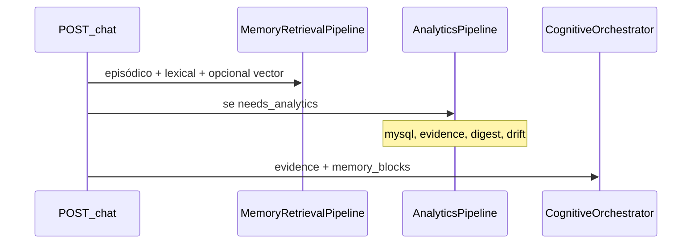

# Memory Augmentation Layer (experimental)

**Papel:** subsistema **opcional** de recuperação conversacional por similaridade vectorial. **Não** faz parte do núcleo cognitivo analítico do Orion.

**Índice mestre:** [`ORION_V3_MASTER_ARCHITECTURE.md`](./ORION_V3_MASTER_ARCHITECTURE.md).

---

## Posição na arquitectura

```text
Core (obrigatório):  dados → evidência → cognição → contexto LLM
Optional:            Memory Augmentation (pgvector, chat_turn_embeddings)
```

O valor diferenciador do projeto está no **runtime analítico** (planner, `SemanticQueryPlan`, MySQL, evidence builder, digest, provenance, drift guard) e na **orquestração** (`CognitiveOrchestrator`, attention policy, allocator). Os embeddings servem apenas para **continuidade conversacional** em sessões longas.

---

## O que embeddings MAY fazer

- Recuperar turnos antigos relevantes na **mesma sessão** (`chat_turn_embeddings` + `VectorRetriever`).
- Ajudar continuidade conversacional quando o histórico episódico/lexical não basta.
- Correr com flag explícita (`ORION_EMBEDDING_MODE`) e **degradar** para episódico + lexical se falharem (API, Postgres, migração em falta).

---

## O que embeddings MUST NOT fazer

- Influenciar `SemanticQueryPlan`, SQL, planner, reducers, evidence builder, provenance ou attention policy.
- Ser pré-requisito do `POST /api/v1/chat`.
- Substituir o pipeline analítico em intents `analytical`.
- Entrar em `broker/` (nenhum import de `memory/chat_turn_*` ou `providers/openai_embedding` no broker).

---

## Modos de operação (`ORION_EMBEDDING_MODE`)

| Modo | Indexação (após cada mensagem) | Retrieval vectorial no chat |
|------|--------------------------------|-----------------------------|
| `off` (default) | Não | Não |
| `index_only` | Sim | Não |
| `retrieve` | Sim | Sim (em **paralelo** com `SemanticRetriever`, nunca em substituição) |

Compatibilidade: `ORION_EMBEDDING_ENABLED=true` sem `EMBEDDING_MODE` equivale a `retrieve` (com aviso em log).

---

## Módulos e migrações (experimental — congelado)

| Componente | Caminho |
|------------|---------|
| Tabela | `007_chat_turn_embeddings.sql`, `008_chat_turn_embeddings_content.sql` |
| Store | `memory/chat_turn_embedding_store.py` |
| Retriever | `memory/vector_retriever.py` |
| Pipeline | `memory/retrieval_pipeline.py` (vector é uma camada entre episódico e composer) |
| Provider | `providers/openai_embedding.py` |

**Congelamento:** não expandir para embedding-centric orchestration, vector no planner/composer, ou writer para `memory_embeddings` (003) sem caso de uso analítico explícito.

---

## Fluxo num turno de chat



A indexação vectorial corre no `SessionManager` **após** persistir mensagem, independentemente do modo `retrieve`.

---

## Prioridades de evolução (fora desta camada)

1. Planner: `intent → analytical strategy`
2. `SemanticQueryPlan` + compiler
3. Evidence builder + provenance/drift

Ver [`PLANO_EXECUCAO.md`](../execution/PLANO_EXECUCAO.md) e [`ARQUITETURA_COGNITIVA_CENTRAL.md`](./ARQUITETURA_COGNITIVA_CENTRAL.md).
