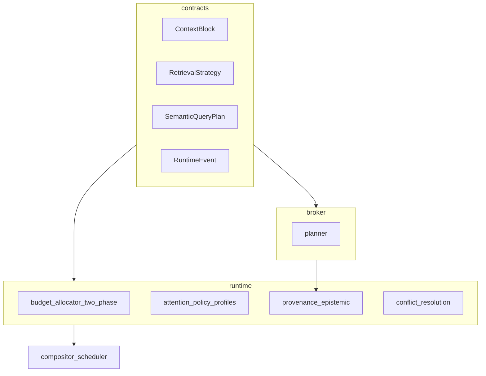

## Papel deste documento no ecossistema Orion v3

Este ficheiro é o **roadmap técnico incremental**: responde *«o que implementar primeiro?»* — ordem de trabalho, contratos estáveis antes de pipelines pesados, milestones e **testes de fluxo cognitivo**.

**Não substitui:**

| Documento | Papel |
|-----------|--------|
| [`ROADMAP_COM_MYSQL_INTEGRADO.md`](../roadmaps/ROADMAP_COM_MYSQL_INTEGRADO.md) | Pipeline analytics + dados reais no runtime (SQL seguro, executor, integração). |
| [`ARQUITETURA_COGNITIVA_CENTRAL.md`](../architecture/ARQUITETURA_COGNITIVA_CENTRAL.md) | Camada cognitiva superior — intenção, evidência, fusão de contexto, orquestração. |

**Índice mestre:** [`ORION_V3_MASTER_ARCHITECTURE.md`](../architecture/ORION_V3_MASTER_ARCHITECTURE.md).

---

# Plano: Cognitive Context Infrastructure — `orion_mcp_v3`

## Posicionamento

O pacote deixa de ser “framework MCP com memória” e converge para **infraestrutura de contexto cognitivo**: uma **RFC coerente** com governança explícita, separação de responsabilidades, formalização do contexto, política de atenção, estado e prevenção de **colapso sistémico** quando múltiplos produtores competem pelo mesmo orçamento.

**Tese:** o gargalo é **atenção / tokens**, não storage.

| Problema | Direcção de solução no plano |
|----------|------------------------------|
| Escassez de tokens | `ContextBudgetAllocator` (2 fases) |
| Sobrecarga semântica | Broker + digest + planner |
| Deriva / alucinação | Provenance + epistemologia separada |
| Colapso de memória | `runtime/` + conflitos |
| Alocação de atenção | Compositor + scheduler + perfis |
| Retrieval inseguro | DSL + `RetrievalStrategy` + validação |
| Competição entre blocos | Políticas + scores + reserva rígida |

---

## Estado actual no repositório

- **[`connection_hub`](../../src/orion_mcp_v3/connection_hub/)**
- **[Migrações Postgres](../../src/orion_mcp_v3/infra/postgres/migrations/)**
- **[Redis](../../src/orion_mcp_v3/infra/redis/MEMORY_KEYSPACE.md)**
- **[COMO_GEMINI_FUNCIONA.md](../guides/COMO_GEMINI_FUNCIONA.md)**

---

## Separação memória conversacional × digest analítico

| Tipo | Natureza |
|------|----------|
| Memória conversacional | Cognitiva |
| Digest analítico | Computacional |

`ContextBlock.source` + `semantic_role` clarificam o tipo de unidade.

---

## Prioridade ABSOLUTA — contratos antes de pipelines profundos

**Risco identificado:** implementar demasiada infraestrutura antes dos **contratos** estáveis → deriva semântica entre módulos.

**Ordem mandatória (fase “Contratos + fluxo cognitivo”):**

1. **`ContextBlock`** completo (incl. `semantic_role`).
2. **Tipos de proveniência** + **metadados epistémicos** (secção abaixo).
3. **`RuntimeEvent`** tipado (sem obrigar event bus).
4. **`SemanticQueryPlan`** + **`RetrievalStrategy`** (contratos JSON-friendly).
5. **`ContextBudgetAllocator` MVP** (2 fases + elasticidade por faixa).
6. **Testes de fluxo cognitivo** — orçamento, blocos competindo, provenance mínima — **antes** de pipelines completos de memória/broker.

Só depois: repositório literal, pipelines Postgres/Redis, broker pesado, map-reduce completo.

---

## 1. Pasta `contracts/` (ou `schemas/`)

Formalizar **antes** da proliferação de implementações:

- `ContextBlock` (+ `SemanticRole`, limites por role).
- `ProvenanceRecord` / âncoras de derivação.
- `EpistemicMetadata` (`epistemic_confidence`, `observability_score`, `coverage_score`).
- `SemanticQueryPlan` (métricas, filtros, group_by).
- `RetrievalStrategy` (estratégia de recuperação **≠** só query — ver secção Planner).
- `AnalyticalDigest` (campos digest + ligação a provenance).
- `RuntimeEvent` + variantes/carga útil.

Objetivo: **uma semântica estável** entre `runtime/`, `broker/`, `memory/` e testes.

---

## 2. `ContextBlock` — papel semântico (`semantic_role`)

Para além de `source`, cada bloco nasce com **`semantic_role`** (enum), por exemplo:

- `FACT`, `INSIGHT`, `EVIDENCE`, `INSTRUCTION`, `SCHEMA`, `TOOL_RESULT`, `SUMMARY`.

**Utilidade futura imediata:**

- Algumas roles **não podem ser comprimidas** ou **descartadas** sem política explícita.
- Algumas exigem **provenance obrigatória** (ex.: `INSIGHT` derivado de digest).

Isto evita caos quando orçamento, scheduler e compressão operam sobre a mesma unidade formal.

---

## 3. Provenance ≠ confiança epistémica

**Provenance** = infraestrutural — **de onde veio**, cadeia de derivação, âncoras (`source_refs`, `aggregation_logic`, cobertura amostral).

**Epistemologia** = **o quanto devemos crer no conteúdo**, dado o processo e a cobertura.

Exemplos válidos:

- **Alta proveniência, baixa confiança epistémica** — amostra pequena mas totalmente rastreável.
- **Alta confiança epistémica, baixa proveniência** — heurística ou resumo “mole” sem cadeia fina.

Campos sugeridos em `EpistemicMetadata` (ou em `ContextBlock`):

- `epistemic_confidence`
- `observability_score` (quão “visível” é o raciocínio / dados subjacentes)
- `coverage_score` (quão representativo é o conjunto face ao universo)

---

## 4. `ContextBudgetAllocator` — duas fases + elasticidade

Continua **separado** do compositor (composição ≠ atenção ≠ truncagem).

### Phase 1 — reserva rígida (*hard reservation*)

Garante capacidade mínima para:

- instruções de sistema,
- essência / regras estáveis,
- instruções críticas de segurança ou formato.

Evita que embeddings ou digest **expulsem** o núcleo não negociável.

### Phase 2 — alocação competitiva

O restante do orçamento disputa-se entre, tipicamente:

- digest analítico,
- embeddings,
- literal recente,
- resumo curto — conforme política e scores.

### Por bloco / faixa

Campos recomendados para estabilidade:

- `reserved_tokens`, `min_tokens`, `max_tokens`, `elasticity` (ajuste quando há folga ou pressão).

---

## 5. Planner: `SemanticQueryPlan` + `RetrievalStrategy`

O planner não deve produzir **apenas** um plano de métricas/filtros. Deve também emitir uma **`RetrievalStrategy`** — *query* e *retrieval* não são a mesma coisa.

Exemplo ilustrativo:

```json
{
  "strategy": "trend_analysis",
  "aggregation": "monthly",
  "sampling": "outliers_plus_recent",
  "compression": "semantic_map_reduce"
}
```

**Leitura em três camadas** (conceptual; podem partilhar módulos):

- **Query planner** — o que pedir ao DB (DSL / SQL compilado).
- **Retrieval planner** — como amostrar, agregar e comprimir (`RetrievalStrategy`).
- **Context planner** — como encaixa no orçamento global (alinhado a `BudgetAllocator` + compositor).

### DSL — tipos de intenção

O plano semântico / DSL deve distinguir pelo menos:

| Tipo | Exemplo de uso |
|------|----------------|
| retrieval | buscar dados |
| analytical | agregar |
| exploratory | descobrir padrões |
| operational | executar acção (com políticas de segurança) |

O comportamento do planner **muda** por tipo.

---

## 6. `RuntimeEvent` (cognição orientada a eventos — MVP tipado)

Para evitar refactor massivo quando surgir event bus:

Definir desde já **`RuntimeEvent`** tipado, por exemplo:

- `digest_created`
- `memory_promoted`
- `budget_exceeded`
- `conflict_detected`

**Sem** obrigar fila ou broker de eventos na primeira entrega — apenas contrato + pontos de emissão opcionais.

Direcção futura: **blackboard / produtores múltiplos** — vários módulos escrevem no estado partilhado; um scheduler central resolve competição (documentar em `docs/` como analogia arquitectural, não como implementação completa v3).

---

## 7. Compositor = **Attention Allocator**

MVP: ordem fixa + digest + salvaguardas (como já na RFC).

**Evolução:** scheduler por score com:

- `relevance`, `recency`, `reliability`, `user_focus`, `compression_value`
- **`novelty_score`** e **`redundancy_score`** — evitar embeddings duplicados, digests redundantes e summaries repetidos a consumir orçamento.

**Prioridade semântica instável** (digest recente vs essence crítica vs literal emocional) mitigada por **`AttentionPolicy` profiles** — não apenas uma política fixa.

Perfis sugeridos (pesos diferentes no scheduler):

- `ANALYTICAL`
- `CONVERSATIONAL`
- `EXECUTION`
- `PLANNING`
- `MEMORY_RECALL`

---

## 8. Map-reduce, drift e provenance

Manter mitigação de **summary drift** com âncoras; enriquecer com **epistemic** para não confundir “bem rastreado” com “estatisticamente sólido”.

---

## 9. Camada `runtime/`

| Módulo | Papel |
|--------|--------|
| `context_state.py` | Estado da sessão cognitiva |
| `attention_policy.py` | Perfis + pesos |
| `budget_allocator.py` | 2 fases + elasticidade |
| `conflict_resolution.py` | Competição digest vs literal vs essence |
| `provenance.py` | Tipos de âncora + validação |

Integração opcional com **`RuntimeEvent`**.

---

## 10. Essência — governança

Inalterado no essencial: sem autopromoção agressiva; campos `promotion_*`, `decay_score`, validação humana opcional.

---

## 11. Riscos (actualizado)

| Risco | Mitigação |
|-------|-----------|
| Prioridade semântica implícita | Perfis `AttentionPolicy` + scheduler |
| Redundância no prompt | `novelty_score` / `redundancy_score` |
| Infra antes de contratos | Fase **contracts first** + testes cognitivos |
| Confundir rastreio com verdade | Provenance vs epistemic |

---

## 12. Evolução: Context Graph Runtime (v4)

Provenance / relevância / derivação / tempo / atenção como **arestas** — roadmap explícito; **não** fecho do v3.

---

## Diagrama (alto nível)



---

## Tarefas de implementação (resumo)

1. **`contracts/`** — todos os tipos estáveis.  
2. **`ContextBlock` + `SemanticRole`**.  
3. **Provenance + EpistemicMetadata**.  
4. **`RuntimeEvent`**.  
5. **`SemanticQueryPlan` + `RetrievalStrategy`**.  
6. **`ContextBudgetAllocator`** (2 fases, elasticidade).  
7. **Testes de fluxo cognitivo**.  
8. **`runtime/`** (estado, políticas, conflitos).  
9. **Broker** (planner + agregação + sampling + reducers).  
10. **Pipelines memória**, map-reduce, compositor evolutivo.  
11. **DSL compiler** por tipo de intenção.  
12. **Docs** (Blackboard, event-driven roadmap, grafo v4).  
13. **Exports, README, testes**.

---

## Fases de execução (reordenadas)

- **Fase C0 — Contratos:** `contracts/` + tipos acima.  
- **Fase C1 — Orçamento + eventos:** BudgetAllocator MVP + `RuntimeEvent`.  
- **Fase C2 — Testes cognitivos:** fluxos mínimos competindo por tokens.  
- **Fase M1 — Memória literal e camadas** (Postgres/Redis).  
- **Fase M2 — Broker + RetrievalStrategy + DSL.**  
- **Fase M3 — Destilação + compositor + scheduler avançado.**

### Pontes cognitivas (sem remover C0–M3)

Estas fases **acrescentam checkpoints** alinhados a [`ARQUITETURA_COGNITIVA_CENTRAL.md`](../architecture/ARQUITETURA_COGNITIVA_CENTRAL.md); mantêm incrementalismo e entregas testáveis.

| Fase | Nome | Objetivo |
|------|------|----------|
| **Fase 2.5 — Cognitive Foundation** | Contratos e resolvedores mínimos para separar *entendimento* de *execução* (`CognitivePlan`, `IntentResolver`, ligação a `SemanticQueryPlan`). | Evoluir de *digest mecânico* para *evidência endereçável*. |
| **Fase 5.5 — Cognitive Orchestrator** | `ContextFusion` + política de turno: evidência analítica + memória conversacional + `allocate` sob uma orquestração explícita. | Fechar *pergunta → evidência → contexto LLM* sem abandonar SQL nem milestones. |

Dependências típicas: **2.5** após C2 e contratos base; **5.5** após broker/runtime estáveis (M2+) e integração descrita no roadmap MySQL.

---

## Notas de âmbito

- Tudo sob a raiz deste pacote ([`../../`](../../)) — código em [`src/orion_mcp_v3/`](../../src/orion_mcp_v3/).  
- Coerência cognitiva depende mais de **contratos + governança** do que de quantidade de features.  
- **v3** = fundação; **Context Graph** = evolução documentada.
