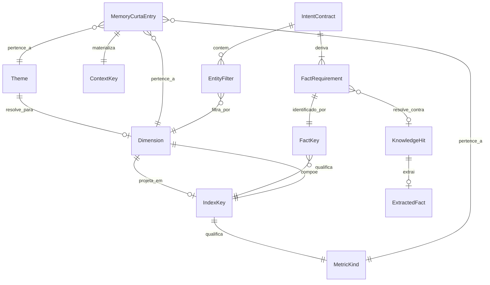
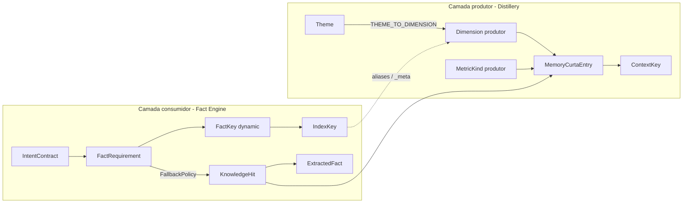

# Ontologia Orion

Documento vivo das entidades e relações do analytics cognitivo remissivo.
Descreve a **estrutura** verificável no código — não substitui os catálogos
existentes (`scripts/distillery/catalog.py`,
`public_chat/domain/key_metrics_contract.py`, YAMLs de memória/semântica).

**Escopo:** pipeline `chat_public` + destilação (`distillery`) +
`memory_curta`. O broker MySQL fica fora deste documento.

**Camadas de vocabulário:**

| Camada | Papel | Fonte |
|--------|-------|-------|
| **Produtor** | Slugs gravados em `memory_curta` (`dimension`, `metric_kind`) | `scripts/distillery/catalog.py` |
| **Consumidor** | Vocabulário do Fact Engine / `_meta` de `key_metrics` | `public_chat/domain/key_metrics_contract.py` |
| **Ponte** | Aliases e maps `THEME_TO_*` / `METRIC_KIND_ALIASES` | Ambos os módulos acima |

---

## 1. Entidades

| Nome canônico | Definição (negócio) | Atributos obrigatórios | Identificador único | Onde é definida | Catálogo / fonte de verdade | Aliases e normalização |
|---|---|---|---|---|---|---|
| **Dimension** | Eixo analítico sob o qual um valor é cortado (ex.: por forma de pagamento). | `slug: str` | slug canônico | Produtor: `DIMENSION_CANONICAL` em `scripts/distillery/catalog.py`. Consumidor: labels em `CANONICAL_INDEX_META` / `DIMENSION_ALIASES` em `key_metrics_contract.py`. | Dual — ver § camadas. Resolução: `resolve_dimension()` (produtor), `_normalize_dimension()` (consumidor). | Produtor: `DIMENSION_ALIASES` + prioridade `THEME_TO_DIMENSION`. Consumidor: `DIMENSION_ALIASES` (tuple de sinônimos → label de `_meta`). |
| **MetricKind** | Tipo de medida de negócio (faturamento, comissão, taxa, …). | `slug: str` | slug canônico | Produtor: `METRIC_KIND_CANONICAL`. Consumidor: `METRIC_KINDS` (`revenue`, `commission`, `share`, `count`, `rate`). | Dual. Resolução: `resolve_metric_kind()` / `METRIC_KIND_ALIASES`. | Ex.: `receita`→`faturamento` (produtor); `faturamento`↔`revenue` (ponte consumidor). |
| **Theme** | Tema remissivo que agrupa uma entrada de memória (ex.: formas de pagamento). | `slug: str` | slug do tema | `THEME_TO_DIMENSION` (produtor); themes em `public_chat/config/memory_catalog.yaml`; `THEME_TO_INDEX_KEY` (consumidor). | `memory_catalog.yaml` (elegibilidade de resolução); `THEME_TO_DIMENSION` (correção de dimension). | Slug via `slugify_memory_label()` quando entra em `context_key`. |
| **IndexKey** | Chave de índice dentro de `key_metrics` que aponta para uma série/lista analítica. | `key: str`; `_meta` com `dimension`, `metric_kind`, `entity_field`, `value_field`, `schema` | string da chave | `CANONICAL_INDEX_META` em `key_metrics_contract.py`; índice runtime `KeyMetricsIndexEntry` em `key_metrics_introspection.py`. | `CANONICAL_INDEX_META` + maps `DIMENSION_TO_INDEX_KEY` / `THEME_TO_INDEX_KEY`. | `TODO: revisar catálogo` — `DIMENSION_TO_INDEX_KEY` diverge entre produtor (`comissao_por_concessionaria` para `por_concessionaria`) e consumidor (`faturamento_e_comissao_por_concessionaria`). |
| **FactKey** | Identificador composicional do fato pedido/resolvido no turno. | string com gramática `dynamic:` (hot path) | a própria string | Construção: `entity_scoped_fact_key` / `period_scoped_fact_key` em `key_metrics_introspection.py`. Modelo de uso: `FactRequirement.fact_key`. | Hot path: índices presentes nos hits + `CANONICAL_INDEX_META`. Legado estático: `fact_semantics.yaml` / `memory_catalog.yaml` (nota abaixo). | Entity segment: `entity_slug()`. Period: concatenado com `@`. |
| **ContextKey** | Identidade determinística de uma entrada materializada em `memory_curta`. | segmentos derivados de `user_id`, `category`, `theme`, `periodo?` | `user_id:slug(category):slug(theme)[:period_slug]` | `build_context_key()` em `memory/remissive_models.py` | Fórmula em código; UNIQUE na tabela `memory_curta`. | `slugify_memory_label` (NFKD→ASCII) + `_period_slug`. |
| **MemoryCurtaEntry** | Uma resposta analítica validada — **exatamente uma dimensão** por entrada. | `user_id`, `category`, `context_key`, `validated_answer`; opcionais: `metric_kind`, `dimension`, `key_metrics`, … | `context_key` | Dataclass `RemissiveKnowledgeItem` (`remissive_models.py`); persistência `RemissiveMemoryStore` / tabela `memory_curta`. | Colunas `metric_kind`/`dimension` (migração `015_…`); regra de granularidade no prompt do distillery. | Dimension/metric_kind normalizados na destilação. |
| **IntentContract** | Intenção tipada do usuário no turno público (métrica, período, operação, filtros). | `intent: str`; demais opcionais (`metric`, `period`, `dimension`, `operation`, `entity_filters`, …) | — (por turno) | `public_chat/domain/intent_contract.py` | Heurísticas + LLM interpreter; enums `PublicIntentType` / `PublicOperationType`. | — |
| **EntityFilter** | Filtro de escopo ou entidade na intenção (`dimension` + `value`). | `dimension: str`, `value: str`, `match: str` (default `contains`) | — | `intent_contract.py` | Validado contra `key_metrics_scope_axes` / schema do índice em `partition_scope_entities`. | Dimension normalizada via aliases do consumidor. |
| **FactRequirement** | Pedido resolvível: o que o Fact Engine deve buscar na memória remissiva. | `fact_key`, `semantics: FactSemantics`; opcionais `metric`, `dimension`, `entity`, `period`, `matched_key`, `scope_entities`, `discarded_scope`, … | `fact_key` (no plano) | `fact_engine/models.py`; fábrica `build_dynamic_requirement()` | Semântica inline no hot path; legado via `FactSemanticsCatalog`. | — |
| **KnowledgeHit** | Trecho de `memory_curta` recuperado para o turno. | `origin_id: int`, `context_key`, `category`, `validated_answer`, `key_metrics` | `origin_id` | `public_chat/domain/knowledge.py` | Somente tabelas remissivas (`PublicRemissiveReader` / retriever). | — |
| **ExtractedFact** | Valor factual extraído de um hit para o narrador. | `fact_key`, `label`, `value`, `fact_type`, `confidence`, `origin_id`, `context_key`, `trace` | `fact_key` + `origin_id` | `fact_engine/models.py`; `FactExtractor` | Prioridade `SourcePriority` em `FactSemantics`. | — |

### Nota de legado — FactKeys estáticas

O hot path atual gera **`dynamic:`** via `build_dynamic_requirement`. Nomes
estáticos (ex.: `faturamento_total_periodo`) e o YAML
`public_chat/config/fact_semantics.yaml` permanecem como contrato paralelo /
legado (`themes_for_fact` no `memory_catalog.yaml`). Não são a gramática
canônica deste documento.

### Entidades que **não** existem como classes de domínio

Não há no código entidades tipadas `Dealership`, `Vehicle`, `ServiceRecord`,
nem classes `Dimension`/`MetricKind`/`FactKey`. Concessionária, serviço,
produto, etc. aparecem como **labels de dimensão / entity_field** nos
catálogos e em `_meta`.

---

## 2. Relações

| Nome | Origem → Destino | Card. | Validação e estágio do pipeline | Exemplo |
|---|---|---|---|---|
| `resolve_para` | Theme → Dimension | N:1 | `THEME_TO_DIMENSION` tem prioridade sobre alias/canônico em `resolve_dimension()` — **Distillery**. | `formas_de_pagamento` → `por_forma_pagamento` |
| `projeta_em` | Dimension → IndexKey | N:1 | `DIMENSION_TO_INDEX_KEY` (produtor e consumidor). **TODO:** alinhar divergência em `por_concessionaria`. — Distillery + enrich/consumer. | `por_forma_pagamento` → `faturamento_por_tipo_de_pagamento` |
| `qualifica` | IndexKey → (Dimension, MetricKind, entity_field, …) | 1:1 | `CANONICAL_INDEX_META` / `_meta` no payload `key_metrics`. — Enrich distillery + introspecção Fact Engine. | `faturamento_por_tipo_de_pagamento` → dim `forma_pagamento`, kind `revenue` |
| `compõe` | FactKey → IndexKey [+ Entity + Period] | 1:1 (+ quals 0..1) | Gramática `dynamic:` em `entity_scoped_fact_key` / `period_scoped_fact_key`. — **FactPlanner** / `build_dynamic_requirement`. | `dynamic:faturamento_por_tipo_de_pagamento@pix@2026-04` |
| `materializa` | MemoryCurtaEntry → ContextKey | 1:1 | `build_context_key()` + UNIQUE em `memory_curta`. — Persistência Distillery. | upsert por `context_key` |
| `pertence_a` | MemoryCurtaEntry → Dimension, MetricKind, Theme | 1:1 cada | Regra de granularidade do prompt distillery (uma dimensão por item). | Entry só com `dimension=por_forma_pagamento` |
| `deriva` | IntentContract → FactRequirement(s) | 1:N | `plan_analytical_requirements` / FactPlanner. | Intent ranking pagamento → N requirements `dynamic:` |
| `filtra_por` | EntityFilter → Dimension+valor (scope/entity) | N:1 dim | `partition_scope_entities` + `_sanitize_entity_against_discarded`. — Planner / `build_dynamic_requirement`. | Filtro PIX; se dim fora do schema → `discarded_scope` |
| `resolve_contra` | FactRequirement → KnowledgeHit | 1:0..1 | `FallbackPolicy.resolve_from_hits`: themes (catálogo **ou** `semantics.memory_themes`), período em `context_key`, presença de keys. — **MemoryResolver**. | Hit cujo `key_metrics` contém `matched_key` |
| `extrai` | KnowledgeHit → ExtractedFact | 1:0..1 | `FactExtractor` respeitando `source_priority` e `key_metrics_scope_axes`. — Workspace pipeline. | Valor da série no índice |

### Isolamento do chat público

O pipeline `chat_public` consulta **apenas** memória remissiva
(`memory_curta` / embeddings / essence) — nunca o broker MySQL
(`public_chat/README.md`, guardrails de import).

---

## 3. Fact Keys como composição de entidades

### 3.1 Gramática canônica (`dynamic:`)

```text
dynamic:{index_key}
dynamic:{index_key}@{entity_slug}
dynamic:{index_key}@{entity_slug}@{period}
```

| Segmento | Entidade / papel | Função |
|----------|------------------|--------|
| `dynamic:` | prefixo literal | `_DYNAMIC_PREFIX` |
| `{index_key}` | **IndexKey** | chave em `key_metrics` / `CANONICAL_INDEX_META` |
| `@{entity}` | valor de entidade na **Dimension** do índice | `entity_slug()` |
| `@{period}` | qualificador temporal | `period_scoped_fact_key` (quando `include_period_in_key`) |

**Decomposição semântica (além da string):**

- **Dimension** e **MetricKind** vêm do `_meta` / `KeyMetricsIndexEntry` do IndexKey (`qualifica`), não de tokens extras na string.
- **Theme(s)** de resolução vão em `FactSemantics.memory_themes` (hoje hardcode `fechamento_gerencial`, `fechamento_gerencial_mensal` em `build_dynamic_requirement`).
- **Scope** adicional: `scope_entities` no `FactRequirement` (não entra na string da fact_key).

### 3.2 Fact keys estáticas (legado)

Forma: nome opaco no catálogo YAML (ex.: `ranking_forma_pagamento`).
Decomposição composicional **não** é a fonte de verdade — o YAML associa
semântica e o `memory_catalog` associa themes. Tratar como contrato legado.

### 3.3 Combinações válidas vs desconhecidas

**Válidas hoje (estrutura, não enumeração):**

- Qualquer `dynamic:{index_key}` onde `index_key` exista no índice dos hits do turno e/ou em `CANONICAL_INDEX_META`.
- Qualificadores `@entity` / `@period` produzidos pelas funções acima a partir de `IntentContract` + entry.
- Themes de fallback inline listados em `build_dynamic_requirement`.

**Desconhecidas / a revisar:**

| Item | Marcação |
|------|----------|
| `DIMENSION_TO_INDEX_KEY["por_concessionaria"]` diferente entre produtor e consumidor | `TODO: revisar catálogo` |
| Index keys presentes só em hits, fora de `CANONICAL_INDEX_META` | `TODO: revisar catálogo` — aceitos no hot path via índice runtime |
| Dimension/metric_kind fora do canônico do distillery (gravados com warning) | `TODO: revisar catálogo` |
| Parser `index_key_from_dynamic` ainda aceita `:` além de `@` no restante | `TODO: revisar catálogo` / alinhar testes vs código (`@` é o escritor canônico) |
| Membership de `dynamic:` em `memory_catalog.themes.fact_keys` | Não aplicável hoje — bypass (ver §4) |

---

## 4. Zonas de instabilidade conhecidas

| Zona | O que ocorre hoje | O que reforçar (entidade/relação) |
|------|-------------------|-----------------------------------|
| **`dynamic:` bypassa gate de membership estático** | `FallbackPolicy` usa `themes_for_fact(fact_key)`; para `dynamic:…` o catálogo não lista a key → cai em `semantics.memory_themes` inline. Não há gate estrutural de IndexKey no policy. | Reforçar `compõe` + validação IndexKey∈catálogo no `FallbackPolicy` (ou gate espelhado no Planner). |
| **Scope / entity leakage** | Filtros fora do schema viram `discarded_scope` (`not_in_schema`, `excluded_loop_dim`); `_sanitize_entity_against_discarded` limpa entity se o valor veio de scope inválido. Telemetria em `FactRequirement` / traces — não é gap. | Reforçar `filtra_por` e documentar eixos (`key_metrics_scope_axes`) como parte estável da ontologia do IndexKey. |
| **Destilação sem rejeição dura** | `resolve_dimension` / `resolve_metric_kind` **acham warning e gravam** valores desconhecidos. | Fechar **Dimension** / **MetricKind** com política de rejeição ou quarentena; hoje a relação `pertence_a` pode apontar para slugs fora do catálogo. |
| **LLM disambiguate de IndexKey** | `_llm_disambiguate_index` escolhe só dentro da allowlist de candidates/hits — sem fallback para `fact_semantics.yaml`. | Relação `projeta_em` / catálogo IndexKey como allowlist global opcional quando hits forem ambíguos demais. |
| **Ponte dual produtor↔consumidor** | Dois vocabulários de MetricKind/Dimension e maps `DIMENSION_TO_INDEX_KEY` desalinhados em ao menos um caso. | Explicitar ponte como relação de primeira classe; PRs devem atualizar **ambos** os lados. |
| **`NOT_IN_CATALOG` / `LLM_FALLBACK`** | Reasons/enums existem no Fact Engine; emissão/`LLM_FALLBACK` de resolução **não** confirmada no hot path v1. | `TODO` — não tratar como comportamento operacional até haver emissão no código. |

---

## 5. Regras de evolução da ontologia

1. **Como propor** nova entidade/relação ou valor de catálogo:
   - Observar logs estruturados (dimensions/metric_kinds desconhecidos, `discarded_scope`, gaps `MEMORY_EXISTS_BUT_NO_MATCH` / `NO_MEMORY_FOUND`, fact_keys `dynamic:` sem match de índice).
   - Revisar manualmente se é padrão recorrente de negócio.
   - Abrir PR **aditivo** nos catálogos canônicos (`scripts/distillery/catalog.py` e/ou `key_metrics_contract.py` + YAMLs), nunca um YAML paralelo a este documento.

2. **Erro de extração upstream vs lacuna real:**
   - **Upstream:** o valor é sinônimo/typo de algo já canônico, ou o LLM misturou dimensão de loop com scope → corrigir alias, `THEME_TO_DIMENSION`, ou sanitização — **não** expandir a ontologia.
   - **Lacuna:** o mesmo conceito aparece em dados reais de concessionária com significado estável e não há slug/IndexKey que o represente → extensão aditiva do catálogo + testes.

3. **Mudança estrutural = mudança de hardware:**
   Alterar a gramática de `FactKey`, a fórmula de `build_context_key()`, a cardinalidade “1 dimensão por entry”, ou o contrato do `FallbackPolicy` **não** é refactor local. Exige revisão de todo código que depende de catálogos, `build_context_key()`, `FallbackPolicy`, introspecção de `key_metrics` e destillery. Extensões aditivas (novo alias, novo IndexKey em `CANONICAL_INDEX_META`) são o caminho padrão.

---

## Diagrama





---

## Referências de código

| Artefato | Path |
|----------|------|
| Spec Fact Engine | `src/orion_mcp_v3/public_chat/docs/FACT_ENGINE_SPEC.md` |
| FallbackPolicy | `src/orion_mcp_v3/public_chat/domain/fact_engine/fallback_policy.py` |
| Modelos Fact Engine | `src/orion_mcp_v3/public_chat/domain/fact_engine/models.py` |
| Gramática dynamic | `src/orion_mcp_v3/public_chat/domain/key_metrics_introspection.py` |
| Contrato key_metrics | `src/orion_mcp_v3/public_chat/domain/key_metrics_contract.py` |
| Catálogo distillery | `scripts/distillery/catalog.py` |
| Context key | `src/orion_mcp_v3/memory/remissive_models.py` |
| Intent | `src/orion_mcp_v3/public_chat/domain/intent_contract.py` |
| Memory catalog YAML | `src/orion_mcp_v3/public_chat/config/memory_catalog.yaml` |
