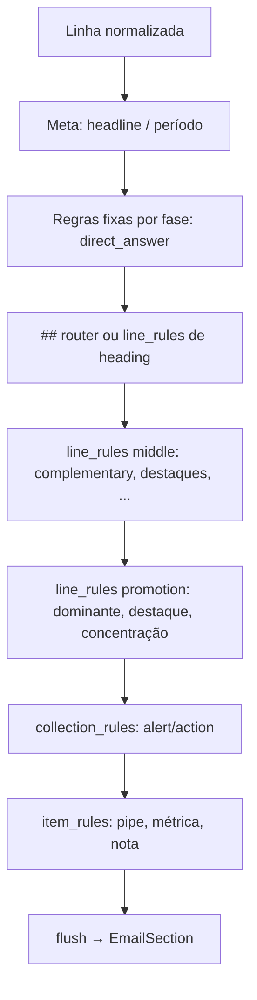

A Fase 3 não é “jogar tudo em `sections`”. Hoje o motor já migrou **openers de seção**; o que falta são **outros tipos de regra** com comportamentos diferentes. A migração incremental é: um tipo por PR, um teste de paridade por regra, loop do `rule_engine` fica mais declarativo e o `parsing.py` vai esvaziando.

## Estado atual (Fase 2 ligada)

| Já declarativo | Ainda hardcoded no `rule_engine.py` |
|----------------|-------------------------------------|
| `direct_answer`, `complementary`, `highlights`, `ranking_header`, `section_total` | `headline`, `##` + roteamento alerta/ação |
| | `Dominante:`, `Concentração:`, `Destaque:` |
| | `is_alert()`, `is_action()`, `collection_mode` |
| | `_NOTE_RX`, métricas, pipe tables, `... (+N)` |

Ou seja: **seção abre por regra**; **linha especial ainda é `if`**.

---

## Taxonomia de regras (Fase 3)

Não tudo vira `SectionOpenRule`. O desenho natural é separar por **efeito**:

```text
ParsingRulesConfig
├── sections: tuple[SectionOpenRule, ...]     # já existe
├── line_rules: tuple[LineRule, ...]          # novo — ordem importa
├── collection_rules: CollectionRule          # alertas/ações com modo
└── item_rules: ItemRuleConfig                # métrica, pipe, nota (último)
```

### `LineRule` — uma linha, um efeito

```python
@dataclass(frozen=True)
class LineRule:
    id: str
    pattern: str
    effect: Literal[
        "set_highlight",      # Destaque: → current.highlight
        "open_highlights",    # Dominante: → abre Destaques + highlight
        "append_note",        # Concentração: → nota em Destaques
        "skip",               # template:, linhas disponíveis
        "append_omitted",     # ... (+ 3 categorias)
    ]
    target_section: str | None = None  # "Destaques"
    value_from_group: str = "text"
    auto_open_section: bool = False    # Dominante abre seção se None
    enabled: bool = True
```

### `CollectionRule` — máquina de estados (alertas/ações)

Mais complexo que regex simples:

```python
@dataclass(frozen=True)
class CollectionRule:
    id: str  # "alerts" | "actions"
    # Gatilhos que ENTRAM no modo
    heading_keywords: tuple[str, ...] = ()      # ## com "alerta"
    line_prefixes: tuple[str, ...] = ()         # is_alert()
    standalone_patterns: tuple[str, ...] = ()   # discrepância...
    # Enquanto no modo: todas as linhas vão para alerts/actions
    until: Literal["next_section", "next_heading"] = "next_section"
```

`collection_mode` vira interpretação dessa config, não `if` espalhado.

---

## Ordem incremental (uma regra por PR)

Cada passo: **config → handler genérico → teste paridade → remover `if` duplicado**.

```text
PR1  highlight (Destaque:) -> Feito
PR2  dominante (Dominante: + auto_open Destaques) -> Feito
PR3  concentracao (Concentração: → nota) -> Feito
PR4  omitted_categories (... (+N)) -> Feito
PR5  markdown_heading_router (## → seção vs alerta vs ação) -> Feito
PR6  alert_standalone (is_alert prefixes) -> Feito
PR7  action_standalone (is_action prefixes) -> Feito
PR8  collection_mode (continuação de linhas em alertas/ações) -> Feito
PR9  note_lines (Detalhe / Top N / Observação) -> Feito
PR10 metric + pipe (último — ou fica como fallback permanente)
```

### Por que essa ordem?

1. **Destaque** — simples, sem `collection_mode`, teste já existe no fechamento fixture.
2. **Dominante** — abre seção + highlight; caso do ranking complementar.
3. **Concentração** — depende de seção Destaques existir.
4. **Omitted** — só append em `current.notes`.
5. **## router** — desbloqueia fechamento + alertas por heading.
6–8. **Alertas/ações** — o bloco mais delicado (vários caminhos no loop).
9–10. **Notas e métricas** — alto volume de testes, menor risco de regressão visual.

---

## Como fica o loop (visão)

Hoje é pipeline fixo com `if`. Na Fase 3 evolui para **fases ordenadas**:



Implementação prática: em vez de 15 `if`, algo como:

```python
for rule in self._rules_config.line_rules_ordered(phase="promotion"):
    if match := self._try_line_rule(rule, raw):
        apply_effect(match)
        break
```

A **ordem** vem da config (como já é com `sections`).

---

## Exemplo concreto — PR2 Dominante

**Config:**

```python
LineRule(
    id="dominante",
    pattern=r"^Dominante:\s*(?P<text>.+)$",
    effect="open_highlights",
    target_section="Destaques",
    value_from_group="text",
    auto_open_section=True,
)
```

**Handler genérico:**

```python
def _apply_open_highlights(ctx, match, rule):
    ctx.flush()
    ctx.collection_mode = None
    ctx.current = SectionDraft(title=rule.target_section, kind="default")
    ctx.current.highlight = match.groups[rule.value_from_group]
```

**Teste:** reutiliza `test_build_report_from_text_parses_complementary_ranking_and_destaques` — compara legado vs rules **antes** de apagar `_DOMINANTE_RX` do engine.

**Só depois** remove o `if dominante_match` hardcoded.

---

## Alertas — o caso especial (PR6–8)

Hoje há **4 caminhos** para alerta:

| Caminho | Hoje |
|---------|------|
| `##` com "alerta"/"concilia" | `collection_mode = "alerts"` |
| `is_alert(raw)` standalone | flush + append + mode |
| `collection_mode == "alerts"` | append linha seguinte |
| `current is None and alerts` | fallback append |

Isso vira **uma** `CollectionRule` com lista de gatilhos + política de continuação. Migração em 2 PRs:

- **PR6:** standalone (`discrepância`, `registros com valor zero`)
- **PR8:** modo + continuação + fallback

Testes: fixture `fechamento_gerencial_marco.txt` (5 alertas, 3 ações no teste existente).

---

## `parsing.py` — quando morre?

| Momento | Ação |
|---------|------|
| Durante Fase 3 | `parsing.py` mantém helpers compartilhados (`normalized_lines`, `looks_like_metric`, `SectionDraft`) |
| Após PR10 | `build_report_from_text` vira thin wrapper: `return build_report_from_rules(...)` |
| Depois | Apagar loop duplicado; manter só narrativa (`narrative_report_from_text`) |

Com `ORION_EMAIL_USE_RULE_ENGINE=true` em produção, o wrapper pode ser o default até remover o legado.

---

## YAML — quando entra?

Não no primeiro PR de cada regra. Sequência:

1. **Dataclass** em `parsing_rules.py` (como hoje)
2. **Testes** com `ParsingRulesConfig.default()`
3. **Opcional:** `load_rules_from_yaml(path)` que monta o mesmo dataclass
4. **Settings:** `ORION_EMAIL_PARSING_RULES_PATH=config/email_parsing/default.yaml`

O YAML espelha o dataclass — não é segunda fonte de verdade.

---

## Rastreabilidade (bonus do seu log)

Na Fase 3, vale logar em `email_delivery`:

```json
{
  "use_rule_engine": true,
  "sections_parsed": 6,
  "alerts_parsed": 2,
  "line_rules_matched": {"dominante": 1, "highlight": 3}
}
```

Assim o log prova qual regra disparou, não só “e-mail enviado”.

---

## Resumo executivo

| Pergunta | Resposta |
|----------|----------|
| É tudo `SectionOpenRule`? | **Não** — dominante/destaque são `LineRule`; alertas são `CollectionRule` |
| Como migrar incremental? | **1 regra = 1 PR = 1 teste paridade = 1 `if` removido** |
| Ordem sugerida | destaque → dominante → concentração → ## → alertas → ações → notas → métricas |
| Risco | **Alertas/collection_mode** — deixar por último entre os “comportamentais” |
| Visão geral no body? | **Trilha paralela** — regra narrativa + merge/html híbrido, não só evidência SQL |

Se quiser implementar, no modo Agent eu começaria pelo **PR1 `Destaque:`** — menor superfície, teste no fixture de março já cobre.