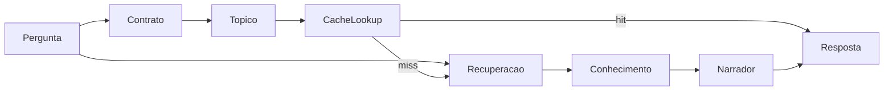

# Arquitetura — Chat Público

## Visão



## Camadas

| Camada | Responsabilidade |
|---|---|
| `domain/` | Contrato de intenção, `semantic_hash`, tópico, fingerprint |
| `application/` | Janela de contexto, runner de turno (fases 2–3) |
| `infrastructure/` | Postgres, LLM intent, store, leitor remissivo (fase 2) |
| `prompts/` | YAML versionado + loader próprio |
| `config/` | Settings `PUBLIC_CHAT_*` |

## Persistência

Tabelas `public_chat_*` — migrações em `infrastructure/postgres/migrations/`.

- **Perguntas:** histórico imutável, encadeamento `parent_question_id` + `thread_id`
- **Respostas:** cache exato `(topic, semantic_hash)` com `answer_payload`
- **Pivô:** auditoria pergunta ↔ resolução

Sem colunas vetoriais em `public_chat_*`. Busca semântica usa apenas `memory_embeddings` (fase 2).

## Encadeamento (sem sessão)

```
POST /ask { message, parent_question_id? }
```

Raiz: `parent_question_id=NULL`, `thread_id=id`. Follow-up herda `thread_id` do pai.

## Extração futura

O módulo foi desenhado para mover para repositório/serviço independente: borda HTTP, Postgres e leitor remissivo são adaptadores configuráveis; regras de negócio vivem em `domain/` e `application/`.
