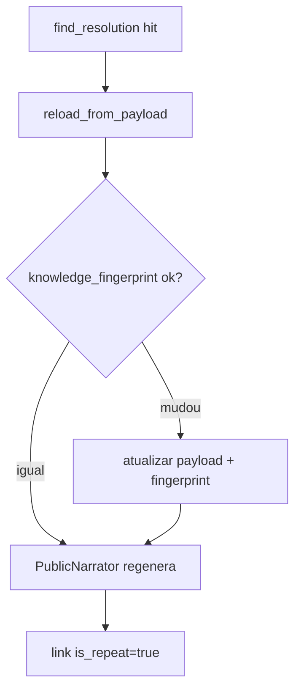

# Fase 3 — Cache Hit, API e Integração

**Pré-requisito:** [Fase 2 concluída](chat-público-fase-2-retrieval-narração.plan.md) — retrieval, narrador, persistência miss.

Plano mestre: [chat_público_remissivo_03507a27.plan.md](chat_público_remissivo_03507a27.plan.md)

---

## Objetivo da fase

Produto **completo** e exposto:

```
POST /api/v1/public/ask
  → intent → cache exato (topic, semantic_hash)?
       ├─ hit  → reload_from_payload → verificar knowledge_fingerprint → narrar → is_repeat=true
       └─ miss → retrieve → narrar → upsert cache → is_repeat=false
  → SSE + question_id + thread_id para follow-up
```

---

## Escopo IN

| Item | Detalhe |
|---|---|
| `consulta_turn_runner.py` | **v2** — ramos hit + miss |
| `application/factory.py` | `build_public_chat_runner()` completo |
| `api/schemas.py` | `AskRequest`, eventos SSE |
| `api/routes/public_ask.py` | `create_public_ask_router()` |
| `OrionSettings` | Campos `ORION_PUBLIC_CHAT_*` |
| `main.py` | Bloco aditivo + slot runner |
| `presentation_snapshot` | Opcional via `ORION_PUBLIC_CHAT_USE_PRESENTATION_SNAPSHOT` |

## Escopo OUT (evolução futura)

- Serviço independente / extração de repo
- Múltiplas knowledge bases
- Invalidação admin de cache
- Canais WhatsApp/Slack

---

## Ramo cache hit (novo nesta fase)



- **Skip** `memory_embeddings` vector search
- **Sempre** re-narrar (exceto se `USE_PRESENTATION_SNAPSHOT=true` e fingerprint inalterado)
- `is_repeat=true` no pivô

---

## API

**`POST /api/v1/public/ask`**

Request:
```python
message: str
parent_question_id: str | None = None
```

Response SSE:
```json
{"delta": "..."}
{"finish_reason": "stop", "question_id": "...", "thread_id": "...", "cached": true, "topic": "...", "semantic_hash": "..."}
```

- `503` se `public_chat_enabled=false` ou runner não inicializado
- `400` se `parent_question_id` inválido

---

## Settings aditivos

| Variável | Default |
|---|---|
| `ORION_PUBLIC_CHAT_ENABLED` | `false` |
| `ORION_PUBLIC_CHAT_CACHE_TTL_DAYS` | `90` |
| `ORION_PUBLIC_CHAT_USE_PRESENTATION_SNAPSHOT` | `false` |
| `ORION_PUBLIC_CHAT_INTENT_MAX_TOKENS` | `512` |
| `ORION_PUBLIC_CHAT_INTENT_MIN_CONFIDENCE` | `0.5` |
| `ORION_PUBLIC_CHAT_CONTEXT_DEPTH` | `3` |

**Pré-requisitos runtime:** `postgres_enabled` + `embedding_active` + `llm_enabled`

---

## Wiring (`main.py` — aditivo)

```python
if s.public_chat_enabled and pg_pool and s.embedding_active and s.llm_enabled:
    runner = build_public_chat_runner(pool=pg_pool, settings=s, llm_provider=provider)
    state["public_chat_runner"] = runner
# create_public_ask_router via slot mutável — não altera create_chat_router
```

---

## Critérios de conclusão

- [ ] Mesma `(topic, semantic_hash)` → hit → skip retrieval → `is_repeat=true`
- [ ] Intenções distintas → miss → resoluções separadas
- [ ] `knowledge_fingerprint` divergente → atualiza cache + re-narra
- [ ] Follow-up "e em junho?" com `parent_question_id` funciona E2E
- [ ] `POST /ask` retorna `text/event-stream`
- [ ] Guardrails finais + fases 1–2 verdes
- [ ] Nenhum embedding/HNSW em `public_chat_*`

---

## Testes desta fase (`tests/focused/public_chat/phase3/`)

| Teste | Verifica |
|---|---|
| `test_cache_hit_by_semantic_hash` | Hit → skip retrieve → is_repeat |
| `test_cache_hit_regenerates_narrative` | Narrador chamado no hit |
| `test_knowledge_fingerprint_invalidation` | Staleness atualiza cache |
| `test_cache_miss_different_intent` | Resoluções distintas |
| `test_cache_stores_answer_payload_not_narrative` | Sem content como fonte |
| `test_follow_up_inherits_slots` | E2E com parent_question_id |
| `test_invalid_parent_question_400` | HTTP 400 |
| `test_api_sse` | Content-Type event-stream |
| `test_api_disabled_503` | Feature flag off |
| `test_runner_full_hit_then_miss` | Sequência integrada |
| `test_guardrail_isolation` | Imports proibidos |
| `test_no_regression` | Analítico intacto |

**Regressão:** `pytest tests/focused/public_chat/ -v`

---

## Ordem de implementação

1. Estender `consulta_turn_runner.py` com ramo hit
2. `factory.py` completo
3. `api/schemas.py` + `routes/public_ask.py`
4. Settings + `main.py`
5. Suite `phase3/` + regressão completa
6. Smoke manual: `curl -N POST /api/v1/public/ask ...`

---

## Smoke test manual

```bash
export ORION_PUBLIC_CHAT_ENABLED=true
# uvicorn ...

curl -N -X POST http://localhost:8000/api/v1/public/ask \
  -H 'Content-Type: application/json' \
  -d '{"message": "Qual o faturamento de maio de 2026?"}'

# Segunda pergunta equivalente → cached: true
curl -N -X POST ... -d '{"message": "Quanto faturou em maio de 2026?"}'
```
