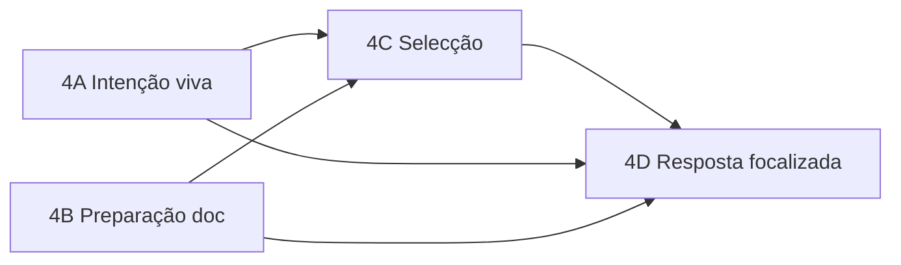

# Fase 4 — Contexto Focalizado (índice)

**Pré-requisito:** [Fase 3 concluída](chat-público-fase-3-api-cache.plan.md) — API, cache hit/miss, logging pipeline.

Plano Cursor (espelho): `.cursor/plans/fase_4_answer_resolver_ef7b7f77.plan.md`

---

## Problema que a Fase 4 resolve

O retrieval traz **documentos multi-secção**; o narrador recebe o relatório inteiro e entra em modo **Executive Summary** em vez de **Question Answering**. A solução não é recriar um motor analítico com regras por dimensão — é **entregar ao LLM apenas o subconjunto relevante**.

```text
Pergunta → Intent → Retrieval → [Preparar doc] → [Seleccionar secções] → Narrator QA
```

---

## Sub-fases semânticas

| Sub-fase | Plano | Responsabilidade semântica | Nova chamada LLM? |
|---|---|---|---|
| **4A** | [Intenção viva](chat-público-fase-4a-intenção-viva.plan.md) | Capturar *o que* se pergunta (`operation`, `dimension`, `period`); corrigir colisão de cache | Intent (existente, enriquecido) |
| **4B** | [Preparação do documento](chat-público-fase-4b-preparação-documento.plan.md) | Filtrar *qual documento* (mês) e *estruturar* texto em secções | Não |
| **4C** | [Selecção de contexto](chat-público-fase-4c-selecção-contexto.plan.md) | Escolher *quais secções* são relevantes à pergunta | Sim (Context Selector) |
| **4D** | [Resposta focalizada](chat-público-fase-4d-resposta-focalizada.plan.md) | Responder à pergunta literal sobre contexto mínimo; integrar pipeline | Narrator (existente, modo QA) |



**Dependências:**
- 4A e 4B são **independentes** entre si (podem ser implementadas em paralelo)
- 4C depende de 4A + 4B
- 4D depende de 4A + 4B + 4C

**Gate entre sub-fases:** `pytest public_chat/tests/phase4X/` verde + DoD da sub-fase X.

---

## Isolamento (todas as sub-fases)

Toda implementação fica em `src/orion_mcp_v3/public_chat/`. Ver [ISOLATION.md](../ISOLATION.md).

- Zero alterações em `broker/`, `runtime/`, `api/routes/chat.py`, migrações globais
- Única dependência Orion: `orion_mcp_v3.protocols.llm.LLMProvider`
- `test_guardrails.py` verde após 4D

---

## Critério de aceite global (Fase 4 completa)

Pergunta: *"qual a forma de pagamento foi pior em março de 2026?"*

- Intent: `operation: ranking_asc`, `dimension: forma_pagamento`, `period: 2026-03`
- Scoper: 1 documento (março), não 5 meses
- Selector: secção `"Formas de pagamento"` apenas
- Narrator: **Depósito Bancário** (menor > 0); nota Cheque/Permuta zerados
- Narrador **não** resume Cartão dominante nem secções irrelevantes

---

## Fora de escopo (Fase 4)

- Resolver determinístico por dimensão (`answer_resolver.py`)
- Import de `broker.answer_projector`
- Alterações em `scripts/distill_supervised_memory.py`
- Short-circuit intent / presentation snapshot (optimizações posteriores)
