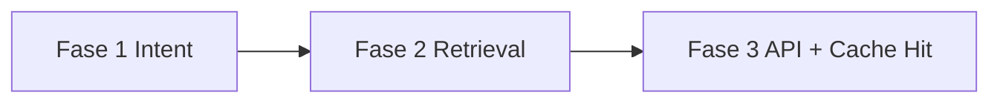
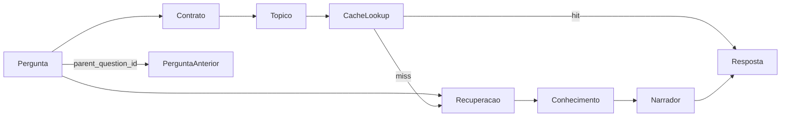
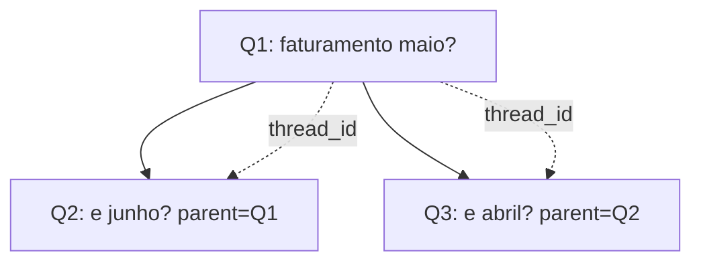
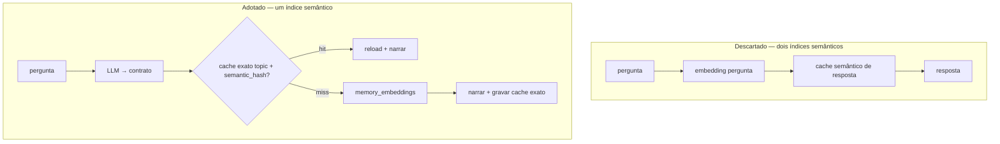
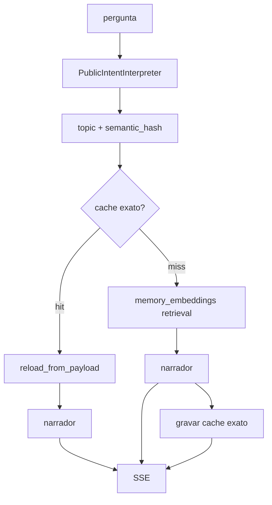
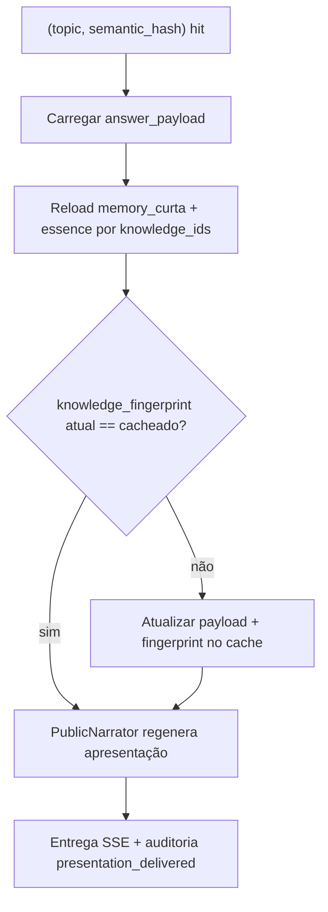
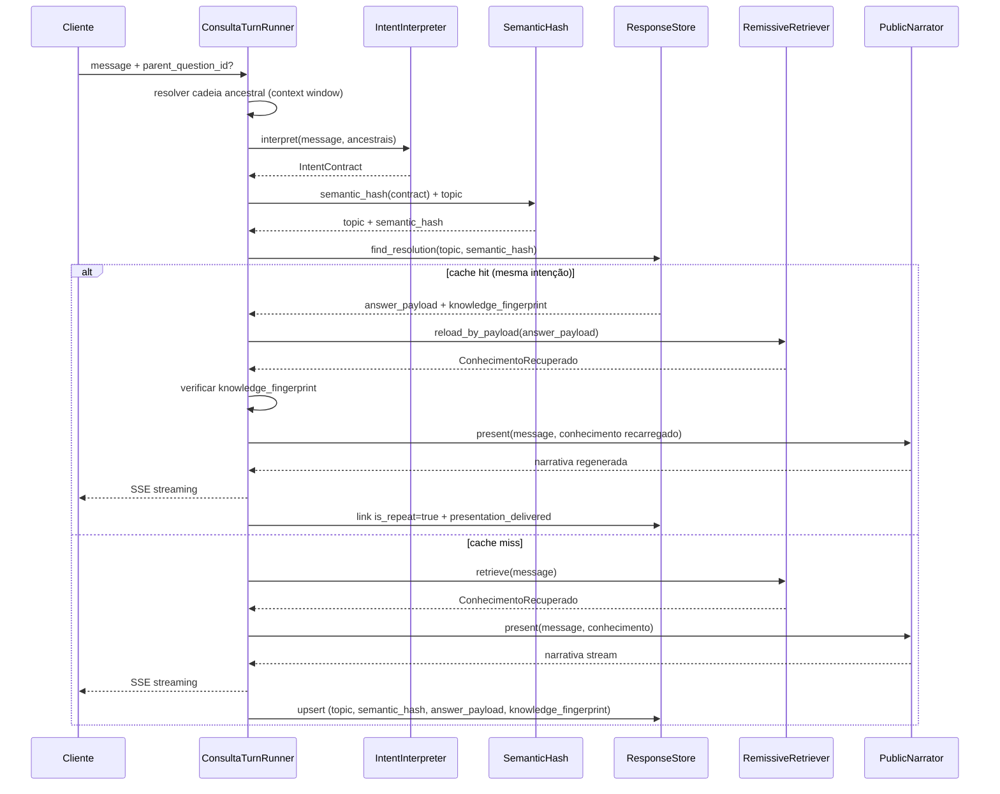

# Chat Público — Plano Mestre (índice)

> **Implementação incremental em 3 fases.** Complete cada fase, rode os testes, só então avance.

| Fase | Plano | Entrega principal |
|---|---|---|
| **1** | [Fase 1 — Fundação e Intenção](chat-público-fase-1-fundação-intenção.plan.md) | Schema + domain + LLM intent + perguntas encadeadas |
| **2** | [Fase 2 — Retrieval e Narração](chat-público-fase-2-retrieval-narração.plan.md) | `memory_*` + narrador + runner **cache miss** + auditoria |
| **3** | [Fase 3 — Cache Hit e API](chat-público-fase-3-api-cache.plan.md) | Cache hit + `POST /api/v1/public/ask` + wiring |



**Gate entre fases:** `pytest tests/focused/public_chat/phaseN/` verde + critérios DoD da fase N.

---

## Princípio central

> **O Chat Público não é um chatbot. É um mecanismo de consulta sobre conhecimento validado previamente destilado.**

Essa premissa governa todas as decisões abaixo.

---

## Visão do produto

O Chat Público responde perguntas utilizando **exclusivamente** conhecimento consolidado em `memory_curta`, `memory_essence` e seus índices (`memory_embeddings`).

| Faz | Não faz |
|---|---|
| Interpreta a intenção da pergunta | Executar análises |
| Localiza conhecimento relevante | Acessar MySQL |
| Produz resposta legível | Consultar brokers |
| | Criar conhecimento novo |
| | Participar da destilação |

O Orion analítico continua responsável por **materializar** a base `memory_*`. O Chat Público apenas **consome**.

---

## Objetivo arquitetural

Módulo **completamente isolado** do pipeline analítico — separação forte o suficiente para, no futuro, mover para repositório próprio sem reescrever regras de negócio.

O Orion passa a ser fornecedor da base de conhecimento; o Chat Público é o produto de consulta.

---

## Princípios de arquitetura

### 1. Isolamento total

Sem dependência de componentes analíticos. Possui modelos, prompts, persistência, contexto e regras **próprios**.

Nenhum comportamento herdado ou estendido do pipeline analítico. Ao reutilizar utilitários estáveis (`LLMProvider`, `EmbeddingService.embed`, `to_pgvector`), **não alterar** funções existentes — criar métodos/classes novos no módulo público.

### 2. Leitura apenas

Tabelas remissivas = base pronta. O Chat Público **nunca** escreve em `memory_*`.

### 3. Conhecimento como fonte de verdade

| Camada | Natureza | Onde vive |
|---|---|---|
| **Conhecimento** | Permanente (até destilação atualizar) | `memory_curta`, `memory_essence` |
| **Resolução cacheada** | Ponteiro para conhecimento + fingerprint | `public_chat_responses.answer_payload` |
| **Narrativa** | Transitória, regenerável | Produzida pelo narrador a cada entrega |

**O cache não guarda a narrativa como fonte principal.** Guardar só `assistant_content` congela a apresentação enquanto o conhecimento pode mudar:

```
Conhecimento A  →  Narrativa X  (cacheada 90 dias)
        ↓
Conhecimento A' (destilação atualizou memory_curta)
        ↓
Cache ainda serve Narrativa X  ← errado
```

**Correto:** cachear **qual conhecimento** responde à intenção; **regenerar** a narrativa ao entregar.

### 4. Independência de implementação

Estrutura interna reflete limites de um futuro serviço — mesmo dentro do monólito:

```
src/orion_mcp_v3/public_chat/
  api/              # rotas HTTP, DTOs de borda
  application/      # orquestração de turno, contexto mínimo
  domain/           # conceitos, contrato, tópico, regras puras
  infrastructure/   # SQL, remissive reader, LLM adapters, cache store
```

---

## Modelo conceitual (4 conceitos + encadeamento consultivo)



### Pergunta

Intenção original do usuário. Registro histórico — **nunca sobrescrita**.

Cada consulta é um nó. Follow-ups apontam para a pergunta anterior via `parent_question_id`. Não existe **sessão** — o produto é consultivo, não conversacional.

### Encadeamento (sem sessão)

**Removido:** `public_chat_sessions`, `conversation_id`, `SessionManager`.

**Substituído por:** janela de contexto curta entre perguntas relacionadas.

| Campo | Função |
|---|---|
| `question_id` | Identificador da consulta corrente (retornado na resposta) |
| `parent_question_id` | Pergunta imediatamente anterior — `NULL` na consulta raiz |
| `thread_id` | Agrupa a cadeia de follow-ups (herdado do pai ou = `id` na raiz) |

**Único requisito de continuidade:** completar lacunas em follow-ups elípticos ("e em junho?", "e em abril?").

**Resolução de contexto:** percorrer a cadeia `parent_question_id` até profundidade `N` (configurável), carregando `query_original` + `intent_contract` dos ancestrais. Sem estado de sessão global.



Amanhã, ao extrair para serviço independente, a API permanece stateless:

```
POST /ask
{ "message": "e junho?", "parent_question_id": "..." }
```

Sem `conversation_id`. A relação entre perguntas **persiste**; a sessão **não**.

### Contrato de intenção

Interpretação estruturada (LLM → JSON validado). Representação semântica canônica da consulta:

- `intent` — tipo de consulta
- `metric` — métrica de negócio
- `period` — período canônico (`YYYY-MM`)
- `domain` — domínio
- `entity_filters` — filtros de entidade
- `confidence` — confiança da extração

**Artefato principal do turno.** Usado por cache, recuperação, contexto, auditoria e métricas.

### Tópico

Agrupamento **determinístico** derivado **exclusivamente** do contrato (`PublicTopicResolver`).

**Regra única de verdade (não negociável):**

```
metric + period + domain (+ intent)
        ↓
   topic slug          ← agrupamento legível (#1a)

contrato normalizado (metric + period + filters + intent)
        ↓
   semantic_hash       ← chave de cache (#1b)  sha256(...)

memory_curta (conteúdo)
        ↓
   knowledge_fingerprint  ← staleness do conhecimento (#2)
```

| Origem | Pode definir `topic` / `semantic_hash`? |
|---|---|
| Contrato interpretado normalizado | **Sim** — única via |
| `query_original` (texto do usuário) | **Não** — só auditoria |
| ~~`query_normalized`~~ | **Descartado** — clientes raramente perguntam igual |
| `memory_curta.category` | **Não** |
| `memory_curta.context_key` | **Não** |
| Hit mais relevante do retrieval | **Não** |
| Usuário na API | **Não** |

**Proibido no código:** `update_question_topic` pós-retrieval, `resolve_from_context_key`, ou qualquer branch que sobrescreva `topic` com dados de `memory_*`.

Quando intent diz `domain: financeiro` e o hit traz `category: faturamento`, **o contrato ganha** para tópico e cache. A categoria da memória entra só em `context_keys` / metadados de evidência para auditoria e narração.

Perguntas com redações diferentes mas **mesmo contrato normalizado** compartilham `semantic_hash`:

| Pergunta (textos distintos) | Contrato normalizado | `semantic_hash` |
|---|---|---|
| "Qual o faturamento de maio?" | `{metric: faturamento, period: 2026-05}` | `sha256(...)` → **igual** |
| "Quanto faturou em maio?" | `{metric: faturamento, period: 2026-05}` | **igual** |
| "Receita de maio?" | `{metric: faturamento, period: 2026-05}` | **igual** |

→ Mesmo `(topic, semantic_hash)` → cache hit → `is_repeat=true`. **A entidade fundamental não é o texto — é o contrato normalizado.**

### Conhecimento recuperado

Itens carregados de `memory_*` que fundamentam a resposta.

**Enriquece. Nunca redefine.**

| Papel | O que faz |
|---|---|
| **Enriquecer** | Fornece `validated_answer`, `key_metrics`, `context_key`, `category` para narrador e auditoria |
| **Não redefine** | Não altera `intent_contract`, `topic`, `semantic_hash` já fixados antes do retrieval |

A recuperação ocorre **depois** que contrato, tópico e lookup de cache já foram resolvidos. Divergência semântica entre `domain` do contrato e `category` do hit é registrada em evidência — não promove a hit a nova verdade de tópico.

---

## Um único índice semântico (princípio eliminatório)

**Eliminado:** cache semântico de resposta (embedding da pergunta → similaridade vetorial em `public_chat_*`).

**Motivo:** `memory_embeddings` **já é** o índice semântico do produto. Criar um segundo índice vetorial sobre respostas duplicaria complexidade sem ganho proporcional.

| Abordagem | Índice semântico (vetores) | Cache de resolução |
|---|---|---|
| **Descartada** | `public_chat_responses.embedding` + HNSW | Hit por similaridade de frase |
| **Adotada** | **Somente** `memory_embeddings` | Hit **exato** por `(topic, semantic_hash)` |



**Sinonímia** ("Qual o faturamento de maio?" vs "Quanto faturou em maio?"):
1. **Caminho A (preferido):** LLM normaliza → mesmo contrato → mesmo `semantic_hash` → **cache exato** (sem vetor)
2. **Caminho B (fallback):** contratos ligeiramente diferentes → cache miss → **`memory_embeddings`** resolve sinonímia no conhecimento

Não existe Caminho C (vetor sobre respostas cacheadas).

---

## Estratégia de recuperação

Busca semântica **exclusiva** = índice remissivo (`memory_embeddings` → `memory_curta`).

- `PublicRemissiveReader` — SQL read-only próprio (não altera `RemissiveMemoryStore`)
- Busca vetorial global (sem `user_id`) + `ivfflat.probes`
- Carrega `memory_curta` e `memory_essence` por `origin_id` / themes
- **Somente no cache miss** — nunca para deduplicar respostas prontas

---

## Estratégia de cache — somente exato

Cache reduz custo de **repetição da mesma intenção de negócio** — não substitui retrieval semântico.

**Não é cache semântico.** É lookup **determinístico** por intenção normalizada:

Chave: **`(topic, semantic_hash)`** — igualdade exata, sem `<=>`, sem embeddings em `public_chat_*`.

### `semantic_hash` — chave de cache exato (não é índice vetorial)

`semantic_hash` é **sha256 de contrato normalizado** — comparação por igualdade (`=`), não por distância cosseno. Nome histórico; comportamento = **cache exato de intenção**.

```python
# domain/semantic_hash.py
def build_semantic_hash(contract: IntentContract) -> str:
    """sha256 de JSON canônico: metric, period, intent, entity_filters ordenados."""
    canonical = normalize_contract_for_hash(contract)
    # Ex.: {"metric":"faturamento","period":"2026-05","filters":[],"intent":"consulta_metrica"}
    return hashlib.sha256(json.dumps(canonical, sort_keys=True).encode()).hexdigest()
```

`normalize_contract_for_hash()` aplica as mesmas regras do parser (período canônico, slugs, filters ordenados) — **independente** da redação de `query_original`.

**Lookup:**

```sql
SELECT * FROM public_chat_responses
WHERE topic = $1 AND semantic_hash = $2 AND expires_at > now()
```

**Constraint:** `UNIQUE (topic, semantic_hash)` — substitui qualquer `UNIQUE(topic, query_normalized)`.

### O que é cacheado (fonte principal)

`answer_payload` JSONB — ponteiro estável para o conhecimento que responde à intenção:

```json
{
  "context_keys": ["user:financeiro:faturamento:2026-05"],
  "knowledge_ids": [42, 57],
  "essence_themes": ["fechamento_mensal"]
}
```

Mais `knowledge_fingerprint` — hash do conteúdo efetivo em `memory_*` no momento do cache (validação de staleness).

```python
# domain/knowledge_fingerprint.py
def build_knowledge_fingerprint(knowledge: ConhecimentoRecuperado) -> str:
    # Hash determinístico de validated_answer + key_metrics + essence usados
```

### O que NÃO é fonte principal

| Campo | Papel |
|---|---|
| `presentation_snapshot` | **Opcional** — cópia da última narrativa; só acelera se `knowledge_fingerprint` ainda bate |
| ~~`content` / `assistant_content` como única verdade~~ | **Descartado** |

### Fluxo completo (dois caminhos apenas)



**Proibido no módulo `public_chat/`:** `embed(pergunta)` para cache lookup, coluna `embedding` em `public_chat_responses`, índice HNSW/IVFFlat em tabelas `public_chat_*`, `ORDER BY embedding <=> ...` sobre respostas.

`EmbeddingService` é usado **apenas** dentro de `PublicRemissiveReader` ao consultar `memory_embeddings` (mesmo padrão da destilação, sem alterar código existente).

### Fluxo em cache hit (exato)



1. Lookup por `(topic, semantic_hash)`
2. Recarregar conhecimento via `knowledge_ids` / `context_keys`
3. Recalcular `knowledge_fingerprint` — se divergiu, atualizar cache (conhecimento mudou na destilação)
4. **Sempre regenerar narrativa** a partir do conhecimento recarregado (fonte de verdade)
5. Opcional: se fingerprint inalterado **e** `presentation_snapshot` presente, pular LLM e servir snapshot (otimização de latência — desligável via config)

### Fluxo em cache miss

**Retrieval remissivo** (`memory_embeddings`) — único índice semântico → montar `answer_payload` + `knowledge_fingerprint` → narrador → gravar **cache exato** `(topic, semantic_hash)` → entregar.

TTL (`expires_at`): limite operacional (90 dias). **Staleness semântica** é detectada por `knowledge_fingerprint`, não só por TTL.

---

## Context window consultiva (não conversacional)

**Não há sessão.** Há apenas encadeamento mínimo de perguntas.

Continuidade **só** para completar lacunas semânticas em follow-ups:

- "e em junho?"
- "e no mês anterior?"
- "e por vendedor?"

O interpretador recebe a **cadeia ancestral** (`parent_question_id` → … → raiz), limitada a `N` níveis, para herdar slots (`metric`, `domain`). Não há histórico extenso nem memória conversacional.

Config: `ORION_PUBLIC_CHAT_CONTEXT_DEPTH` (default `3` — profundidade máxima da cadeia ancestral).

---

## Papel do interpretador de intenção (LLM)

Peça central. Converte linguagem natural → contrato estável.

**Fluxo:**

1. `PublicIntentInterpreter` monta prompt com pergunta + **cadeia ancestral** (via `parent_question_id`) + schema JSON
2. `LLMProvider.chat()` → JSON bruto
3. `parse_public_intent_payload()` → contrato validado
4. `PublicTopicResolver` → `topic`
5. `build_semantic_hash()` → chave de cache

Prompt: [`prompts/public_chat_intent.yaml`](src/orion_mcp_v3/prompts/public_chat_intent.yaml) — **não** reutiliza `analytical_intent.yaml`.

Fallback: contrato vazio / JSON inválido / `confidence` baixa → `topic=geral`, `semantic_hash=sha256(geral)`.

---

## Papel do narrador

**Apresenta. Não raciocina.**

- Organiza conhecimento recuperado
- Resume `validated_answer` e `key_metrics`
- Complementa com `memory_essence` quando relevante
- Torna compreensível para usuário leigo

Prompt: [`prompts/public_chat_narrator.yaml`](src/orion_mcp_v3/prompts/public_chat_narrator.yaml)

Sem hits: *"Não encontrei informações validadas sobre isso."*

**Não altera** `CognitiveNarrator`.

---

## Auditoria (cadeia rastreável)

Todo turno persiste:

| # | Pergunta | Onde |
|---|---|---|
| 1 | O que o usuário perguntou? | `public_chat_questions.query_original` |
| 2 | Como foi interpretado? | `public_chat_questions.intent_contract` (JSONB) |
| 3 | Qual conhecimento foi usado? | `public_chat_responses.answer_payload` + `knowledge_fingerprint` |
| 4 | Qual resposta foi entregue? | `public_chat_question_responses.presentation_delivered` (texto deste turno) |

Pivô `public_chat_question_responses`: N perguntas (textos diferentes) → 1 resolução cacheada quando compartilham `(topic, semantic_hash)` (`is_repeat=true`).

---

## Modelo de dados

### Migração [`015_public_chat_schema.sql`](src/orion_mcp_v3/infra/postgres/migrations/015_public_chat_schema.sql)

```sql
-- Consulta (histórico imutável, encadeamento consultivo — sem sessão)
CREATE TABLE public_chat_questions (
    id                  UUID PRIMARY KEY DEFAULT gen_random_uuid(),
    thread_id           UUID NOT NULL,                -- raiz da cadeia de follow-ups
    parent_question_id  UUID NULL REFERENCES public_chat_questions(id),
    topic               VARCHAR(128) NOT NULL,
    intent_contract     JSONB NOT NULL DEFAULT '{}',
    semantic_hash       VARCHAR(64) NOT NULL,         -- sha256 do contrato normalizado
    query_original      TEXT NOT NULL,                -- auditoria; NÃO usado no cache
    created_at          TIMESTAMPTZ NOT NULL DEFAULT now()
);
CREATE INDEX idx_pcq_thread ON public_chat_questions (thread_id, created_at);
CREATE INDEX idx_pcq_parent ON public_chat_questions (parent_question_id);
CREATE INDEX idx_pcq_semantic ON public_chat_questions (topic, semantic_hash);

-- Resolução cacheada (ponteiro para conhecimento — NÃO narrativa como fonte)
CREATE TABLE public_chat_responses (
    id                    UUID PRIMARY KEY DEFAULT gen_random_uuid(),
    topic                 VARCHAR(128) NOT NULL,
    semantic_hash         VARCHAR(64) NOT NULL,
    answer_payload        JSONB NOT NULL,
    knowledge_fingerprint VARCHAR(64) NOT NULL,
    presentation_snapshot TEXT NULL,
    expires_at            TIMESTAMPTZ NOT NULL,
    created_at            TIMESTAMPTZ NOT NULL DEFAULT now(),
    UNIQUE (topic, semantic_hash)
);

-- Pivô auditoria
CREATE TABLE public_chat_question_responses (
    question_id            UUID NOT NULL REFERENCES public_chat_questions(id),
    response_id            UUID NOT NULL REFERENCES public_chat_responses(id),
    is_repeat              BOOLEAN NOT NULL DEFAULT false,
    presentation_delivered TEXT NOT NULL,             -- narrativa entregue neste turno
    linked_at              TIMESTAMPTZ NOT NULL DEFAULT now(),
    PRIMARY KEY (question_id, response_id)
);
```

**Regras de `thread_id` / `parent_question_id`:**
- Consulta raiz (`parent_question_id IS NULL`): `thread_id = id` (auto-atribuído após insert)
- Follow-up: `parent_question_id` = pergunta anterior; `thread_id` herdado do pai
- `parent_question_id` inexistente → 400 (não cria sessão fallback)

**Nota:** zero embeddings em `public_chat_*`. Cache = igualdade exata em `(topic, semantic_hash)`. Vetores só em `memory_embeddings`.

---

## Fluxo de um turno



---

## Estrutura do módulo

```
src/orion_mcp_v3/public_chat/
  __init__.py
  api/
    routes.py              # create_public_chat_router
    schemas.py             # PublicChatRequest, SSE events
  application/
    consulta_turn_runner.py  # orquestração
    context_window.py        # cadeia ancestral via parent_question_id (sem sessão)
    factory.py               # build_public_chat_runner()
  domain/
    models.py                # Pergunta, IntentContract, Topico, ConhecimentoRecuperado
    intent_contract.py       # dataclass + enums
    semantic_hash.py         # build_semantic_hash() — sha256 contrato normalizado
    knowledge_fingerprint.py # build_knowledge_fingerprint() — hash conteúdo memory_*
    intent_parser.py         # parse_public_intent_payload()
    topic_resolver.py        # PublicTopicResolver — slug só de metric/period/domain/intent
  infrastructure/
    intent_interpreter.py    # PublicIntentInterpreter (LLM)
    remissive_reader.py      # PublicRemissiveReader (SQL memory_*)
    remissive_retriever.py   # RemissiveRetriever
    response_store.py        # ResponseStore — cache, auditoria, cadeia ancestral
    narrator.py              # PublicNarrator
```

Borda HTTP: [`api/routes/public_ask.py`](src/orion_mcp_v3/api/routes/public_ask.py) delega 100% à application.

### `PublicTopicResolver` ([`topic_resolver.py`](src/orion_mcp_v3/public_chat/domain/topic_resolver.py))

```python
def resolve_topic(contract: IntentContract) -> str:
    # ÚNICA entrada: campos do contrato interpretado
    # Ex.: metric=faturamento + period=2026-05 → "faturamento:2026-05"
    # NÃO recebe KnowledgeHit, category, context_key
```

Sem métodos `resolve_from_*` ligados a `memory_*`.

### `RemissiveRetriever` ([`infrastructure/remissive_retriever.py`](src/orion_mcp_v3/public_chat/infrastructure/remissive_retriever.py))

- `retrieve(query) → ConhecimentoRecuperado` — busca vetorial (cache miss)
- `reload_from_payload(answer_payload) → ConhecimentoRecuperado` — carrega por `knowledge_ids` / `context_keys` (cache hit, sem nova busca vetorial)

### `ResponseStore` — métodos relevantes

- `insert_question(..., parent_question_id?) → question_id`
- `load_ancestor_chain(question_id, max_depth) → list[AncestorTurn]`
- `find_resolution(topic, semantic_hash) → CachedResolution | None`
- `upsert_resolution(topic, semantic_hash, answer_payload, knowledge_fingerprint, presentation_snapshot?)`
- `link_question_response(question_id, response_id, is_repeat, presentation_delivered)`
- `reload_knowledge(answer_payload) → ConhecimentoRecuperado` — delega ao `RemissiveRetriever`/`PublicRemissiveReader`

---

## API

**Request** — consulta stateless, sem sessão:

```python
message: str
parent_question_id: str | None = None   # follow-up; omitir na consulta raiz
```

**Response** SSE:

```
data: {"delta": "..."}
data: {
  "finish_reason": "stop",
  "question_id": "...",
  "thread_id": "...",
  "parent_question_id": null,
  "cached": true,
  "topic": "faturamento:2026-05",
  "semantic_hash": "a3f2..."
}
```

O cliente guarda `question_id` se quiser fazer follow-up. Não há `conversation_id`.

**Endpoint:** `POST /api/v1/public/ask` (nome alinhado ao produto consultivo; não `/chat`).

---

## Configuração (`OrionSettings` — aditivo)

| Variável | Default | Descrição |
|---|---|---|
| `ORION_PUBLIC_CHAT_ENABLED` | `false` | Liga o módulo |
| `ORION_PUBLIC_CHAT_CACHE_TTL_DAYS` | `90` | TTL operacional da resolução cacheada |
| `ORION_PUBLIC_CHAT_USE_PRESENTATION_SNAPSHOT` | `false` | Se true, pula LLM quando knowledge_fingerprint inalterado |
| `ORION_PUBLIC_CHAT_INTENT_MAX_TOKENS` | `512` | Tokens na extração de contrato |
| `ORION_PUBLIC_CHAT_INTENT_MIN_CONFIDENCE` | `0.5` | Abaixo → fingerprint `geral` |
| `ORION_PUBLIC_CHAT_CONTEXT_DEPTH` | `3` | Profundidade máxima da cadeia ancestral |

**Pré-requisitos:** `postgres_enabled` + `embedding_active` (retrieval remissivo) + `llm_enabled` (intent + narrator).

---

## Wiring (`main.py` — somente adições)

```python
if s.public_chat_enabled and pg_pool and s.embedding_active and s.llm_enabled:
    runner = build_public_chat_runner(pool=pg_pool, settings=s, llm_provider=provider)
    state["public_chat_runner"] = runner
    # router via slot mutável — não altera create_chat_router
```

---

## Estratégia de evolução futura

### 1. Serviço independente

Extrair `public_chat/` para repositório próprio. Contratos de borda (`api/`) e `infrastructure/remissive_reader` viram adaptadores configuráveis.

### 2. Múltiplas bases de conhecimento

Hoje: `memory_*`. Amanhã: `wiki_*`, `faq_*`, `knowledge_base_*`.

Trocar **provedor de conhecimento** (`KnowledgeProvider` protocol) sem mudar domain/application.

### 3. Múltiplos canais

Web, WhatsApp, API pública, Slack, Teams — mesma `application/`, bordas diferentes em `api/`.

---

## Testes ([`tests/focused/public_chat/`](tests/focused/public_chat/))

| Teste | Verifica |
|---|---|
| `test_migration_schema` | `semantic_hash`, `UNIQUE(topic, semantic_hash)`; sem `query_normalized` |
| `test_root_question_thread_id` | Raiz: `thread_id = id`, `parent_question_id IS NULL` |
| `test_follow_up_chain` | Follow-up herda `thread_id`, aponta `parent_question_id` |
| `test_context_window_depth` | Cadeia > N níveis truncada na interpretação |
| `test_invalid_parent_question` | `parent_question_id` inexistente → 400 |
| `test_semantic_hash_equivalent_phrasings` | 3 redações distintas → mesmo hash → mesmo cache |
| `test_semantic_hash_stable` | Contrato normalizado idêntico → sha256 igual |
| `test_unique_topic_semantic_hash` | Constraint `UNIQUE(topic, semantic_hash)` no schema |
| `test_intent_parser` | JSON válido/inválido, normalização de período |
| `test_topic_from_contract_only` | Tópico e fingerprint imutáveis após retrieval; `category` do hit não altera `topic` |
| `test_category_divergence_contract_wins` | `domain: financeiro` + hit `category: faturamento` → topic permanece do contrato |
| `test_cache_stores_answer_payload_not_narrative` | `answer_payload` + `knowledge_fingerprint` gravados; sem `content` obrigatório |
| `test_cache_hit_regenerates_narrative` | Hit recarrega knowledge_ids e chama narrador |
| `test_knowledge_fingerprint_invalidation` | memory_curta atualizada → fingerprint muda → cache atualizado |
| `test_cache_hit_by_semantic_hash` | Mesmo `(topic, semantic_hash)` → `is_repeat=true`, skip retrieval |
| `test_no_semantic_cache_on_responses` | Guardrail: sem embedding/HNSW/`embedding <=>` em `public_chat_*` |
| `test_synonymy_via_remissive_on_miss` | Contratos distintos → cache miss → `memory_embeddings` resolve |
| `test_cache_miss_different_intent` | Intenções distintas → respostas separadas |
| `test_follow_up_inherits_slots` | "e em junho?" + `parent_question_id` → contrato herda metric |
| `test_remissive_reader_readonly` | SQL sem escrita, sem filtro user_id |
| `test_audit_chain` | Pergunta → contrato → answer_payload → presentation_delivered |
| `test_guardrail_isolation` | Sem imports de broker, AnalyticsExecutor, RemissiveMemoryStore |
| `test_no_regression` | Arquivos analíticos intactos |
| `test_api_sse` | POST retorna `text/event-stream` |

---

## Ordem de implementação (3 fases)

Ver planos detalhados — **não implementar tudo de uma vez.**

### Fase 1 — [Fundação e Intenção](chat-público-fase-1-fundação-intenção.plan.md)

Schema completo + domain + intent LLM + persistência de perguntas. **Sem** retrieval, narrador, API.

Testes: `tests/focused/public_chat/phase1/`

### Fase 2 — [Retrieval e Narração](chat-público-fase-2-retrieval-narração.plan.md)

`PublicRemissiveReader` + narrador + `ConsultaTurnRunner` **só cache miss**. **Sem** API.

Testes: `tests/focused/public_chat/phase2/`

### Fase 3 — [Cache Hit e API](chat-público-fase-3-api-cache.plan.md)

Runner completo + `POST /api/v1/public/ask` + settings + `main.py`.

Testes: `tests/focused/public_chat/phase3/` + regressão `phase1/` + `phase2/`

---

## Distribuição de testes por fase

| Fase | Pasta | Quantidade aprox. |
|---|---|---|
| 1 | `phase1/` | 12 testes (schema, hash, intent, ancestral, guardrails) |
| 2 | `phase2/` | 12 testes (remissive, narrator, miss path, auditoria) |
| 3 | `phase3/` | 11 testes (cache hit, API SSE, E2E, regressão) |

Testes do plano mestre abaixo estão **particionados** nos planos de fase — implementar na pasta indicada.

---

## Casos de borda

- **LLM / JSON inválido:** fingerprint `geral`, turno continua
- **Conhecimento atualizado na destilação:** `knowledge_fingerprint` diverge → atualiza `answer_payload` + re-narra; TTL não é o único gatilho
- **Sem hits remissivos:** narrador fallback; não grava resolução cacheada (ou payload vazio com TTL curto)
- **Divergência contrato vs memória:** contrato governa tópico/cache; `category` do hit só em `context_keys` e narrador
- **parent_question_id inválido:** HTTP 400 — não existe fallback de sessão

---

## O que NÃO muda

- [`RemissiveMemoryStore`](src/orion_mcp_v3/memory/remissive_memory_store.py) — destilação offline
- [`/api/v1/chat`](src/orion_mcp_v3/api/routes/chat.py) — pipeline analítico
- [`SessionManager`](src/orion_mcp_v3/runtime/session_manager.py), [`CognitiveNarrator`](src/orion_mcp_v3/runtime/narrator.py)
- Tabelas `memory_*` — somente leitura

---

## Resultado esperado

O Chat Público deixa de ser extensão simplificada do Orion. Passa a ser produto com responsabilidade clara:

> **Transformar perguntas humanas em consultas sobre conhecimento validado e apresentar respostas fundamentadas — sem executar análises e sem depender do pipeline analítico.**
