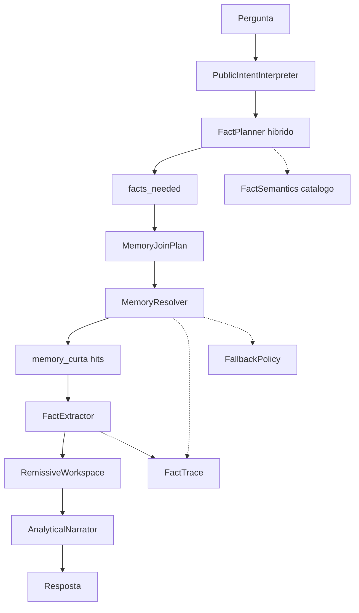

# Fase 5 — Chat Público Analítico (Fact Engine Remissivo)

**Goal:** Responder perguntas compostas combinando fatos de múltiplas memórias destiladas, sem reler relatórios inteiros.

**Frase-guia:** O Chat Público não pergunta *"qual documento ler?"* — pergunta *"quais fatos combinar?"*.

**Isolamento:** 100% em [`src/orion_mcp_v3/public_chat/`](src/orion_mcp_v3/public_chat/). Zero imports de `broker/`, `runtime/`, `contracts/evidence_block.py` ([`ISOLATION.md`](src/orion_mcp_v3/public_chat/docs/ISOLATION.md)). Espelhar o *padrão* analítico, não importar o código.

---

## Diagnóstico do estado actual

A Fase 4 resolveu **QA sobre um documento** — o log [`181945Z`](logs/public_chat/public_chat_pipeline_20260618T181945Z.jsonl) confirma respostas correctas com `validated_answer` ~6320 chars, mas ainda envia **6320 chars ao narrador** porque `section_count: 1` ("documento").

O salto da Fase 5 é de **"RAG com contexto"** para **"engine de fatos"**.

| Pergunta | Memórias necessárias | Pipeline actual |
|---|---|---|
| "pior forma pagamento março" | 1 fechamento | Funciona (com texto grande) |
| "faturamento maio + oficina" | fechamento + vendas_departamento | Falha — vector top-5 não garante ambas |
| "participação oficina no total" | 2 fatos + 1 derivado | Falha — narrador não recebe workspace estruturado |

**Manter:** [`PublicIntentInterpreter`](src/orion_mcp_v3/public_chat/infrastructure/intent_interpreter.py), cache `(topic, semantic_hash)`, [`RemissiveRetriever`](src/orion_mcp_v3/public_chat/infrastructure/remissive_retriever.py), [`knowledge_scoper`](src/orion_mcp_v3/public_chat/domain/knowledge_scoper.py).

**Substituir (atrás de feature flag):** [`section_parser.py`](src/orion_mcp_v3/public_chat/domain/section_parser.py) + [`context_selector.py`](src/orion_mcp_v3/public_chat/infrastructure/context_selector.py) + [`prepare_selected_context`](src/orion_mcp_v3/public_chat/application/context_pipeline.py).

---

## Arquitectura proposta



**Pipeline canónico:**

```text
Intent → Facts (planner)
Facts → Memories (resolver + join plan)
Memories → Workspace (extractor + derivados)
Workspace → Answer (narrator)
```

**Separação de responsabilidades:**

| Camada | Pensa em | Não pensa em |
|---|---|---|
| `FactPlanner` | Necessidades analíticas (`facts_needed`) | Quais memórias existem |
| `MemoryJoinPlan` | Quais fontes combinar e por qual chave | Valores concretos |
| `MemoryResolver` | Quais `context_key`/hits satisfazem cada fact | Como responder |
| `FactExtractor` | Valores concretos + confiança + trace | Sinónimos da pergunta |
| `AnalyticalNarrator` | Resposta a partir do workspace (RAW vs DERIVED) | SQL, novos factos |

---

## 5.0 — Fact Engine Spec v1 (contratos transversais)

Documento canónico: [`public_chat/docs/FACT_ENGINE_SPEC.md`](src/orion_mcp_v3/public_chat/docs/FACT_ENGINE_SPEC.md)

Implementar **antes** de 5A–5D; todos os sub-módulos importam estes tipos de `domain/fact_engine/`.

### 1) Contrato de Fact Semantics (crítico)

Cada `fact_key` no catálogo declara **o que é um fact válido** — não só o nome.

```python
# domain/fact_engine/semantics.py
class AggregationRule(str, Enum):
    SUM = "sum"
    MAX = "max"
    MIN = "min"
    LAST = "last"
    DERIVED = "derived"
    LOOKUP = "lookup"      # valor único por entity

class Comparator(str, Enum):
    ASC = "asc"
    DESC = "desc"
    NONE = "none"

class SourcePriority(str, Enum):
    KEY_METRICS = "key_metrics"
    STRUCTURED = "structured"   # secções parseadas
    PARSED_TEXT = "parsed_text"
    LLM = "llm"

@dataclass(frozen=True)
class FactSemantics:
    fact_key: str
    aggregation_rule: AggregationRule
    comparator: Comparator          # ranking_asc → MIN sobre value numérico
    source_priority: tuple[SourcePriority, ...]  # ordem fixa de tentativa
    value_kind: str                 # "currency" | "count" | "pct" | "label"
    allows_multiple_values: bool    # ranking lista vs lookup único
    derived_from: tuple[str, ...]    # fact_keys pai (ex.: participação)
```

**Regras canónicas (exemplos):**

| fact_key | aggregation | comparator | source_priority | notas |
|---|---|---|---|---|
| `faturamento_total_periodo` | LOOKUP | NONE | key_metrics → parsed_text | "total" = headline ou `faturamento_liquido`; não somar key_metrics |
| `ranking_forma_pagamento` | MIN/MAX | asc/desc | structured → parsed_text | sobre **value numérico**; excluir zeros do ranking principal |
| `faturamento_departamento_oficina` | LOOKUP | NONE | key_metrics → parsed_text | match entity "oficina" |
| `participacao_oficina` | DERIVED | NONE | — | oficina / total; FactType=DERIVED |

Sem `FactSemantics`, o `FactExtractor` diverge silenciosamente entre camadas.

**Ficheiro:** [`config/fact_semantics.yaml`](src/orion_mcp_v3/public_chat/config/fact_semantics.yaml) — par com `memory_catalog.yaml`.

---

### 2) Fact Resolution Trace (observabilidade)

Cada fact extraído carrega rastreabilidade completa — responder *"por que esse fact veio desse memory hit?"*

```python
# domain/fact_engine/trace.py
class ResolutionRule(str, Enum):
    CATALOG = "catalog"
    VECTOR_RETRIEVAL = "vector_retrieval"
    LLM_FALLBACK = "llm_fallback"
    JOIN_PLAN = "join_plan"

class ExtractionPath(str, Enum):
    KEY_METRICS = "key_metrics"
    STRUCTURED_PARSER = "structured_parser"
    RANKING_DERIVED = "ranking_derived"
    LLM_EXTRACT = "llm_extract"
    DERIVED_COMPUTE = "derived_compute"

@dataclass(frozen=True)
class FactTrace:
    fact_key: str
    resolved_from: tuple[int, ...]       # origin_ids
    context_keys: tuple[str, ...]
    rule_applied: ResolutionRule
    extraction_path: ExtractionPath
    semantics_version: str               # hash do fact_semantics.yaml
```

**Logging (5E):** etapas `fact.resolve`, `fact.extract` em [`pipeline_snapshots.py`](src/orion_mcp_v3/public_chat/infrastructure/pipeline_snapshots.py) — incluir `FactTrace` serializado no JSONL.

---

### 3) MemoryJoin Strategy

Resolver facts **não basta** — é preciso planear o **join entre memórias** para composição robusta.

```python
# domain/fact_engine/join_plan.py
@dataclass(frozen=True)
class MemorySourceRequirement:
    theme_slug: str                      # ex.: fechamento_gerencial
    fact_keys: tuple[str, ...]           # facts que esta fonte deve satisfazer
    required: bool

@dataclass(frozen=True)
class MemoryJoinPlan:
    period: str                          # join_key principal
    required_sources: tuple[MemorySourceRequirement, ...]
    join_keys: tuple[str, ...]           # ["period"] — extensível p/ entity depois
```

**Exemplo composta maio + oficina:**

```yaml
period: "2026-05"
required_sources:
  - theme_slug: fechamento_gerencial
    fact_keys: [faturamento_total_periodo]
    required: true
  - theme_slug: vendas_departamento
    fact_keys: [faturamento_departamento_oficina]
    required: true
join_keys: [period]
```

O `MemoryResolver` executa o join plan — não resolve facts de forma flat/independente e espera que a composição "aconteça".

---

### 4) Gap Reason Codes

Substituir `gaps: tuple[str, ...]` por gaps tipados:

```python
# domain/fact_engine/gap.py
class GapReason(str, Enum):
    NOT_IN_CATALOG = "not_in_catalog"           # fact_key desconhecido
    NO_MEMORY_FOUND = "no_memory_found"           # catálogo ok, zero hits no período
    MEMORY_EXISTS_BUT_NO_MATCH = "memory_exists_but_no_match"  # hit errado tema/entity
    PARTIAL_MATCH_ONLY = "partial_match_only"     # key_metrics vazio, só texto
    EXTRACTION_FAILED = "extraction_failed"       # memória ok, extractor falhou
    LOW_CONFIDENCE = "low_confidence"             # abaixo threshold

@dataclass(frozen=True)
class FactGap:
    fact_key: str
    reason: GapReason
    detail: str | None
    origin_ids_attempted: tuple[int, ...]
```

`RemissiveWorkspace.gaps` passa a `tuple[FactGap, ...]`. Narrador usa `reason` para mensagens honestas.

---

### 5) Confiança por camada (confidence propagation)

```python
# domain/fact_engine/confidence.py
EXTRACTION_CONFIDENCE = {
    ExtractionPath.KEY_METRICS: 0.95,
    ExtractionPath.STRUCTURED_PARSER: 0.75,
    ExtractionPath.RANKING_DERIVED: 0.85,
    ExtractionPath.DERIVED_COMPUTE: 0.90,   # se ambos pais >= 0.8
    ExtractionPath.LLM_EXTRACT: 0.70,
}

MIN_FACT_CONFIDENCE = 0.65   # abaixo → gap LOW_CONFIDENCE
MIN_DERIVE_CONFIDENCE = 0.80 # derivados só se pais >= este valor
```

`ExtractedFact` inclui `confidence: float` e `trace: FactTrace`.

Narrador: só calcula derivados (ex.: participação %) se ambos facts pai ≥ `MIN_DERIVE_CONFIDENCE`; caso contrário declara gap.

---

### 6) Proof binding no narrador (FactType)

```python
# domain/fact_engine/fact_type.py
class FactType(str, Enum):
    RAW = "raw"           # extraído directamente da memória — hard truth
    DERIVED = "derived"   # calculado no workspace (participação, diferença)
    ESTIMATED = "estimated"  # LLM extract ou baixa confiança — narrador declara incerteza
```

`ExtractedFact` inclui `fact_type: FactType`.

**Regras do narrador analítico:**

- Só citar valores `RAW` e `DERIVED` (com fórmula explícita) como factos centrais
- `ESTIMATED` → linguagem cautelosa ou pedir validação
- Proibido inventar `DERIVED` sem facts pai presentes no workspace

---

### 7) FallbackPolicy explícita (entre fases)

Política única — evita que cada camada invente fallback diferente:

```python
# domain/fact_engine/fallback_policy.py
@dataclass(frozen=True)
class FallbackPolicy:
    """Ordem fixa de resolução por fact_key."""

    async def resolve_fact(self, requirement, *, vector_hits, catalog) -> ResolveResult:
        # 1. Catálogo + SQL por period/theme (MemoryJoinPlan)
        # 2. Se miss e catalog_hit_exists → merge vector_hits do retriever
        # 3. Se still missing → LLM fact resolution (extract only, not plan)
        # 4. Se still missing → FactGap com reason explícito
        ...
```

**Tabela de decisão:**

| Estado | Acção |
|---|---|
| Catálogo encontra theme + SQL hit | Extrair via source_priority |
| Catálogo ok, SQL miss, vector tem hit | Usar vector; trace `VECTOR_RETRIEVAL` |
| Hit existe, extractor falha | Gap `PARTIAL_MATCH_ONLY` ou `EXTRACTION_FAILED` |
| Planner LLM só se determinístico vazio + confidence < 0.7 | trace `LLM_FALLBACK` |
| Nunca inventar valor | Gap `NO_MEMORY_FOUND` |

---

### 8) Mapeamento EvidenceBlock ↔ RemissiveWorkspace (anti-drift)

Não importar [`EvidenceBlock`](src/orion_mcp_v3/contracts/evidence_block.py), mas documentar equivalência explícita em `FACT_ENGINE_SPEC.md`:

| EvidenceBlock (Chat Analítico) | RemissiveWorkspace (Chat Público) |
|---|---|
| `summary` | narrador sintetiza a partir de `facts[]` |
| `metrics` | `ExtractedFact[]` com `fact_type=RAW` |
| `insights` | `ExtractedFact[]` com `fact_type=DERIVED` |
| `supporting_data.direct_answer_set` | parser local em `validated_answer` |
| `coverage` | `confidence` agregada + `gaps[]` |
| `provenance` | `FactTrace.resolved_from` + `context_keys` |

**Regra Fase 6:** qualquer extensão a um lado deve actualizar esta tabela — evita duplicação divergente.

---

## Modelo de domínio (actualizado)

```python
# domain/fact_engine/models.py
@dataclass(frozen=True)
class FactRequirement:
    fact_key: str
    metric: str | None
    dimension: str | None
    entity: str | None
    period: str | None
    operation: str | None
    semantics: FactSemantics          # resolvido do catálogo

@dataclass(frozen=True)
class ExtractedFact:
    fact_key: str
    label: str
    value: str
    unit: str | None
    fact_type: FactType
    confidence: float
    origin_id: int
    context_key: str
    trace: FactTrace

@dataclass(frozen=True)
class RemissiveWorkspace:
    period: str | None
    facts: tuple[ExtractedFact, ...]
    gaps: tuple[FactGap, ...]
    requirements: tuple[FactRequirement, ...]
    join_plan: MemoryJoinPlan | None
    workspace_confidence: float         # min(facts) ou regra documentada
```

---

## Sub-fases

### 5A — Fact Planner híbrido

**Ficheiros:**
- [`domain/fact_planner.py`](src/orion_mcp_v3/public_chat/domain/fact_planner.py)
- [`domain/fact_requirements.py`](src/orion_mcp_v3/public_chat/domain/fact_requirements.py)
- [`config/fact_semantics.yaml`](src/orion_mcp_v3/public_chat/config/fact_semantics.yaml)
- [`prompts/public_chat_fact_planner.yaml`](src/orion_mcp_v3/public_chat/prompts/public_chat_fact_planner.yaml)

**Output:** `tuple[FactRequirement, ...]` — cada um com `semantics` do catálogo.

**LLM fallback:** só se `facts_needed` vazio, `confidence < 0.7`, ou pergunta composta detectada.

**Logging:** `fact.plan` com requirements + semantics keys.

**Testes:** `tests/phase5a/`

---

### 5B — Memory Resolver + MemoryJoinPlan

**Ficheiros:**
- [`domain/memory_catalog.py`](src/orion_mcp_v3/public_chat/domain/memory_catalog.py)
- [`domain/fact_engine/join_plan.py`](src/orion_mcp_v3/public_chat/domain/fact_engine/join_plan.py)
- [`infrastructure/memory_resolver.py`](src/orion_mcp_v3/public_chat/infrastructure/memory_resolver.py)
- [`domain/fact_engine/fallback_policy.py`](src/orion_mcp_v3/public_chat/domain/fact_engine/fallback_policy.py)
- [`infrastructure/remissive_reader.py`](src/orion_mcp_v3/public_chat/infrastructure/remissive_reader.py) — SQL por period/theme

**Fluxo:**

```text
facts_needed → build MemoryJoinPlan (themes + join_key=period)
             → SQL lookup por source
             → merge vector hits (FallbackPolicy step 2)
             → dedupe origin_id
             → FactTrace por fact_key
```

**Testes:** `tests/phase5b/` — join de 2 fontes para maio; gap `NO_MEMORY_FOUND` quando `vendas_departamento` ausente.

---

### 5C — Fact Extractor

**Ficheiros:**
- [`domain/fact_extractor.py`](src/orion_mcp_v3/public_chat/domain/fact_extractor.py)
- [`domain/direct_answer_parser.py`](src/orion_mcp_v3/public_chat/domain/direct_answer_parser.py)

**Extracção obedece `FactSemantics.source_priority`:**

1. `key_metrics` (conf 0.95)
2. `structured` parser secções (conf 0.75)
3. `ranking_derived` min/max determinístico (conf 0.85)
4. `llm_extract` (conf 0.70) — só se anteriores falharem
5. `derived_compute` participação etc. (conf 0.90 se pais ok)

Cada passo regista `FactTrace.extraction_path`. Falha → `FactGap` com reason.

**Testes:** `tests/phase5c/` — fixture março 6320 chars; ranking Depósito Bancário; confiança propagada.

---

### 5D — Workspace Builder + Analytical Narrator

**Ficheiros:**
- [`application/workspace_pipeline.py`](src/orion_mcp_v3/public_chat/application/workspace_pipeline.py)
- [`infrastructure/analytical_narrator.py`](src/orion_mcp_v3/public_chat/infrastructure/analytical_narrator.py)
- [`prompts/public_chat_analytical_narrator.yaml`](src/orion_mcp_v3/public_chat/prompts/public_chat_analytical_narrator.yaml)
- [`application/consulta_turn_runner.py`](src/orion_mcp_v3/public_chat/application/consulta_turn_runner.py) — feature flag
- [`config/settings.py`](src/orion_mcp_v3/public_chat/config/settings.py) — `PUBLIC_CHAT_USE_WORKSPACE`

**Prompt narrador recebe:**

```json
{
  "facts": [{ "label", "value", "fact_type", "confidence" }],
  "gaps": [{ "fact_key", "reason", "detail" }],
  "allowed_derivations": ["participacao = oficina / total"]
}
```

**Regras proof binding:** RAW citável; DERIVED com fórmula; ESTIMATED cauteloso; gaps declarados.

**Testes E2E:** `tests/phase5d/`

---

### 5E — Observabilidade

**Etapas JSONL novas:**

| Etapa | Conteúdo |
|---|---|
| `fact.plan` | requirements, composite flag |
| `fact.join_plan` | required_sources, join_keys |
| `fact.resolve` | FactTrace por fact_key |
| `fact.extract` | extraction_path, confidence |
| `workspace.build` | facts count, gaps com reason, workspace_confidence |

Substituem `section.parse` + `selector.select` quando flag activa.

---

## Feature flag e migração

| Flag | Comportamento |
|---|---|
| `PUBLIC_CHAT_USE_WORKSPACE=false` (default inicial) | Fase 4 actual |
| `PUBLIC_CHAT_USE_WORKSPACE=true` | Fact Engine pipeline |

Deprecar Fase 4 path após 5D verde; não apagar legacy até estabilizar.

---

## Critérios de aceite

### Caso 1 — Simples (regressão)
*"Qual a forma de pagamento menos usada em março de 2026?"*
- `ranking_forma_pagamento` com semantics MIN/asc
- Depósito Bancário R$ 3.690; trace completo no log
- Narrador recebe facts <500 chars, não 6320

### Caso 2 — Composta
*"Quanto faturamos em maio e qual o valor no departamento oficina?"*
- MemoryJoinPlan: fechamento + vendas_departamento
- Resposta: total + oficina + participação (DERIVED)
- Trace: 2 origin_ids distintos

### Caso 3 — Gap tipado
Memória departamento ausente → `FactGap(reason=NO_MEMORY_FOUND)` — narrador declara, não alucina.

### Caso 4 — Confiança
Se extractor só consegue parsed_text (0.75) para total, derivado participação bloqueado se oficina < 0.65.

---

## Fora de escopo (Fase 5)

- Alterar `memory_curta` / destilação
- Importar `EvidenceBlock` ou `broker/`
- SQL runtime / SemanticQueryPlan
- Comparação cross-period ("cresceu vs mês anterior") — Fase 5F futura

---

## Riscos e mitigações

| Risco | Mitigação |
|---|---|
| Semântica implícita diverge | `fact_semantics.yaml` + FactSemantics obrigatório |
| Debug impossível em composto | FactTrace + GapReason em JSONL |
| Join acidental | MemoryJoinPlan explícito |
| Alucinação em derivados | FactType + MIN_DERIVE_CONFIDENCE |
| Fallback inconsistente | FallbackPolicy única |
| Drift vs EvidenceBlock | Tabela de mapeamento em FACT_ENGINE_SPEC.md |

---

## Documentação

- [`public_chat/docs/FACT_ENGINE_SPEC.md`](src/orion_mcp_v3/public_chat/docs/FACT_ENGINE_SPEC.md) — contrato de sistema (Spec v1)
- [`public_chat/docs/Plans/chat-público-fase-5-workspace-analítico.plan.md`](src/orion_mcp_v3/public_chat/docs/Plans/chat-público-fase-5-workspace-analítico.plan.md) — índice 5.0–5E

**Ordem de implementação recomendada:** 5.0 (spec) → 5A → 5B → 5C → 5D → 5E → docs índice
