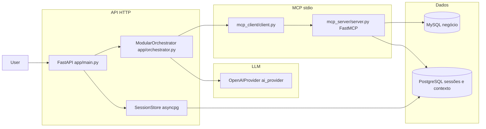

Segue uma **análise técnica detalhada** do repositório `project_mcp_v1`, com base na leitura do código e da documentação interna.

---

## 1. Propósito e posicionamento

O projeto é um **sistema de orquestração de agentes** orientado a **análise operacional de concessionárias / OS / vendedores / serviços**. A API **FastAPI** expõe chat HTTP; um **loop agente ↔ ferramentas** chama um **servidor MCP** (stdio) que concentra **SQL analítico** sobre **MySQL**, utilitários (tempo, busca SerpAPI opcional), **glossário de entidades** e um subsistema de **recuperação de contexto** ligado a **PostgreSQL** (embeddings, K-Means, retrieve).

A documentação em `docs/estrutura-e-recursos.md` descreve bem o desenho; o `README.md` ainda fala em ficheiros separados `main_modular.py` / `modular_orchestrator.py`, mas no código actual a lógica modular vive em **`app/main.py`** (app FastAPI) e **`app/orchestrator.py`** (`ModularOrchestrator`, `SkillLoader`, `ModelRouter`) — ou seja, houve **consolidação** sem o README ter sido totalmente alinhado.

---

## 2. Arquitectura em camadas

- **Camada HTTP**: arranque (`lifespan`), CORS, `POST /chat`, health, integração com **BackgroundTasks** para trabalho pós-turno.
- **Camada de orquestração**: estado da conversa, skills em Markdown, roteamento Maestro → especialista, orçamentos de tokens/LLM, pipelines opcionais (crítica, formatador, F3).
- **Camada MCP**: processo Python separado; o host injeta credenciais MySQL no ambiente para o subprocesso.
- **Camada de dados**: MySQL como fonte analítica; PostgreSQL para sessões, mensagens, metadados ricos e índice semântico.

---

## 3. Stack e dependências

De `requirements.txt`:

- **Runtime**: FastAPI, Uvicorn, Pydantic v2, pydantic-settings, httpx, loguru, python-dotenv.
- **LLM**: `openai` SDK, `tiktoken`.
- **Agentes / tools**: `mcp` (protocolo Model Context Protocol).
- **SQL**: `aiomysql` (pool no servidor MCP), `asyncpg` (sessões na API).
- **ML numérico** (context retrieval): `numpy`, `scikit-learn`.
- **CLI / util**: `typer`, `rich`, `PyYAML` (projeto; o `SkillLoader` faz parse YAML “manual” simplificado no frontmatter).

Frontend (`frontend/package.json`): **React 19**, **Vite 8**, **Tailwind 4**, **Framer Motion** — cliente SPA para consumir a API (tipicamente `localhost:5173` vs CORS em `config.py`).

---

## 4. Ciclo de vida de um pedido de chat

1. **`app/main.py`**: no `lifespan`, cria `AsyncOpenAI`, **sampling MCP** (`build_openai_sampling_callback`), instancia `Client("mcp_server/server.py")`, `connect()`, depois `ModularOrchestrator` e `load_tools()`. Opcionalmente `SessionStore` + migrações PostgreSQL.
2. **`ModularOrchestrator.run`**: resolve modo de fluxo (`legacy` vs `fast_skeleton` via `orchestrator_flow.py`), orçamento de chamadas LLM, tracing opcional.
3. **`orchestrator_sm.run_linear_turn`**: máquina de fases explícita; ramifica para `run_fast_skeleton_turn` ou pipeline legacy (append user, maestro com tool virtual `route_to_specialist`, especialista com tools MCP deduplicadas).
4. Resposta ao cliente; **`post_turn_tasks`**: memória (resumo, notas), observador, refresh do índice de contexto — muitas vezes em **background** para não bloquear o JSON da resposta.

Isto está alinhado com o que o próprio README menciona sobre latência e tarefas de fundo.

---

## 5. Orquestração modular (núcleo técnico)

Ficheiro central: **`app/orchestrator.py`** (~2500+ linhas — orquestrador “gordo” com muita política embebida).

### 5.1 Skills e metadados

- **`SkillLoader`**: lê `app/skills/<id>.md` com frontmatter `---` YAML; cache por id; **parse YAML simplificado** (linha a linha `key: value`) — evita dependência pesada no loader, mas impõe formato restrito no frontmatter.
- **`SkillMetadata`**: `model`, `context_budget`, `max_tokens`, `temperature`, `role`, `agent_type`.
- **`AgentType`**: union literal (`maestro`, `analise_os`, `clusterizacao`, …) — deve manter-se coerente com `Settings` / `.env` para modelos por agente.

### 5.2 Roteamento e ferramentas

- **`routing_tools`**: Maestro com conjunto reduzido de tools + **`route_to_specialist`**; especialistas com lista completa (ou subconjunto) de MCP.
- **`virtual_tools`**: por exemplo agregação analítica em sessão sem ir ao MCP bruto.
- **`orchestrator_state`**: armazenamento de resultados de tools, digest para o modelo, exclusões de certos resultados do “estado” persistido — ataca **coerência de estado** entre LLM, histórico e tools (tema reflectido nos docs conceptuais em `docs/`).

### 5.3 Orçamento e robustez

- **`context_budget`**, **`prompt_assembly`**, **`history_payload`**, **`message_lifecycle`**: redução de mensagens, histórico compacto, saneamento de tools órfãs.
- **`tool_truncation`**: limita tamanho de respostas de tools.
- **`orchestrator_llm_budget`**: tecto global de chamadas `model.chat` por pedido HTTP (degradação controlada).
- **Chamadas MCP paralelas** (semáforo / flags em settings) para várias tools na mesma volta.

### 5.4 Pós-pipelines

- Modo **`orchestrator_post_pipelines_mode`**: `always` vs `heuristic` (saltar pipelines pós-especialista em pedidos curtos).
- Integração com **`pipeline_critique`**, formatador UI, compositor (F3), conforme flags e estado da sessão.

Este desenho mostra evolução de um monólito para **políticas configuráveis** e **dois modos de fluxo** (legacy vs skeleton), o que aumenta superfície de teste mas dá flexibilidade operacional.

---

## 6. MCP: cliente e servidor

### Cliente — `mcp_client/client.py`

- Arranca o servidor com **`sys.executable`** + script `mcp_server/server.py`.
- `ClientSession` com **sampling_callback** e capabilities — permite que o **servidor** peça ao host uma completion OpenAI (útil para `summarize` em analytics, etc.).
- `list_tools` / `call_tool` com **hooks de trace** (`agent_trace`).

### Servidor — `mcp_server/server.py`

- **FastMCP** com tools declaradas por decorators.
- **Resource** `analytics://query/{query_id}`: SQL completo por id (evita inflar descrições das tools).
- Tools típicas: `list_analytics_queries`, `run_analytics_query`, tempo, glossário, busca Google (SerpAPI), registo de **`context_retrieval`** modular.

### SQL e segurança de parâmetros

- **`analytics_queries.py`**: registo de queries a partir de ficheiros SQL com metadados YAML no cabeçalho.
- **`sql_params`**: substituição validada de placeholders de período.
- **`db.py`**: pool aiomysql, paginação, serialização JSON segura (ex.: `Decimal`).

Isto é um padrão sólido: **catálogo declarativo de análises** + execução parametrizada, com recurso MCP para inspeção do SQL.

---

## 7. Persistência e sessões

**`app/session_store.py`**: PostgreSQL com `asyncpg`, utilizadores opcionais, sessões, mensagens (transcript com roles, tool_calls, extras JSONB). Migrações em `migrations/`.

Metadados de sessão agregam: resumo de conversa, notas, logs do observador, caches MCP, etc. **`post_turn_tasks.merge_post_turn_metadata_from_db_row`** evita condições de corrida em que o HTTP sobrescreve chaves escritas em background — desenho maduro para **consistência eventual**.

---

## 8. Recuperação de contexto semântico

Pacote **`mcp_server/context_retrieval/`**: embeddings, batch, worker/CLI, pool PostgreSQL, prefilter ILIKE, clustering (K-Means), `context_retrieve_similar`, etc.

A documentação em `estrutura-e-recursos.md` detalha gatilhos de rebuild, TTL do K-Means, cache de embeddings por mensagem, timeouts síncronos na API vs cron — arquitectura **híbrida** (síncrono limitado + batch/worker).

Na app, **`context_index_service`**, **`context_semantic_contract`**, integração no orquestrador (`_inject_semantic_context_for_specialist`, instrumentação para resposta).

---

## 9. Frontend

SPA React + Vite, consumo da API em `localhost:8000` (típico). Não é obrigatório para o núcleo analítico; o “cérebro” está no Python.

---

## 10. Configuração

**`app/config.py`** é extenso (~870 linhas): dezenas de toggles (OpenAI, MySQL, PostgreSQL, orquestrador, context index, observer, trace, parallel MCP, etc.), com validadores Pydantic. **Implica**: alta flexibilidade e **necessidade de `.env.example`** como contrato operacional (o utilizador já tem `.env` local).

---

## 11. Testes e qualidade

Pasta **`tests/`** com cobertura ampla: orquestrador modular, fluxo e decisões, estado, MCP session cache, truncagem, sanitização OpenAI, analytics, glossário, retrieve/dedupe, embeddings, handoff, persistência de chat, etc.

Isto indica **intenção séria de regressão** num sistema com muitas combinações de flags.

---

## 12. Pontos fortes (síntese técnica)

1. **Separação MCP stdio**: isolamento de tools/SQL e possibilidade de escalar/evoluir o servidor sem misturar com o lifecycle HTTP (com custo de subprocesso).
2. **Catálogo SQL versionado** + resources MCP para transparência ao modelo.
3. **Orquestração rica**: routing, budgets, modos de fluxo, estado explícito de tools, pós-processamento assíncrono.
4. **Duas bases de dados** com papéis claros: MySQL negócio vs PostgreSQL “plataforma”.
5. **Testes** alinhados com subsistemas críticos (MCP, prompts, persistência).

---

## 13. Riscos, complexidade e dívida técnica observável

1. **`app/orchestrator.py` monolítico em tamanho**: muitas responsabilidades no mesmo módulo (embora haja extracção para `orchestrator_sm`, `orchestrator_state`, `prompt_assembly`, etc.). Manutenção e onboarding exigem disciplina.
2. **Parse YAML manual no `SkillLoader`**: rápido e sem PyYAML no loader, mas **frágil** a estruturas YAML mais complexas (listas, nested maps) — documentar formato permitido é importante.
3. **README vs código**: referências a `main_modular` / `modular_orchestrator` como ficheiros separados podem confundir; o `run.py` aponta para `app.main`.
4. **Superfície de configuração**: muitas variáveis interdependentes; erros silenciosos possíveis (ex.: PostgreSQL indisponível → sessões desactivadas com warning).
5. **Segurança operacional**: SQL pré-aprovado mitiga injection na camada de analytics, mas qualquer extensão dinâmica deve manter o mesmo rigor; credenciais em env para subprocesso MCP é padrão comum mas exige controlo de ambiente em deploy.

---

## 14. Conclusão

`project_mcp_v1` é um **backend de agentes analíticos** bem estruturado em torno de **FastAPI + OpenAI + MCP**, com **MySQL** como motor de negócio e **PostgreSQL** para **sessão, memória e contexto semântico**. A evolução documentada (monólito → modular com Maestro e especialistas) está **materializada no código** (`ModularOrchestrator`, skills, routing); a documentação de alto nível em `docs/` é um bom complemento à análise de código.

Se quiseres, numa próxima mensagem podes pedir um **recorte** (só segurança, só performance, só dados, ou diagrama de sequência de um `POST /chat` completo) e aprofundo só nessa dimensão.