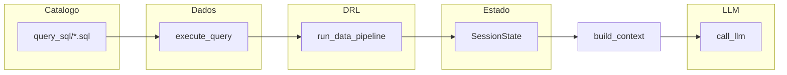

# Analytical Copilot — protótipo (documentação + notebook)

Documento gerado automaticamente a partir do notebook na raiz do repositório: [`analytical_copilot_prototype.ipynb`](../analytical_copilot_prototype.ipynb). Data de referência: 2026-05-03.

Após alterar o notebook, pode exportá-lo com `jupyter nbconvert analytical_copilot_prototype.ipynb --to markdown` e substituir ou fundir a secção «Conteúdo do notebook» abaixo.

## Visão geral da arquitetura

**Fórmula:** `Sistema = Data Engine + Estado + LLM (apenas renderer)`.

| Camada | Papel |
|--------|--------|
| **Catálogo SQL** (`project_mcp_v1/mcp_server/query_sql/`) | Cada `query_id` é um ficheiro `.sql` com cabeçalho YAML `/* @mcp_query_meta ... */` (`resource_description`, `when_to_use`, `output_shape`). |
| **Camada de dados** | `resolve_query` + `execute_query`: substitui `__MCP_DATE_FROM__` / `__MCP_DATE_TO__` via `sql_params.apply_placeholders`; com `USE_MYSQL=1` executa com `MySQLAgent.executar_select` e credenciais `MYSQL_*`. |
| **DRL** | `run_data_pipeline`: schema inferido, summary genérico, insights determinísticos, amostra limitada — o LLM não recebe o dataset completo. |
| **Estado** | `SessionState`: datasets por id, cache `summaries` por assinatura `query_id + params`, dedupe com `last_query_signature`. |
| **Decisão** | Heurística por regex (`build_query_plan`) + modo `state_only` para continuações (“e o …”). |
| **LLM** | `call_llm`: só reformula o JSON de contexto; sem chave usa stub. |



## Variáveis de ambiente relevantes

| Variável | Uso |
|----------|-----|
| `USE_MYSQL` | `1` / `true` — executa SQL real; caso contrário usa mocks por `query_id`. |
| `MYSQL_HOST`, `MYSQL_PORT`, `MYSQL_USER`, `MYSQL_PASSWORD`, `MYSQL_DATABASE` | Conexão MySQL (mesmo padrão que `agentes_simples_5.ipynb`). |
| `OPENAI_API_KEY`, `MODELO_DEFAULT` | Opcional — renderer OpenAI. |
| Intervalo de datas | Nos params (`date_from`, `date_to`) ou variáveis lidas pelo notebook para alinhar aos placeholders SQL (ver células do notebook). |

---

## Orion MCP (`orion_mcp/`) — projeto no mesmo repositório

O notebook deste documento é um **protótipo reduzido** (fluxo legível, decisão por regex, estado em memória). O **[Orion MCP](../orion_mcp/)** é o **sistema state-driven de produção** que evolui o `project_mcp_v1`: API HTTP versionada, estado persistido, motor de decisão determinístico, Data Engine completo, execução de analytics sobre MySQL através de um **serviço MCP** (gRPC de longa duração), PostgreSQL para sessão e memória semântica opcional (pgvector), filas Celery para indexação de embeddings, observabilidade e limites de orçamento explícitos.

### O que o Orion MCP faz (visão funcional)

1. **Chat analítico orientado a estado** — Cada turno lê e escreve `conversation_state` em PostgreSQL. O estado do diálogo (fase, flags, entidades, hints) é a fonte de verdade; não há “histórico solto” enviado ao modelo como única memória.
2. **Orquestração única por pedido** — Um fluxo (`Orchestrator`) por request: transições de estado (`core/state`), execução de ações (`DecisionEngine` + `ActionExecutor`), construção de contexto (`ContextBuilder`), chamadas ao LLM só onde o desenho do turno exige (resposta, insights, formatação).
3. **LLM não governa o fluxo** — A `DecisionEngine` decide o próximo passo com base em estado, entrada e estratégia; o modelo não escolhe ferramentas livremente no sentido clássico “agente autónomo”.
4. **Dados de negócio via catálogo SQL** — Queries versionadas em `mcp_adapter/query_sql/*.sql` com o mesmo tipo de meta YAML (`@mcp_query_meta`) que no `project_mcp_v1`. Execução apenas por `query_id` conhecido; placeholders `__MCP_DATE_FROM__` / `__MCP_DATE_TO__`. O núcleo pode invocar analytics através do **cliente gRPC** (`ORION_MCP_GRPC_TARGET`) que fala com o processo MCP (pool MySQL, cache Redis L2, circuit breaker).
5. **Data Representation Layer no núcleo** — `core/data_engine/` implementa pipeline (`pipeline.py`), inferência de schema (`schema_inference.py`), resumos (`summary_builder.py`), amostragem (`sampler.py`), extração de valores (`value_extractor.py`): alinhado conceptualmente ao protótipo do notebook, mas integrado nas ferramentas e no contexto para o LLM.
6. **Contexto estruturado para o modelo** — `ContextBuilder` monta secções (dados resumidos, perfil heurístico da tarefa, limites de tokens). Há tetos (`ORION_LLM_PROMPT_TOKEN_BUDGET`, `ORION_LLM_CONTEXT_MAX_CHARS`, etc.) e degradação documentada (`payload.perf`: timeout de tool, MCP indisponível, truncagem, …).
7. **Memória curta e longa** — Estado de conversa em Postgres; memória longa opcional com embeddings em `memory_embeddings` + índice ANN (HNSW/IVFFlat conforme dimensão) e worker Celery para indexação assíncrona.
8. **API HTTP** — `POST /api/v1/chat`, `POST /api/v1/chat/stream` (SSE), OpenAPI em `/openapi.json`, `/health`, `/metrics` (Prometheus). Suporte a `query_id`, `date_from`/`date_to`, paginação no domínio MCP quando configurado.
9. **Observabilidade** — Métricas, tracing opcional, logs estruturados; stack Docker (API, Postgres, Redis, serviço MCP, observabilidade) descrita em `docker/` e ficheiros compose na raiz de `orion_mcp`.

### Mandamentos e invariantes (resumo)

Documento canónico: [`orion_mcp/docs/ARCHITECTURE.md`](../orion_mcp/docs/ARCHITECTURE.md). Entre outros: um único fluxo de orquestração por pedido; estado persistido como verdade do turno; contexto sempre construído pelo `ContextBuilder`; decisão determinística; ferramentas determinísticas e cacheáveis; configuração tipada (`Settings`); contrato HTTP versionado; MCP em processo persistente com gRPC em produção (não subprocess stdio no hot path).

### Estrutura de diretórios (referência)

Árvore focada em código, SQL, docs e infra — sem `.venv`, caches nem artefactos gerados:

```text
orion_mcp/
├── README.md
├── pyproject.toml
├── requirements.txt
├── requirements-dev.txt
├── run_server.py                 # arranque uvicorn com PYTHONPATH=src
├── docker-compose.yml            # raiz: atalhos / composição
├── docker-compose.observability.yml
├── deploy/
│   └── prometheus.yml
├── docker/
│   ├── docker-compose.yml        # API, Postgres, Redis, MCP, volumes
│   ├── docker-compose.mysql-peer.yml
│   ├── app/Dockerfile
│   └── postgres/Dockerfile, init.sql
├── docs/
│   ├── ARCHITECTURE.md           # invariantes, MCP em rede, Secção 3 performance
│   ├── architecture.md
│   ├── api.md
│   ├── modules.md
│   ├── TRACEABILITY.md
│   ├── heurística_de_tomada_de_decisão.md
│   └── …                         # planos, resumos, pontos a corrigir
├── migrations/                   # cópias SQL (001_conversation_state, 002_memory_embeddings, …)
├── prompts/
│   └── example_skill.yaml
├── scripts/
│   ├── check_query_sql_meta.py
│   ├── validate_openapi.py
│   ├── validate_docs_vs_code.py
│   ├── generate_docs.py
│   └── generate_grpc.sh
├── src/orion_mcp/
│   ├── api/                      # FastAPI: main, routes/chat, schemas
│   ├── core/
│   │   ├── budget.py
│   │   ├── config/settings.py
│   │   ├── context/context_builder.py
│   │   ├── data_engine/          # DRL: pipeline, schema, summary, sampler, value_extractor
│   │   ├── decision/             # decision_engine, actions
│   │   ├── formatter/
│   │   ├── llm/                  # provider, embeddings, model_config, request_dump
│   │   ├── memory/               # short, long, embed_pipeline, index_queue
│   │   ├── orchestrator/         # orchestrator, state_manager, action_executor, …
│   │   ├── prompts/skill_model.py
│   │   ├── state/                # models, transitions, intent_heuristic, turn_hints
│   │   ├── strategy.py
│   │   └── tools/                # registry, data_interpreter, summarize, stubs
│   ├── infra/
│   │   ├── cache/tool_cache.py
│   │   ├── db/                   # pool, migrate, state_repository, migrations SQL
│   │   ├── observability/        # metrics, tracing, drl_session_log
│   │   └── queue/celery_app.py
│   └── mcp_adapter/              # serviço MCP: MySQL, gRPC, catálogo SQL
│       ├── client/               # grpc_client, circuit_breaker
│       ├── gateway/app.py        # HTTP opcional debug
│       ├── grpc_gen/             # código gerado a partir de proto
│       ├── proto/orion_mcp_tools.proto
│       ├── queries/              # analytics_sql, demo
│       ├── query_sql/*.sql       # relatórios (meta YAML + SQL)
│       ├── query_sql_meta.py
│       ├── server/               # main gRPC, mysql_pool, query_executor
│       ├── sql_catalog.py, sql_placeholders.py, sql_select.py
│       └── stdio_server.py       # legado / dev
└── tests/                        # testes por módulo (api, engine, mcp, memory, …)
```

### Pacotes `src/orion_mcp` — responsabilidades

| Área | Conteúdo típico |
|------|------------------|
| `api/` | Aplicação FastAPI, rotas de chat (JSON e stream), validação de pedidos (`query_id`, datas, limites). |
| `core/decision/` | Máquina de decisão sobre estado e ações enumeradas. |
| `core/orchestrator/` | Laço do turno: preparar estado, executar ações, LLM quando aplicável, persistência. |
| `core/data_engine/` | Pipeline analítico sobre resultados tabulares (alinhado à filosofia DRL do notebook). |
| `core/context/` | Montagem do prompt/estrutura enviada ao LLM com orçamentos. |
| `core/tools/` | Registo de ferramentas, interpretação de dados para pré-visualização, integração com MCP remoto. |
| `core/memory/` | Memória de sessão curta / longa e pipeline de embeddings. |
| `infra/db/` | Pool Postgres, repositório de estado, migrações. |
| `infra/queue/` | Celery para trabalhos assíncronos (ex.: indexar memória). |
| `mcp_adapter/` | Servidor de analytics: execução SQL catalogada, gRPC, pool MySQL, cache Redis no serviço MCP. |

### Relação com o notebook `analytical_copilot_prototype.ipynb`

| Aspeto | Notebook (protótipo) | Orion MCP |
|--------|----------------------|-----------|
| Catálogo SQL | Importa `project_mcp_v1/mcp_server` | `orion_mcp/mcp_adapter/query_sql/` + `sql_catalog.py` |
| Execução MySQL | `MySQLAgent.executar_select` local | Serviço MCP dedicado + gRPC na API |
| Estado | `SessionState` em RAM | `conversation_state` em Postgres + repositório |
| Decisão | Regex fixa | `DecisionEngine` + transições de estado |
| DRL | Funções num notebook | Pacote `core/data_engine` + integração nas tools |
| LLM | Stub ou OpenAI simples | `LLMProvider`, streaming, orçamentos, halt/debug |

Documentação adicional no próprio pacote: [`orion_mcp/README.md`](../orion_mcp/README.md) (arranque, pgvector, Celery), [`orion_mcp/docs/api.md`](../orion_mcp/docs/api.md) (contrato HTTP e campos opcionais do chat).

---

## Conteúdo do notebook (exportação)

As secções abaixo reproduzem as células do Jupyter na ordem original.

<!-- célula 0: markdown -->

# Analytical Copilot — protótipo (DRL + estado + LLM isolado)

**Filosofia:** `Sistema = Data Engine + Estado + LLM (apenas renderer)`

- LLM não vê dados brutos; só `summary`, `insights` e `sample`.
- Catálogo de queries: `project_mcp_v1/mcp_server/query_sql/` (meta YAML + SQL).
- Sem orquestração multi-agente nem skills — apenas o fluxo mínimo reprodutível.

<!-- célula 1: código -->

```python
import json
import os
import random
import re
import sys
import warnings
from typing import Any, Dict, List, Optional, Tuple

import pandas as pd
from dotenv import load_dotenv

load_dotenv(os.path.join(os.path.abspath("."), ".env"))
sys.path.insert(0, os.path.abspath("."))

SYSTEM = {
    "name": "Analytical Copilot Prototype",
    "principles": [
        "LLM nunca vê dados brutos",
        "insights são determinísticos",
        "contexto é estruturado",
        "estado evita recomputação",
        "memória longa via datasets",
    ],
}

SYSTEM
```

<!-- célula 2: markdown -->

## 1. Camada de dados (`execute_query`)

- **`query_id`**: nome do ficheiro em `project_mcp_v1/mcp_server/query_sql/` (ex.: `faturamento_mensal_recebidos_pendentes`). Metadados: `/* @mcp_query_meta ... */` — ver `project_mcp_v1/mcp_server/query_sql_meta.py`.
- **`resolve_query(query_id)`**: lê meta + SQL bruto (`__MCP_DATE_FROM__` / `__MCP_DATE_TO__`).
- **Datas**: `date_from` / `date_to` em `params`, ou `MCP_DATE_FROM` / `MCP_DATE_TO` no `.env`.
- **`USE_MYSQL=1`**: `MySQLAgent.executar_select` com credenciais `MYSQL_*` (como no `agentes_simples_5.ipynb`).

<!-- célula 3: código -->

```python
_MCP_SERVER = os.path.join(os.path.abspath("."), "project_mcp_v1", "mcp_server")
if _MCP_SERVER not in sys.path:
    sys.path.insert(0, _MCP_SERVER)

from analytics_queries import QUERY_DIR, QUERY_IDS, QUERY_REGISTRY, get_sql
from query_sql_meta import parse_sql_file
from sql_params import apply_placeholders


def mysql_agent_from_env():
    from mnt.skills.agente_mysql.helpers import MySQLAgent

    host = os.environ.get("MYSQL_HOST", "localhost")
    porta_env = os.environ.get("MYSQL_PORT")
    porta = int(porta_env) if porta_env else 3306
    usuario = os.environ.get("MYSQL_USER", "root")
    senha = os.environ.get("MYSQL_PASSWORD", "")
    banco = os.environ.get("MYSQL_DATABASE", "")
    return MySQLAgent(host=host, porta=porta, usuario=usuario, senha=senha, banco=banco)


def _use_mysql() -> bool:
    return os.environ.get("USE_MYSQL", "").strip().lower() in ("1", "true", "yes", "on")


def resolve_query(query_id: str) -> dict:
    """Lê `query_sql/{query_id}.sql`: meta YAML (@mcp_query_meta) + corpo SQL com placeholders."""
    path = QUERY_DIR / f"{query_id}.sql"
    if not path.is_file():
        raise FileNotFoundError(
            f"query_id={query_id!r} não encontrado em query_sql/. "
            f"Ids válidos (amostra): {', '.join(QUERY_IDS[:8])}…"
        )
    meta, sql_body = parse_sql_file(path)
    return {"path": str(path), "meta": meta, "sql_body": sql_body}


def default_date_range(params: dict) -> tuple[str, str]:
    """Intervalo YYYY-MM-DD para __MCP_DATE_FROM__ / __MCP_DATE_TO__ (env ou demo)."""
    d0 = str(params.get("date_from") or os.environ.get("__MCP_DATE_FROM__", "2024-01-01")).strip()
    d1 = str(params.get("date_to") or os.environ.get("__MCP_DATE_TO__", "2024-12-31")).strip()
    return d0, d1


def build_sql_for_query(query_id: str, params: dict) -> str:
    raw = get_sql(query_id)
    d0, d1 = default_date_range(params)
    return apply_placeholders(raw, date_from=d0, date_to=d1)


def _mock_rows(query_id: str, params: dict) -> List[dict]:
    """Linhas sintéticas para o harness (sem MySQL). Colunas aproximam o SQL real."""
    if query_id == "faturamento_mensal_recebidos_pendentes":
        return [
            {
                "Mês de Referência (Competência)": "2024-04",
                "Qtd. Ordens de Serviço (OS)": 10,
                "Total Recebido (R$)": 5000.0,
                "Total Pendente (R$)": 500.0,
                "Faturamento Total Previsto (R$)": 5500.0,
                "_mock": True,
            }
        ]
    if query_id == "servicos_vendidos_por_concessionaria":
        return [
            {
                "concessionaria_id": 1,
                "periodo": "2024-04",
                "servico_id": 3,
                "qtd_os": 42,
                "faturamento_liquido": 12000.0,
                "participacao_no_mes_pct": 31.0,
                "_mock": True,
            },
            {
                "concessionaria_id": 1,
                "periodo": "2024-04",
                "servico_id": 5,
                "qtd_os": 31,
                "faturamento_liquido": 9000.0,
                "participacao_no_mes_pct": 23.0,
                "_mock": True,
            },
        ]
    if query_id == "performance_vendedor_mes":
        return [
            {
                "concessionaria_id": 1,
                "periodo": "2024-04",
                "vendedor_id": 1,
                "qtd_os_fechadas": 12,
                "faturamento_liquido": 9000.0,
                "_mock": True,
            }
        ]
    raise KeyError(f"query_id sem mock definido: {query_id}")


def execute_query(query_id: str, params: dict) -> List[dict]:
    """
    Catálogo = ficheiros em project_mcp_v1/mcp_server/query_sql/ (meta + SQL).
    USE_MYSQL=1: SQL com datas substituídas via MySQLAgent.executar_select.
    """
    params = dict(params or {})
    resolve_query(query_id)
    if _use_mysql():
        sql = build_sql_for_query(query_id, params)
        agent = mysql_agent_from_env()
        resultado = agent.executar_select(
            sql, verbose=False, variavel_notebook=f"df_{query_id}"
        )
        if not resultado.get("sucesso"):
            raise RuntimeError(resultado.get("erro") or "Falha no SELECT")
        return resultado["dataframe"].to_dict(orient="records")
    return _mock_rows(query_id, params)


def query_catalog_summary() -> str:
    """query_id + resource_description (YAML de cada .sql)."""
    return "\n".join(
        f"- **{qid}**: {QUERY_REGISTRY[qid]['resource_description']}" for qid in QUERY_IDS
    )
```

<!-- célula 4: markdown -->

## 2. DRL — Data Representation Layer

`infer_schema` → `build_summary` → `extract_insights` → `build_sample` → `run_data_pipeline`.

<!-- célula 5: código -->

```python
def infer_schema(rows: List[dict]) -> dict:
    """Detecta colunas numeric | categorical | temporal."""
    if not rows:
        return {"columns": {}}
    df = pd.DataFrame(rows)
    columns: Dict[str, Any] = {}
    for col in df.columns:
        s = df[col]
        kind = "categorical"
        if pd.api.types.is_numeric_dtype(s):
            kind = "numeric"
        else:
            with warnings.catch_warnings():
                warnings.simplefilter("ignore", UserWarning)
                parsed = pd.to_datetime(s, errors="coerce", utc=False)
            if parsed.notna().sum() >= max(1, int(0.8 * len(s))):
                kind = "temporal"
        columns[str(col)] = {
            "kind": kind,
            "nunique": int(s.nunique(dropna=True)),
            "null_ratio": float(s.isna().mean()) if len(s) else 0.0,
        }
    return {"columns": columns}


def build_summary(rows: List[dict], schema: dict) -> dict:
    """Métricas genéricas: numéricas, categóricas, temporais."""
    if not rows:
        return {"row_count": 0, "numeric": {}, "categorical": {}, "temporal": {}}
    df = pd.DataFrame(rows)
    cols = schema.get("columns", {})
    numeric, categorical, temporal = {}, {}, {}
    for col, meta in cols.items():
        if col not in df.columns:
            continue
        s = df[col]
        if meta["kind"] == "numeric":
            sn = pd.to_numeric(s, errors="coerce")
            if sn.notna().any():
                numeric[col] = {
                    "count": int(sn.notna().sum()),
                    "mean": float(sn.mean()),
                    "sum": float(sn.sum()),
                    "min": float(sn.min()),
                    "max": float(sn.max()),
                }
        elif meta["kind"] == "temporal":
            st = pd.to_datetime(s, errors="coerce")
            if st.notna().any():
                temporal[col] = {
                    "min": st.min().isoformat(),
                    "max": st.max().isoformat(),
                }
        else:
            vc = s.astype(str).value_counts(dropna=True).head(10)
            total = int(vc.sum()) if len(vc) else 0
            top = []
            for val, cnt in vc.items():
                top.append(
                    {
                        "value": val,
                        "count": int(cnt),
                        "share": round(float(cnt) / total, 4) if total else 0.0,
                    }
                )
            categorical[col] = {"cardinality": int(s.nunique(dropna=True)), "top": top}
    return {
        "row_count": len(rows),
        "numeric": numeric,
        "categorical": categorical,
        "temporal": temporal,
    }


def extract_insights(summary: dict) -> dict:
    """Concentração, dominância, outliers (determinístico)."""
    insights: Dict[str, Any] = {"dominance": [], "concentration": [], "outliers": []}
    for col, block in summary.get("categorical", {}).items():
        top = block.get("top") or []
        if not top:
            continue
        top1 = top[0]["share"]
        if top1 >= 0.4:
            insights["dominance"].append(
                {"column": col, "value": top[0]["value"], "share": top1}
            )
        top3 = sum(t["share"] for t in top[:3])
        shares = [t["share"] for t in top]
        hhi = sum(sh ** 2 for sh in shares) if shares else 0.0
        insights["concentration"].append(
            {"column": col, "top3_share": round(top3, 4), "hhi": round(float(hhi), 4)}
        )

    for col, stats in summary.get("numeric", {}).items():
        mean = stats.get("mean")
        if mean is None:
            continue
        # limites simples tipo score z na média (sem recalcular série completa no notebook)
        lo = stats["min"]
        hi = stats["max"]
        span = hi - lo
        if span and abs(hi - mean) / span > 0.45:
            insights["outliers"].append(
                {"column": col, "note": "max distante da média (regra span)", "mean": mean, "max": hi}
            )
    return insights


def build_sample(rows: List[dict], schema: dict, max_rows: int = 40, seed: int = 42) -> List[dict]:
    """Amostra reproduzível: início + aleatória até max_rows."""
    if not rows:
        return []
    rng = random.Random(seed)
    n = min(max_rows, len(rows))
    head = rows[: min(5, len(rows))]
    rest_idx = list(range(len(rows)))[5:]
    rng.shuffle(rest_idx)
    pick = rest_idx[: max(0, n - len(head))]
    sample = head + [rows[i] for i in sorted(pick)]
    return sample[:n]


def run_data_pipeline(rows: List[dict]) -> dict:
    schema = infer_schema(rows)
    summary = build_summary(rows, schema)
    insights = extract_insights(summary)
    sample = build_sample(rows, schema)
    return {
        "summary": summary,
        "insights": insights,
        "sample": sample,
        "row_count": len(rows),
    }
```

<!-- célula 6: markdown -->

## 3–5. Estado, assinatura de query, decisão e contexto

<!-- célula 7: código -->

```python
class SessionState:
    def __init__(self) -> None:
        self.datasets: Dict[str, List[dict]] = {}
        self.summaries: Dict[str, dict] = {}
        self.last_query_signature: Optional[str] = None


def build_query_signature(query_id: str, params: dict) -> str:
    return f"{query_id}:{json.dumps(params, sort_keys=True, default=str)}"


def should_execute(state: SessionState, signature: str) -> bool:
    return signature != state.last_query_signature


def build_query_plan(question: str) -> dict:
    """Pergunta → query_id (ficheiro em query_sql/) + params."""
    q = question.lower()
    base = {
        "date_from": os.environ.get("__MCP_DATE_FROM__", "2024-01-01"),
        "date_to": os.environ.get("__MCP_DATE_TO__", "2024-12-31"),
    }
    if re.search(r"faturamento|faturado|receita", q):
        return {"query_id": "faturamento_mensal_recebidos_pendentes", "params": dict(base)}
    if re.search(r"top.*servi[cç]o|servi[cç]o.*top|mais.*servi", q):
        return {"query_id": "servicos_vendidos_por_concessionaria", "params": dict(base)}
    if re.search(r"vendedor|vendedora", q):
        return {"query_id": "performance_vendedor_mes", "params": dict(base)}
    return {"query_id": "faturamento_mensal_recebidos_pendentes", "params": dict(base)}


def decide_action(question: str, state: SessionState) -> dict:
    """
    state_only: continuação ('e o vendedor?') reutiliza último pipeline em cache.
    query: nova execução com assinatura.
    """
    q = question.strip().lower()
    if state.last_query_signature and re.match(r"^(e o|e a|e os|e as|também|tambem)\b", q):
        return {"type": "state_only"}
    plan = build_query_plan(question)
    return {"type": "query", "query_id": plan["query_id"], "params": plan["params"]}


def build_context(question: str, data_output: dict) -> dict:
    summary = data_output.get("summary") or {}
    insights = data_output.get("insights") or {}
    sample = data_output.get("sample") or []
    return {
        "question": question,
        "data": summary,
        "insights": insights,
        "sample": sample,
    }


def empty_data_output() -> dict:
    return {"summary": {}, "insights": {}, "sample": [], "row_count": 0}
```

<!-- célula 8: markdown -->

## 6. LLM — apenas renderer

Sem `OPENAI_API_KEY`, usa stub. Com chave, reformula só o que está no `context`.

<!-- célula 9: código -->

```python
def call_llm(context: dict) -> str:
    api_key = os.environ.get("OPENAI_API_KEY")
    if not api_key:
        return (
            "[stub LLM] Protótipo sem OPENAI_API_KEY. "
            "Contexto estruturado (não use como dados brutos):\n"
            + json.dumps(context, ensure_ascii=False, indent=2, default=str)[:4000]
        )
    from openai import OpenAI

    client = OpenAI(api_key=api_key)
    model = os.environ.get("MODELO_DEFAULT") or "gpt-5-mini"
    system = (
        "Você é um renderer: reescreva em português claro a resposta à pergunta do usuário "
        "usando APENAS números e categorias presentes no JSON de contexto. "
        "Não invente métricas. Se faltar dado, diga que o contexto não traz esse detalhe."
    )
    user = json.dumps(context, ensure_ascii=False, default=str)
    resp = client.chat.completions.create(
        model=model,
        messages=[
            {"role": "system", "content": system},
            {"role": "user", "content": user},
        ],
        # temperature omitido: alguns modelos só aceitam o default
    )
    return (resp.choices[0].message.content or "").strip()
```

<!-- célula 10: markdown -->

## 7. Orquestração + métricas

<!-- célula 11: código -->

```python
def run_agent(question: str, state: SessionState) -> str:
    action = decide_action(question, state)

    if action["type"] == "query":
        signature = build_query_signature(action["query_id"], action["params"])
        if should_execute(state, signature):
            rows = execute_query(action["query_id"], action["params"])
            data_output = run_data_pipeline(rows)
            dataset_id = str(len(state.datasets))
            state.datasets[dataset_id] = rows
            state.summaries[signature] = data_output
            state.last_query_signature = signature
        else:
            data_output = state.summaries[signature]
    else:
        sig = state.last_query_signature
        if sig and sig in state.summaries:
            data_output = state.summaries[sig]
        else:
            data_output = empty_data_output()

    context = build_context(question, data_output)
    return call_llm(context)


def debug_metrics(rows: Optional[List[dict]], summary: dict, context: dict) -> dict:
    n = len(rows) if rows is not None else 0
    return {
        "rows": n,
        "summary_size": len(json.dumps(summary, default=str)),
        "context_size": len(json.dumps(context, default=str)),
    }
```

<!-- célula 12: markdown -->

## 8. Test harness

<!-- célula 13: código -->

```python
# Período dos SQL catalogados (__MCP_DATE_*__); ajuste ou defina MCP_DATE_FROM / MCP_DATE_TO no .env
os.environ.setdefault("__MCP_DATE_FROM__", "2026-01-01")
os.environ.setdefault("__MCP_DATE_TO__", "2026-03-31")

state = SessionState()

# (pergunta, nota curta para leitura do teste)
questions = [
    ("qual o faturamento do mês?", "query_id → faturamento_mensal_recebidos_pendentes"),
    ("qual o top serviço?", "query_id → servicos_vendidos_por_concessionaria"),
    ("ranking de vendedores por mês", "query_id → performance_vendedor_mes"),
    ("e o vendedor?", "state_only → reutiliza último pipeline (vendedor)"),
    (
        "ranking de vendedores por mês",
        "mesma pergunta de novo → deve reutilizar cache (should_execute=False)",
    ),
]

for q, nota in questions:
    print("=" * 60)
    print("Q:", q)
    print("Nota:", nota)
    act = decide_action(q, state)
    if act["type"] == "query":
        sig_preview = build_query_signature(act["query_id"], act["params"])
        reexec = should_execute(state, sig_preview)
        meta = resolve_query(act["query_id"])["meta"]
        print(
            f"  Plano: query_id={act['query_id']!r} | output_shape={meta.get('output_shape')} | "
            f"re-exec={reexec} | sig={sig_preview[:80]}…"
        )
        print("  Descrição:", (meta.get("resource_description") or "")[:120], "…")
    else:
        print(f"  Plano: state_only | last_sig={state.last_query_signature!r}")
    out = run_agent(q, state)
    print("--- Resposta (trecho) ---")
    print(out[:2000] if len(out) > 2000 else out)
    sig = state.last_query_signature
    cached = state.summaries.get(sig) if sig else None
    rows_dbg = list(state.datasets.values())[-1] if state.datasets else []
    if cached:
        m = debug_metrics(rows_dbg or None, cached.get("summary", {}), build_context(q, cached))
        print("metrics:", m)
print("=" * 60)
print("Resumo: datasets em memória:", list(state.datasets.keys()), "| chaves de cache:", len(state.summaries))
```

